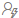
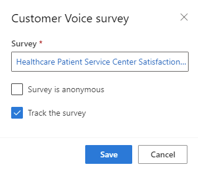

# Create push notifications

Push notifications are messages sent to customers who have installed your mobile app. Push messages allow you to quickly convey offers, messages, or other information directly to users of your app.

> [!NOTE]
> Push notifications are supported only in countries where [Azure Notification Hubs](https://azure.microsoft.com/explore/global-infrastructure/products-by-region/?products=notification-hubs&regions=all) are available.

You can send push messages as part of real-time journeys, similar to other outbound messages like text messages.

## Create a mobile app configuration

To send push notification messages to your customers, you'll first need to set up at least one *Mobile app configuration*. 

> [!IMPORTANT]
> If the user or team who is going to create a mobile application has admin privileges, then no further action is required.
>
> If the user or team who is going to create a mobile application doesn't have admin privileges, then an admin needs to complete the following steps:
> 1. Go to **Advanced Settings** > **Security** > **Field Security Profiles** > **Marketers - Mobile app secrets**.
> 2. Add the corresponding user or team as members.
> 3. Save and close.

To create a new mobile app configuration, go to **Settings** > **Customer engagement** > **Push notifications** and select **+New** on the top ribbon.

> [!div class="mx-imgBorder"]
> 

The mobile app configuration connects your existing mobile application (already published on the App Store, Google Play, or both) to Dynamics 365 Marketing.

> [!IMPORTANT]
> To complete the configuration, an app developer will have to help you get the iOS APNs certificate or Android FCM key for your mobile application. Learn more: [Push notification setup for application developers](real-time-marketing-developer-push.md)
>
> Dynamics 365 Marketing will then generate an access token that is required to authenticate your application.

To create a mobile app configuration, complete the following steps:

### 1. Enter a name and description for the configuration

Start by entering a name and a description of your configuration.

### 2. Configure mobile applications

You can choose to configure an iOS application, an Android application, or both at the same time. Dynamics 365 Marketing will handle both apps under a single mobile configuration.

#### iOS applications

For iOS applications, Marketing uses the Apple Push Notification service (APNs), a platform service that enables third-party application developers to send push notifications to iOS users. You can choose from two authentication modes:

- **Certificate**: Uses a certificate to authenticate. Consult Apple developer documentation on how to create a .p12 (PKCS #12) certificate file that you can upload into Marketing.
- **Token**: Uses a [token-based connection to the APNs](https://developer.apple.com/documentation/usernotifications/setting_up_a_remote_notification_server/establishing_a_token-based_connection_to_apns). For token authentication, the following strings are required:
  - *Signing key*: The content of the .p8 file providing the signing key.
  - *Key ID*: The 10-character Key ID string.
  - *Bundle ID*: Created together with the APNs certificate for your app.
  - *Team ID*: Refer to Apple developer documentation to determine how to get your Team ID.

#### Android applications

For Android applications, Marketing uses the Firebase Cloud Messaging (FCM) service. To configure your Android application to work with Marketing, you need to enter the FCM API key string.

### 3. Complete the configuration

Once you have entered the information for the mobile applications you want to connect, select **Save** to save and validate the mobile app configuration changes.

If the connection was successful, an access token will be generated. You can generate more access tokens as needed—for instance, when app developers need to update the application.

To connect the application with Marketing, you'll need to share the access token and the application ID with your app developer. The token will work immediately, as long as the *Credential validation* field on the right side of the mobile app configuration page shows as valid.

>[!TIP]
> To learn more about the developer configuration for push notifications, see [Push notification setup for application developers](real-time-marketing-developer-push.md).

When the access token is established successfully, the connection is completed and the mobile app configuration will be validated.

Refer to the step-by-step summary on the right side of the mobile app configuration page for the current status of your mobile app configuration.

> [!div class="mx-imgBorder"]
> 

## Create push notification messages

After you have successfully created your mobile app configuration, you can start creating push notification messages by going to **Real-time marketing** > **Channels** > **Push notifications** and selecting **+New push notification** in the top ribbon. You will then be taken to the push notification message editor.

> [!div class="mx-imgBorder"]
> 

In the push notification message editor, you can enter a title, a subtitle, a message, and preview how your message will appear in iOS and Android.

Using the *On-click behavior* field, you can also specify the message behavior when customers tap on the message in their mobile phones.
- **Open the app**: Opens the mobile application.
- **Open the browser**: Opens a specified URL.

Try test-sending the push notification to your mobile app configuration or add it to a journey to see how it can be used.

To stop messages from being sent, you can deactivate or delete them.

## Personalize your push notifications

As with the email editor, you can personalize push notifications to insert dynamic data that is unique to each notification recipient.

To personalize a push notification:

1. Select the **Personalization**  button in the **Message** field.
1. Select **Select a data field** to choose a data source. Your data source can be based on an **Audience**, a **Trigger**, or **Compliance**.
1. After choosing the data source, you can search for the specific attribute or trigger you want.
1. Add a **Label** to quickly identify your token in the message content.

When you send the push notification from a journey, it will automatically populate the token according to the attribute you selected.

## Add a Customer Voice survey to a push notification

Adding a Customer Voice survey link to a push notification or [text message](real-time-marketing-outbound-text-messaging.md#add-a-customer-voice-survey-to-a-text-message) allows you to seek feedback from customers on the channels they use the most.

To add a Customer Voice survey to a push notification:

1. Select the **Customer Voice survey** button  in the **Message** field.
1. Choose a Customer Voice survey in the lookup field.
1. Select whether you want the survey to be anonymous and whether you want to track the survey link after customers click on it. If you select the **Survey is anonymous** option, no user data will be saved with the answers.
    > [!div class="mx-imgBorder"]
    > 
1. Select **Save**.

When you send the push notification from a journey, it will automatically populate the token with the survey and options you selected.

## Send push notification messages in a journey

When creating a real-time marketing journey, you can send push notification messages by:
1. Specifying the mobile application configuration.
1. Then choosing the push notification message you want to send from the journey.

## Track your push notification messaging metrics from channel insights

You can see how customers reacted to your push messages by checking the push notification analytics in the message itself and within journeys.

[!INCLUDE[footer-include](../includes/footer-banner.md)]