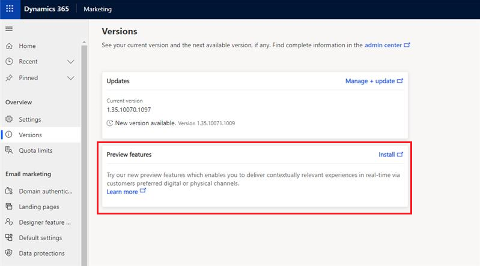

# Real-time marketing quickstart guide

> [!IMPORTANT]
> A preview feature is a feature that is not complete, but is made available before it’s officially in a release so customers can get early access and provide feedback. Preview features aren’t meant for production use and may have limited or restricted functionality.
> 
> Microsoft doesn't provide support for this preview feature. Microsoft Dynamics 365 Technical Support won’t be able to help you with issues or questions. Preview features aren’t meant for production use, especially to process personal data or other data that are subject to legal or regulatory compliance requirements.

This article explains how to create a Dynamics 365 CXP instance and how to set up an environment.

In this April release, you can opt in for preview features updates and evaluate our new data and AI powered real-time customer journey orchestration capabilities. The opt in method is different from the traditional Early access updates.

> [!NOTE]
> Preview features will be limited to North America and Europe region at this time.

## Enable the real-time marketing public preview features

1. From the application, switch to the “Settings” area from the bottom of the left navigation
1. Navigate to **Overview** > **Versions**
1. In the “Preview features” tile, click on “Install”

    > [!div class="mx-imgBorder"]
    >  

1. Install may take approximately one hour to complete. It will continue even if you close the browser window.