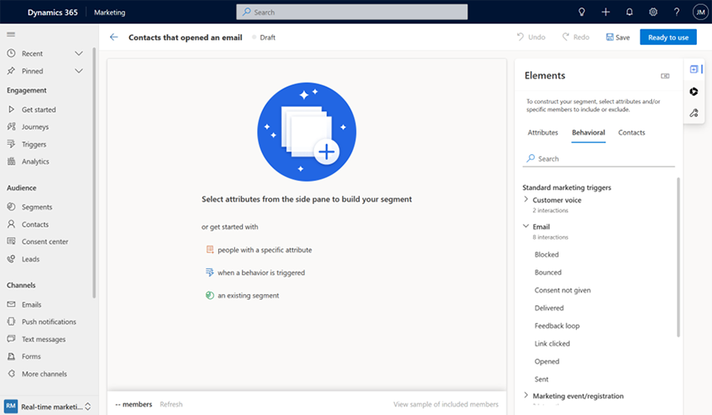
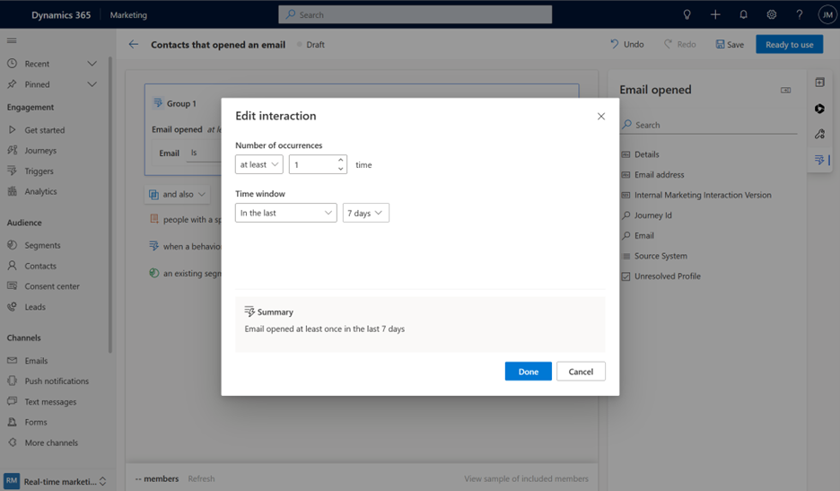
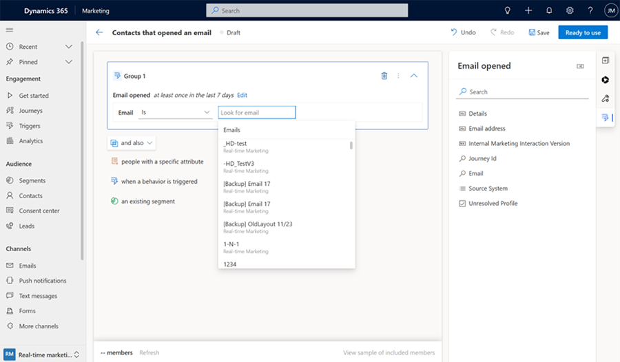

# Improve targeting by using interaction data in segments 

Effective targeting and personalized customer experiences depend on well-defined segments. Use real-time marketing’s segment builder to create segments based on customer interactions and engagement across various marketing channels, websites, events, and more. This feature, in combination with the demographic and firmographic attributes already available for segmentation, enables you to reach the right customers at the right time. Use segments for journey branching or content variations, tailoring the experience for each customer. By defining frequency and time windows, you can create complex, interaction-based conditions, expanding your ability to segment and personalize the customer experience based on more customer actions.

## Some example segment scenarios using interaction data

1. All contacts who opened the email “Your event registration is here” at least once in the past seven days.
1. All leads who have visited the marketing form “business inquiries” in the last month.
1. All contacts who answered a customer voice survey and also selected a “subscribe to newsletter” email link.
1. All contacts who live in San Francisco and have registered for the event “Microsoft Build 2023.”

## Create a segment using interactions

Let’s say you want to create a segment containing all contacts who opened an email at least once in the past week. To create the segment, complete the following steps:
1. To create a new segment, go to **Real-time marketing > Audience > Segments** and select **+New Segment**. For the segment name, enter **All contacts who opened an email at least once in the past week**. Select your target audience. 
1. In the **Elements** section in the right pane, go to the **Behavioral** tab and select **Email > Opened**

  > [!div class="mx-imgBorder"]
  >  

1. When you add the interaction to your canvas, it automatically defaults to a time window and a frequency count of how many times the interaction has occurred in the past. To edit the time window and count to your scenario, select the **Edit interaction** button. To proceed, select **Done**.

  > [!div class="mx-imgBorder"]
  >  

1. Select the email that you want to see whether the customers opened in the previous seven days. 

  > [!div class="mx-imgBorder"]
  >  

> [!NOTE]
> The members preview is not available with behavioral segments.