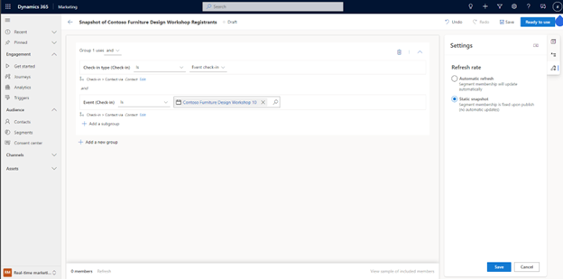

# Create a static snapshot of a segment

Static lists are an important part of audience management. Static lists allow you to:

1) Create point-in-time campaigns for customer segments that satisfy criteria at the time of segment creation.
2) Manage your customer list manually with a selective list that does not follow any logical conditions.
3) Create a seed list to test your customer journeys with.

The real-time marketing static segment experience helps you capture the audience that matters with simplicity, flexibility, and power.

## How to create a static snapshot of your segment

**Example**: Let’s say you have a list of all contacts who’ve checked into the event, “Contoso Furniture Design Workshop”.

Using the [attribute logic builder](real-time-marketing-build-segments.md), you build your segment as usual. You then decide that you want to create a static snapshot to capture only the contacts who’ve checked into the event at the time you’re making the segment. To create a static snapshot of the segment, go to **Settings** and set the segment refresh rate to **Static snapshot**.

> [!div class="mx-imgBorder"]
>