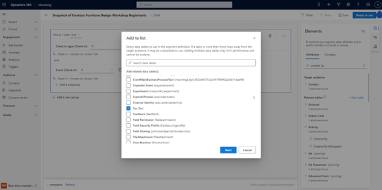
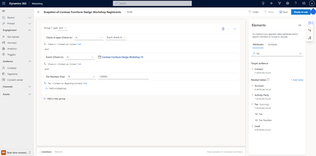

# Sync data tables into the segment builder

The real-time marketing segment builder allows you to sync data tables without relying on the help of administrators. This saves you time when setting up segments, letting you directly add data tables to Dynamics 365 Marketing without using the Dynamics 365 admin center.

**Example**: You want to create a segment using attributes from the Fax table in Dataverse, but you notice that Fax isn’t available in your related data tables.

To add the Fax table directly from the Marketing app, go to the real-time marketing segment builder and create or select a segment. Then, in the **Elements** side pane, select **+Add table** next to **Related tables**. Search for the Fax table, select the check box next to it, then select **Next** to add the table to the segment builder. 

> [!div class="mx-imgBorder"]
> 

After you add the new table, you can use the attributes from Fax immediately in your segment creation.

> [!div class="mx-imgBorder"]
> 

> [!NOTE]
> It can take up to 24 hours for a data table to be synchronized into the system. At this time, the segment member size estimate and preview features are not available. You cannot view the segment membership until the table is synchronized into the system.  

[!INCLUDE[footer-include](../includes/footer-banner.md)]