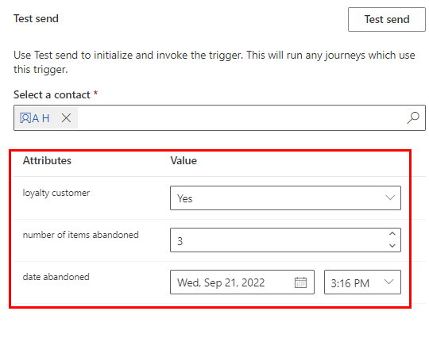
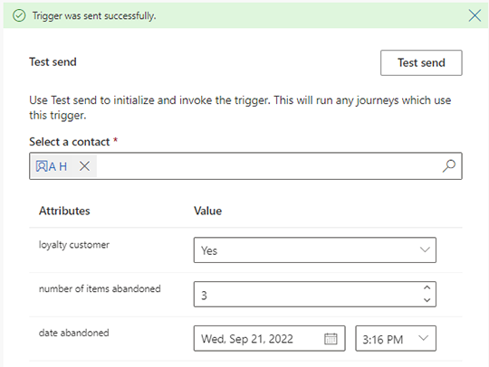
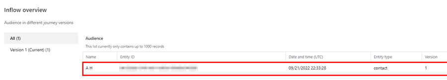

# Test custom triggers before using them

[!INCLUDE[consolidated-sku-rtm-only](../includes/consolidated-sku-rtm-only.md)]

Testing custom triggers before using them in a journey about to be published is the safest way to ensure that your expectations meet your customers' reality. The test-send feature allows you to be confident in the quality and behavior of your custom triggers before you send them out to your audience.

Using the test-send feature, you can:

- Create a custom trigger that is tied to a contact or lead entity.
- Use yourself as a contact to trigger a journey.
- See the inflow of your test journey increase by one every time you test send before using the trigger for a real journey.

> [!NOTE]
> If multiple journeys use the custom trigger, you cannot isolate the test-send to a single journey. This means that your test will affect any journey that listens to that trigger. Always make sure you are triggering test journeys and not real journeys.

## Example: Test a custom trigger for an abandoned cart scenario

In this example, a journey is triggered when a cart is abandoned by a customer. The journey starts and sends a reminder email with an offer of 30% off if the customer completes the purchase. The abandoned cart signal is created using custom triggers. Learn more: [Create custom triggers in real-time marketing](real-time-marketing-custom-triggers.md).

The following steps illustrate how to test the abandoned cart trigger.

1. In the real-time marketing area, go to **Triggers** and select the custom trigger you want to test.
    > [!NOTE]
    > The test-send feature only works with custom triggers bound by a Contact or Lead entity.

    > [!TIP]
    > When you're looking at the list of triggers, custom triggers have a plain lightning bolt icon . Out-of-the-box triggers have a lightning bolt with a suitcase icon .
1. After the custom trigger details page loads, scroll down to the **Test send** feature and select a Contact (this could be yourself or an internal colleague).
1. Add the values to the attributes that will simulate the conditions you want your real customers to fulfill.

    > [!div class="mx-imgBorder"]
    > 

1. Select the **Test send** button. You'll receive a confirmation message that the trigger was sent successfully.

    > [!div class="mx-imgBorder"]
    > 

1. Once you're done testing, you can go to your journey and select the **Total inflow** link. You'll see that the inflow increased by one with the name of the contact you tested with. This confirms that the custom trigger worked as expected.

    > [!div class="mx-imgBorder"]
    > 

[!INCLUDE[footer-include](../includes/footer-banner.md)]
