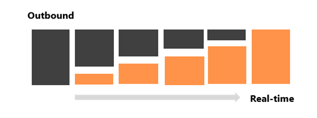

# Real-time marketing transition FAQs

1. **What is Dynamics 365 Customer Insights? Is it a new product?**

    Dynamics 365 Customer Insights and Dynamics 365 Marketing are coming together as one offering named Dynamics 365 Customer Insights. This solution offers a range of tier options based on your usage needs and requirements. Dynamics 365 Customer Insights is designed to revolutionize your customer experiences through two independently adoptable apps: 

    **Customer Insights - Data** (currently known as Dynamics 365 Customer Insights) empowers you to effectively build a unified, real-time 360-degree profile of your customers.  

     **Customer Insights - Journeys** (currently known as Dynamics 365 Marketing) allows you to act on this comprehensive understanding to deliver highly personalized experiences.  

    Learn more: [Dynamics 365 Customer Insights FAQs](ci-faq.md)

1. **How is Dynamics 365 Marketing impacted by this announcement?**

    Dynamics 365 Marketing is becoming Dynamics 365 Customer Insights - Journeys. In Dynamics 365 Customer Insights - Journeys, the focus will solely be on real-time marketing, ensuring a modernized and efficient approach to customer engagement. This shift highlights the commitment to providing businesses with powerful tools to deliver personalized experiences, ultimately driving growth and fostering stronger customer connections.

    Over the next year, we invite all customers to fully transition from outbound to real-time marketing. Real-time marketing has already surpassed traditional outbound marketing in functionality, effectiveness, usability testing results, satisfaction surveys, and our innovations and upcoming AI features are exclusively focused on real-time marketing.

    Starting in August 2023, new customers will access real-time marketing only. Current customers provisioning new environments will also get real-time marketing by default, but if necessary, can add outbound using a self-serve experience.

1. **Why should I transition to real-time marketing?**

    Real-time marketing introduces new ways of marketing by integrating the latest AI technologies, while covering and enhancing traditional outbound scenarios. It offers a wealth of benefits to deliver engaging B2C and B2B experiences.  

    By transitioning to real-time marketing now, you can enjoy the following benefits:

    **Leverage AI to do more with less**

    Real-time marketing already assists marketers with several Copilot capabilities to:

    - Target the right audience simply by describing your segments using everyday words.
    - Generate engaging email content within seconds simply by writing key points or selecting a topic and a tone of voice matching your message.
    - Receive images recommendations from the library that complement your emails.
    
    Furthermore, in the upcoming months, you'll be able to use new innovative Copilot capabilities to:

    - Easily rewrite your existing content to make your messages more compelling.
    - Create new journeys just by describing them in simple words.
    - Prevent messages from sending during unwanted times.
    - Effortlessly style your emails and forms based on your website design.
    - Get step by step guidance to authenticate your domain.

    **Optimize every interaction**

    - Experience seamless integration with Dynamics 365 Customer Insights – Data to capitalize on customer understanding and insights to enhance every interaction.
    - Craft journeys for contact and lead entities in Dataverse, or profiles from Customer Insights.
    - React to customers' actions instantly using out-of-the-box triggers, custom triggers, or triggers based on any data change in Dataverse all without writing any code. 
    - Refine your audience targeting with advanced segmentation capabilities and an unlimited number of segments.
    - Deliver your messages through out-of-the-box text messages, push notifications, custom channels, and benefit from AI-powered channel optimization to reach customers on the most effective channel.
    - Embrace hyper-personalization features like dynamic text and no-code conditional content to support 1:1 targeted, responsive campaigns tailored to individual preferences.

    **Unify sales and marketing**

    - Easily create powerful registration forms, identify leads, organize events or create nurturing journeys.
    - Define granular qualification criteria to better identify and prioritize leads with the upcoming enhanced lead scoring builder.
    
    Thanks to the deep integration of real-time marketing and Dynamics 365 Sales, you can:

    - Align your efforts with sellers by sharing a unified timeline of customer activities.
    - Seamlessly transfer qualified leads to the sales team (upcoming) or engage sales representatives within your customer journey at exactly the right time by assigning a sales call or triggering a sales sequence to further increase the likelihood of closing deals.
    - Continuously optimize your marketing efforts by using AI-powered attribution analytics to understand how your marketing activities contribute to your defined milestones.

    **Scale your business**

    - Leverage business units, brand profiles, and the new consent center to tailor real-time marketing to cater to your business’ unique requirements.
    - Scale your business with 300 million monthly interactions and reach up to 100 million marketing contacts.

    Overall, transitioning to real-time marketing is a powerful way for your businesses to improve marketing strategies, enhance customer engagement, and drive growth.

1. **How do I start with real-time marketing?**

    New customers will directly start in real-time marketing. As a new customer you can start by exploring the main functionalities, create a journey, or send a quick email.  

    If you're a current customer using outbound, you are in “mixed-mode” where both outbound and real-time marketing capabilities are available and can be used simultaneously. Our recommended approach is to start progressively with real-time marketing and then ramp up after you have gained confidence. You can start using real-time marketing for running new journeys. This way you'll have time to train and troubleshoot any dependencies or issues that may arise. Having created and successfully run a few real-time journeys, continue by moving your outbound journeys. This would be a great time to revisit and redesign them. For instance, many of your outbound journeys could flow more naturally and be reused by using triggers in real-time marketing.  

    > [!div class="mx-imgBorder"]
    > 

    To make sure your transition to real-time marketing is a success, we have designed a user-friendly interface that doesn't require extensive retraining - you'll experience interface enhancements that significantly improve usability and efficiency.

    To easily kickstart delivering experiences using real-time marketing, we've designed an email transition tool, made outbound segments available directly in real-time marketing, and empowered you to generate more engaging content and revisit or create new journey within minutes thanks to our new AI-powered Copilot features.

1. **Where can I get help setting up real-time marketing?**

    Real-time marketing is already available within Dynamics 365 Marketing. To get started, you can consult our learning center: [Real-time marketing overview](real-time-marketing-overview.md)

    If you're transitioning from outbound marketing, review our resource page ([Real-time transition resources](real-time-marketing-transition-resources.md)) to receive guidance and prepare your transition to real-time marketing.

    Reach out to your account manager with further questions or if help is needed.

1. **What does this mean for outbound marketing?**

    Real-time marketing has already surpassed traditional outbound marketing in functionality and effectiveness, and our innovations and upcoming AI features are exclusively focused on the real-time marketing. In the coming year, we'll be transitioning all customers to real-time marketing to benefit from improved features to better engage your customers in the moment that matters. We'll continue to support outbound, but we don't intend to add new enhancements.

1. **Will transitioning to real-time marketing require significant user retraining due to a new user interface?**

    Transitioning to real-time marketing doesn't require extensive user retraining, particularly for the most common marketing activities listed below. In these areas, you'll either encounter no differences in the user interface (UI) between outbound and real-time marketing, or you'll experience UI enhancements that significantly improve usability and efficiency.

    **Email creation**

    - Users familiar with the outbound email designer will find the same interface in real-time marketing for basic design and editing capabilities. The interface offers easier and more efficient personalization without need for any coding/scripting.
    
    **Event planning**

    - The user experience for event planning and forms remains the same in both outbound and real-time marketing, eliminating the need for additional training.

    **Forms**

    - Forms benefit from a revamped user experience based on the email planner.

    **Segment building**

    - The segment builder in real-time marketing has a user-friendly and intuitive UI. It now supports natural language instructions, simplifying segment creation. Users can provide instructions in everyday language instead of complex queries.

    **Journeys**

    - The journey UI has been completely redesigned in real-time marketing. Customer feedback indicates that the new UI is more user-friendly, efficient, and natural. Any retraining required for the redesigned journey UI is considered a worthwhile investment, as it improves usability and effectiveness.

## Scalability

1. **What is the new scale of real-time marketing and how does it compare to the previous level?**

    Marketers can now reach up to reach up to 100,000,000 contacts or leads and send up to 300,000,000 messages per month in real-time marketing. This is over 3x the previous outbound marketing limit of 30,000,000 contacts and 100,000,000 monthly interactions.

    This added capacity empowers marketers to deliver personalized experiences at scale and delight their customers in new ways. Additional interactions help marketers grow their business, whether by increasing their customer base in new markets, reaching additional geographies, promoting new products, or expanding their prospective customer pipeline to reach higher sales targets.

1. **When is the increased scale available and is it available only for real-time marketing?**

    The new scale of 100,000,000 contacts and 300,000,000 monthly interactions can only be unlocked with real-time marketing. This is available immediately for customers who need to operate at the new scale. To learn more, reach out to your Microsoft representative.

1. **Are there any additional costs associated with the increased scalability level? What is the implementation process?**

    There's a contact threshold of 10,000,000 contacts purchased that unlocks the new scale. Existing customers that need to upgrade or new customers must meet the contact threshold to unlock the new scale and receive the increased throughput.

    To unlock the new scale, reach out to your Microsoft sales representatives with your requirements. The end-to-end process to upgrade to the new scale will be completed within two weeks.