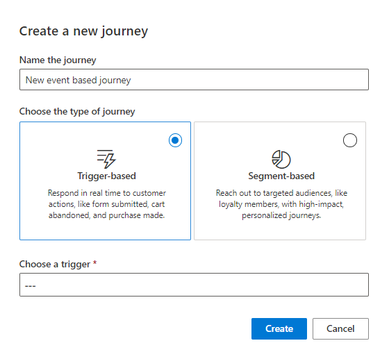
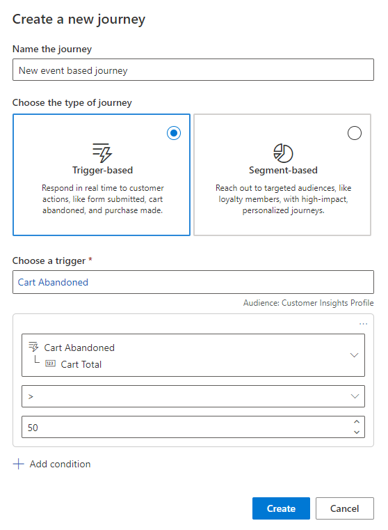
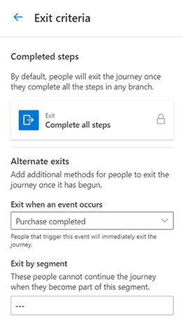

# Create a trigger-based journey

> [!Note]
> “Event triggers” are now called “triggers” in the app and the documentation. The change was made to avoid confusion when referencing event management functionality versus triggering real-time marketing journeys.

Trigger-based customer journeys enable you to react to customers’ actions in real time. Journeys can be triggered based on real-world interactions like walking into a store and connecting to Wi-Fi. Journeys can also be triggered by virtual interactions such as visiting a shopping website. The real-time nature of the journey ensures that you can respond to customers immediately and convert their expression of interest into a sale.

## Creating a trigger-based journey for abandoned cart reminders

To illustrate the capabilities of trigger-based journeys, we'll create a personalized, multichannel, trigger-based journey that can be used to bring prospective buyers with abandoned carts back to your website to complete their purchase.  

## Prerequisites

### Create custom triggers

- Work with your website team to capture the customer's *Abandoned cart* and *Purchase completed* actions as custom triggers. For more information on creating custom events, see [Real-time marketing triggers](real-time-marketing-triggers.md).
- The *Abandoned cart* trigger should be raised whenever a customer adds products to the cart but doesn’t complete the purchase.  
- The *Purchase completed* trigger should be raised whenever a customer completes their purchase.

### Create email, text, and push notifications

We'll use three touchpoints across various channels to remind customers to complete their purchase:

- **Initial email reminder**: When a customer abandons a cart, they'll get an email to remind them to complete their purchase.  
- **Second text reminder**: If the customer hasn't opened their email one day after the initial reminder, we'll try to reach them with a text message.
- **Final push notification**: If the customer hasn't completed their purchase one day after the second reminder, we'll send a final push notification.

You can build the journey while the content is in the **Draft** state. To publish and go live with the journey, the content must be in the **Ready to send** state.

## Set the journey start

When creating a trigger-based journey, you can specify the following properties to configure how customers start the journey:

- **Choose the type of journey**: You can select whether you want to create a trigger-based journey that responds to a customer action, or a segment-based journey that reaches out to a specific audience. Here, we'll want to create a trigger-based journey.
- **Choose the trigger**: This is the trigger that customers must perform to start the journey. We want customers to start the journey when they abandon their cart, so select the *Abandoned cart* event as the trigger.

> [!div class="mx-imgBorder"]
> 

Additional configurations for starting the journey can be found in the journey task pane. See [Real-time marketing journey tile reference](real-time-marketing-tile-reference.md).

## Add journey conditions

You can further personalize the trigger by adding data attributes (conditions) from the trigger’s core entity/table or from entities/tables directly related to those attributes.

To add attributes, choose a trigger, then select the **+Add condition** button. You can add up to 29 attributes to the trigger. This enables you to create highly personalized journeys using out of the box triggers, without the need to create a custom trigger.

In the abandoned cart journey, let's add a condition to only trigger a reminder when the cart value exceeds $50. To do so, select **+Add condition** and then select the "Cart Total" attribute from the Cart Abandoned trigger. Finally, set the operator (">") and the value ("50").

> [!div class="mx-imgBorder"]
> 

To learn how to add conditions based on nested attributes in the triggers, see [Personalize triggers using conditions](real-time-marketing-personalize-triggers.md).

## Set the journey goal

The goal for this journey is to drive a purchase. You can use the *Purchase completed* trigger to track and capture when users meet this goal. The **Amount of people needed for this goal** can be set to 50 percent to indicate that you want at least 50 percent of customers who abandon carts and are targeted by this journey to go on to complete the purchase.

> [!div class="mx-imgBorder"]
> 

## Set the journey exit

By default, customers leave the journey when they’ve completed all the steps. However, you can set additional journey exits using triggers. Setting the journey exit to a trigger provides an easy way to remove customers who perform the trigger from the journey, ensuring that customers don’t receive irrelevant messages from your customer journey. For this journey, you want to make sure to only send reminder messages if customers haven’t yet completed their purchase. By setting the journey exit to the *Purchase completed* event, you can ensure that the moment any customer completes the purchase, they’ll exit the journey and will no longer receive the reminder messages.

> [!div class="mx-imgBorder"]
> 

## Add the abandoned cart reminders

Use the plus sign (**+**) on the journey canvas to add the abandoned cart reminders to your journey.

1. **Send an email**: Select the *Initial email reminder* email that you want to send. For the **Send to** field, select the attribute that contains the email address you want to send the email to.
1. **Add an if/then branch**: In the **Branch off this** field, select the previous email (*Initial email reminder*). You want the reminder to **Wait for** the *Email opened* trigger. Set the time limit to *1 day*. This if/then branch will check to see if the customer opens the *Initial email reminder* email within one day after it was sent. If the customer opens the email within one day, they’ll immediately go down the **Yes** branch. If the customer hasn’t opened the email one day after it was sent, they’ll go down the **No** branch.
1. **Send a text message**: Under the **No** branch, you can send the *Second text reminder*. For the **Send to** field, select the attribute that contains the phone number you want to send the text message to. This text message will only be sent if the customer didn't open the first email message within a day. Because the if/then branch already has a time limit of one day, the text message will be sent one day after the email was sent.
1. **Add a wait**: Add a wait and select **A set amount of time**. Set the duration to **1 day**. This will ensure that customers wait for one day after the text message before moving forward to the next step.
1. **Send a push notification**: As the final step, send the *Final push notification* reminder.

> [!div class="mx-imgBorder"]
> 

## Publish the journey

After adding all the steps to the journey canvas, the journey is ready to go live and message real customers. Before publishing the journey, make sure all related content (email, text messages, and push notifications) is in the **Ready to send** state. Any triggers must also be published and their code integrated. The journey can’t be modified after it's published, so it's a good idea to verify that all the steps in the journey are exactly how you want them before publishing.

Once the journey is published and live, you can look at the journey [analytics page](real-time-marketing-analytics.md) to understand how it’s performing.
