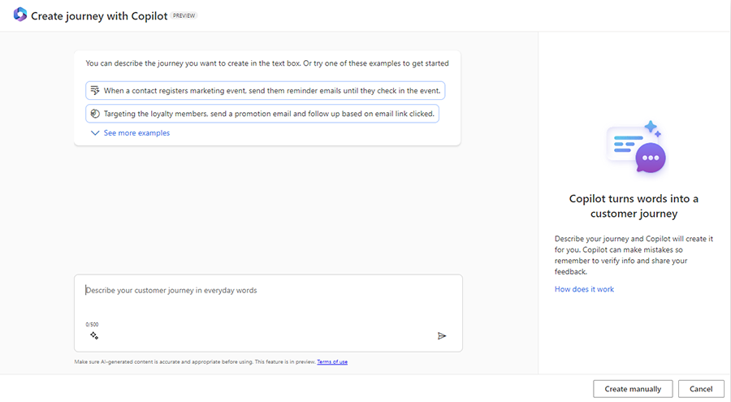
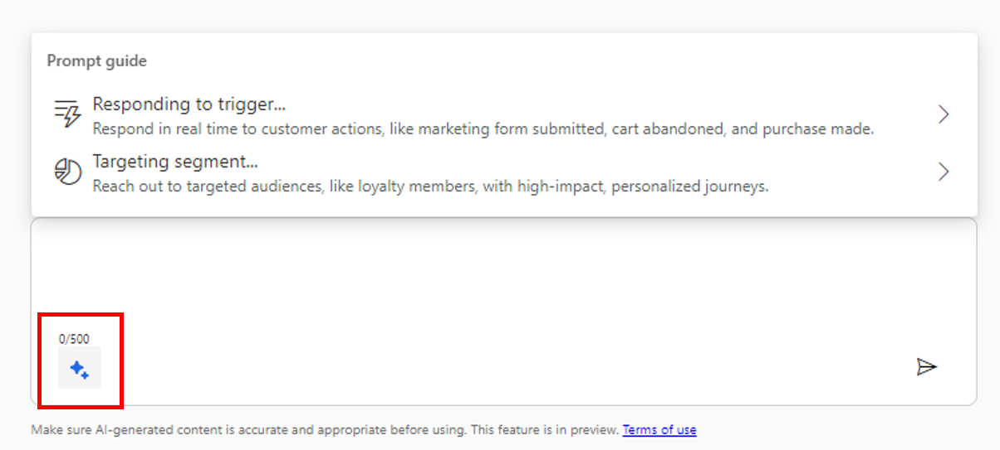
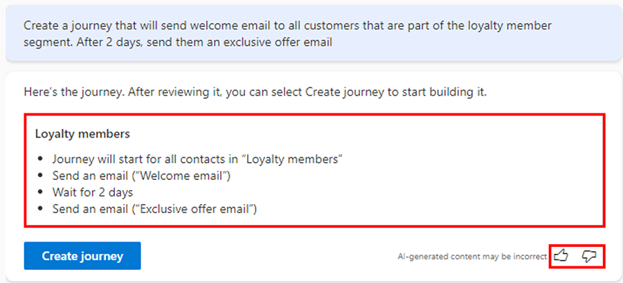
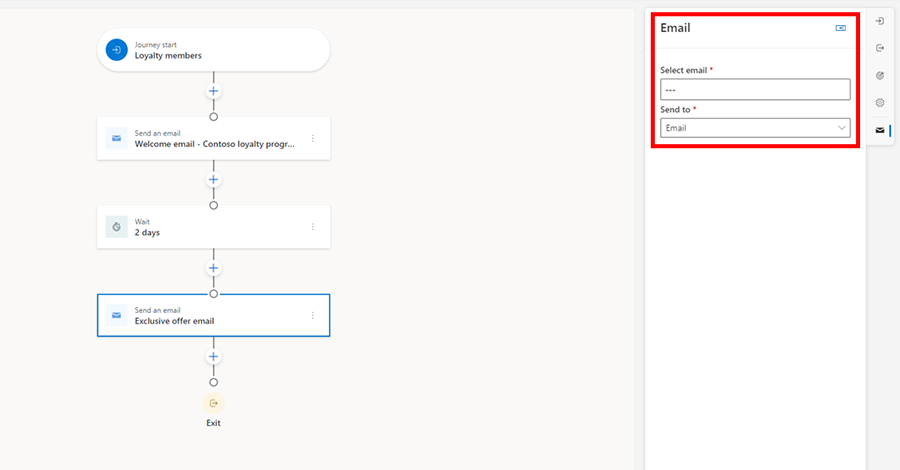

# Use Copilot to create journeys by describing them in their own words

With journey copilot, anyone can now use every day conversational language to create marketing journeys without requiring deep knowledge about the product. You can even improve the copilot by giving feedback, helping you achieve more detailed results in the future.

## Enable journey copilot

To use journey copilot, an administrator needs to enable the feature switch. To enable the switch:
1. Go to **Settings** > **Overview** > **Feature switches** > **Journey**.
1. Enable the journey copilot feature switch toggle, then select **Save** in the upper right.

> [!div class="mx-imgBorder"]
> 

> [!NOTE]
> Journey copilot is only available in the United States in the English language only.

## Use journey copilot

Now, let’s imagine you want to create a welcome journey for people who recently joined your loyalty program. To create a journey with Copilot, select the **Journey** tab under **Engagement**. Then select **New Journey**, which opens the journey copilot window.

> [!div class="mx-imgBorder"]
> 

At the top of the window, there are six suggested prompts to help you get started. To see all of the suggestions, select **See more examples**. You can also use the guided prompt experience by selecting the two star icon in the text entry window.

> [!div class="mx-imgBorder"]
> 

For this example, let’s say that you already have a prompt in mind for your campaign and input in “Create a journey that will send a welcome email to all customers that are part of the loyalty member segment. After two days, send them an exclusive offer email.”

Copilot processes the prompt and responds with a journey suggestion that includes the automatically detected segment and each subsequent step clearly.

> [!div class="mx-imgBorder"]
> 

Once you're satisfied with the suggested journey, select **Create journey** and the journey will be automatically created for you. You can use the icon for **thumbs up** and **thumbs down** on the right side to provide feedback on the copilot and help it improve over time.

As shown in the image below, Copilot automatically detected the **Loyalty members** segment. All you have left to do is add your content (selecting an email in this case), modify your condition if you wish, and then select **Publish**.

> [!div class="mx-imgBorder"]
> 
