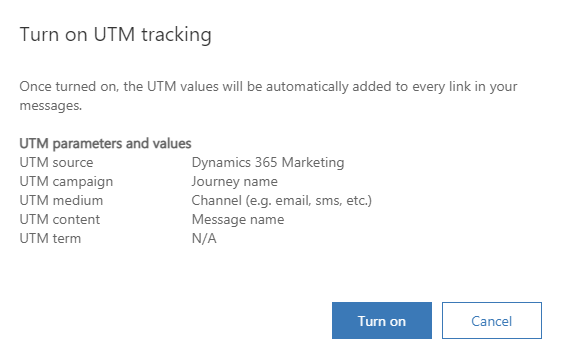
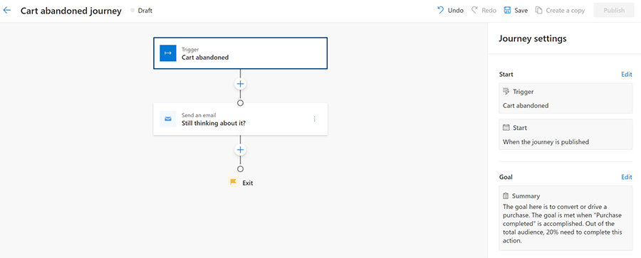
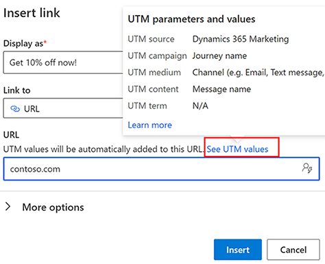
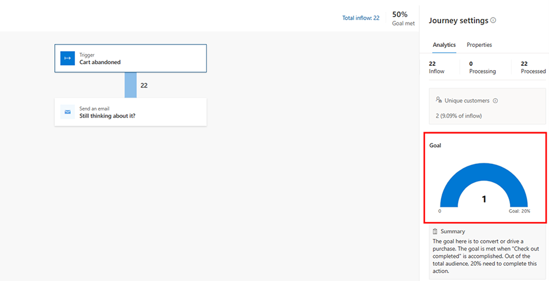
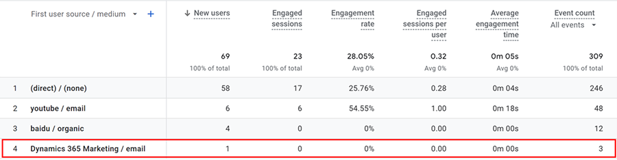
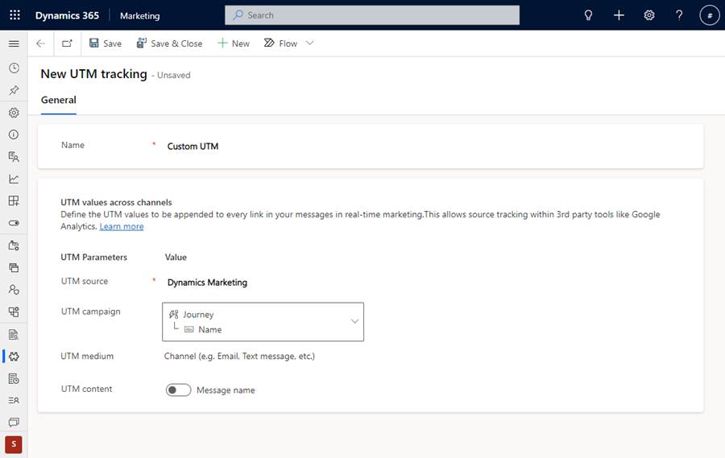
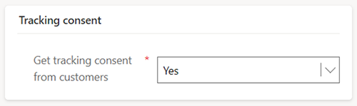
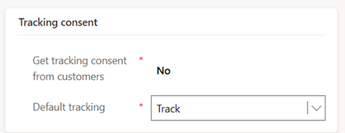

# Measure marketing effectiveness using UTM codes

[!INCLUDE[consolidated-sku-rtm-only](../includes/consolidated-sku-rtm-only.md)]

> [!VIDEO https://www.microsoft.com/videoplayer/embed/RW10UxA]

UTM (Urchin Tracking Module) codes are an essential tool for marketers as they allow them to track the effectiveness of their digital marketing. By adding UTM parameters to URLs, marketers can track the specific source, medium, and journey name that generated website visitors. Using UTM codes makes it easier to understand which journeys are driving the most traffic and conversions. The traffic and conversion information can then be used to optimize marketing strategies and allocate budget more effectively.

UTM codes also provide valuable insights into customer behavior. UTM codes can help identify which channels are most effective in generating traffic for your websites and landing pages, which enables you to attribute conversions to the right source.

## Enable UTM codes

To use UTM codes, an administrator needs to enable the UTM codes feature switch. To enable the switch:

1. Go to **Settings** > **Overview** > **Feature switches**.
1. Enable the **UTM tracking** feature switch toggle, then select **Save** in the upper right.

When enable UTM tracking, you'll see the default values for each UTM parameter. These are the values that will be added to all URLs that you add to your emails or text messages.

> [!div class="mx-imgBorder"]
> 

> [!TIP]
> It may take up to five minutes after enabling the feature switch toggle before the UTM settings are propagated across the channels.

> [!NOTE]
> UTM parameters are only added to emails that allow tracking. If you use a *restrictive* consent model, UTM Parameters are only added to your URLs if a Contact has a Contact Point Consent record for tracking and the status is **Opted In**. If you use a *non-restrictive* consent model, you can set the default tracking to **Track**. This will mean that even without a Contact Point Consent record, the UTM Parameters will be added to the URL within the email or SMS for all Contacts who go through your journeys.

## Use UTM codes in a journey

Imagine an abandoned cart scenario in which website visitors add items to their carts but leave your website without completing their purchases. By using UTM codes in your retargetting journey, you can reach out to the abandoned cart visitors and track the campaign (journey name), medium (channel), and content that results in customers returning to complete their purchases.

### Here’s how you would use UTM codes in an abandoned cart journey

First, create a journey that [targets visitors that abandoned their cart](real-time-marketing-trigger-based-journey.md). After the journey trigger, you'll add a reminder email that nudges visitors to complete the purchases. Because completing the purchase is the purpose of the journey, you can also [set a goal](real-time-marketing-business-goals.md) that measures success whenever a visitor completes a purchase.

> [!div class="mx-imgBorder"]
> 

To use UTM codes in the reminder email, go to **Emails** and select the email you plan to use in your abandoned cart journey. Add a URL to the email that directs your customers back to your website. In the **Add a link** window, you'll see the default values that will automatically be appended to every URL in your message, including unsubscribe.

> [!div class="mx-imgBorder"]
> 

In this case, the source value Dynamics 365 Marketing, the campaign value is the name of the abandoned cart journey, the medium is channel that you're using which is email, and the content is the name of the email.

Once your journey is live and customers start using your links, you'll be able to review insights including how many people clicked your link and how many successfully completed a purchase.

> [!div class="mx-imgBorder"]
> 

You can also use Google Analytics to determine how successful the email you sent was in driving traffic to your website.

> [!div class="mx-imgBorder"]
> 

## Customizing UTM links

After enabling the UTM code feature, you can customize UTM links by going to **Settings** > **Customer engagement** > **UTM tracking**.

To begin customizing your links, select the **+ New** button at the top of the page. Set the following parameters:

- **Name**: The name of your UTM record. 
- **Business unit** (if enabled): If business units are enabled, this shows you which business unit the UTM record is tied to. You can only create one UTM record per business unit.
- **UTM source**: You can change the UTM source to align with your existing naming convention.
- **UTM campaign**: If you've created a custom solution for a campaign, you can have UTM campaign point to the campaign entity.
- **UTM medium**: The channel that the UTM record is used on.
- **UTM content**: Captures UTM content as message name. If you turn it off, UTM content won't be added to the URL link.

To save your customize settings, select the **Save** button at the top of the screen.

> [!div class="mx-imgBorder"]
> 

## UTM parameters in Universal vs Google Analytics 4

Here's how to view UTM data in Google Universal Analytics and in Google Analytics 4:
- In Google Universal Analytics, go to **Acquisitions** > **All Campaigns**. Your default view is the list of all campaigns. 
- In Google Analytics 4, go to **Acquisitions** > **Traffic acquisitions**.

## Troubleshooting

If you've enabled the UTM feature switch and you don’t see any UTM parameters when you select a link in your inbox, check your **Compliance** settings.

If your compliance setting consent model is set to **Restrictive**, then (depending on how your **Tracking** consent is configured), this can mean that a user must explicitly opt in to having tracking links included in emails you send to them. If the system doesn't have consent to include tracking links, UTM codes won't be inserted into emails. The setting that controls how and if links include tracking query parameters is in the **Tracking Consent** section. Learn more: [Manage consent for email and text messages in real-time marketing](real-time-marketing-email-text-consent.md)

For example, if you're configured to “Get tracking consent from customers” and the consent model is **Restrictive**, then you need prior consent for tracking to include tracking links:

> [!div class="mx-imgBorder"]
> 

To guarantee that tracking links are always included (the links don’t require customer consent for tracking), the settings should look like this:

> [!div class="mx-imgBorder"]
> 

[!INCLUDE[footer-include](../includes/footer-banner.md)]
