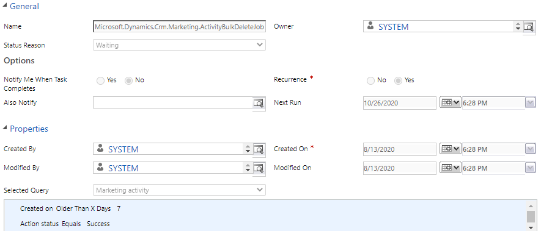

# Recurring activity bulk deletion in Dynamics 365 Marketing

## What is msdyncrm_mktactivity?

The **Marketing Activity** entity (msdyncrm_mktactivity) is used by Marketing Services to send system updates. Each activity is processed by the Marketing data plugin (Microsoft.Dynamics.Crm.MarketingPlugins.Plugins.Data), which then executes the designated action.

Activities are used across the entire Marketing app. The number and frequency of activities depend on the scale and patterns of usage of your Dynamics 365 Marketing implementation. After an activity is successfully executed, it is stored in Microsoft Dataverse, which, over time, can increase the database size.

## How are marketing activities automatically cleared?

To prevent the database size from increasing indefinitely, we have created recurring bulk deletion system jobs that delete old Marketing activity entities. The bulk deletion jobs are automatically deployed and are executed once per day, clearing activities that are older than seven days. The bulk deletion jobs include:

- *Microsoft.Dynamics.Crm.Marketing.ActivityBulkDeleteJob* to clear Marketing activities.
- *Microsoft.Dynamics.EventManagement.ActivityBulkDeleteJob* to clear event management-specific activities.

> [!div class="mx-imgBorder"]
> 

## Options to manually clear the table

The Marketing activity table varies in size, depending on your Marketing usage. If you are creating a large number of Marketing activities, you may want to clear the table more frequently than every seven days.

To clear the table more frequently, you can create additional recurring bulk deletion jobs. The table is safe to be truncated at any time. All data can be cleared, regardless of the age of the data. Data processing is synchronous; only successfully executed activities are stored.

[!INCLUDE[footer-include](../includes/footer-banner.md)]