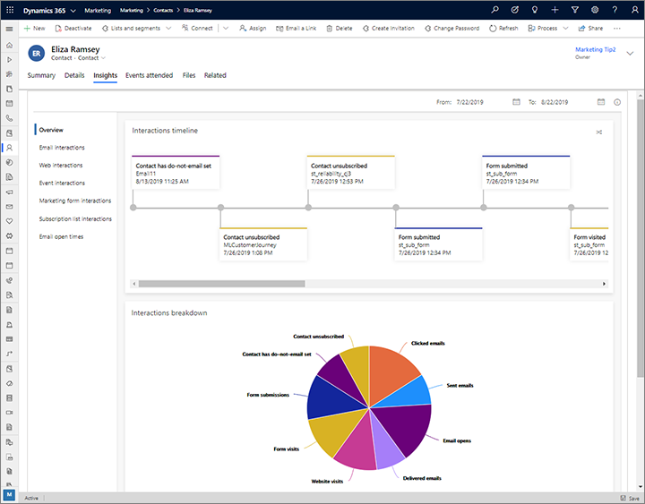
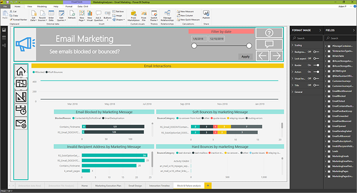
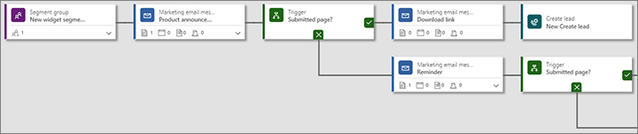
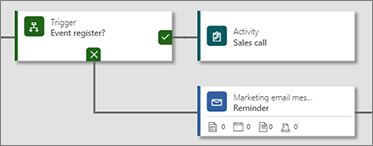
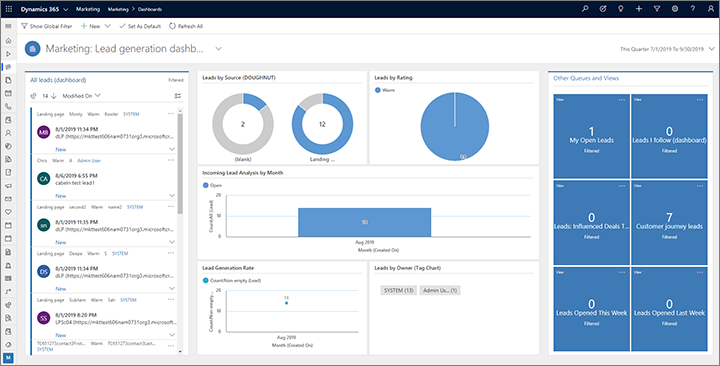
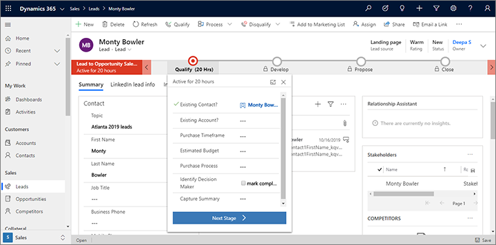

# Sales and marketing collaboration with Dynamics 365

Read this topic to learn how marketers and salespeople can collaborate through dedicated, optimized sales and marketing apps running on top of a unified platform. This topic provides an overview and many links that will show you:

- How marketers and salespeople can benefit by working on a common platform
- How salespeople can influence marketing campaigns
- How salespeople can access marketing results and entities
- How marketers and salespeople can collaborate on events
- How marketers and salespeople can collaborate on LinedIn campaigns
- An example scenario of end-to-end sales/marketing collaboration from inquiry to close

## The power of a unified platform for business apps

A key strength of model-driven apps in Dynamics 365 is that you can run multiple business apps on the same tenant, instance, and database. This enables professionals from across your organization to work with apps tailored to their specific needs while freely sharing data and processes with colleagues focusing on other parts of the business. Admins, customizers and developers have just one platform to learn, and customizations can apply everywhere. There is no need to set up complex data mappings or database connectors because common data for all apps is stored in a single, central repository.

When both marketers and salespeople have access to the same contact, lead, and account data, workers from both departments can collaborate throughout the marketing and sales funnels, bringing contacts from discovery, through nurturing, and on to qualification, opportunity and closure. With Dynamics 365, your organization can move from multiple single-purpose, siloed systems to a unified, collaborative process based on a single source of truth.

## Give salespeople influence over which contacts join which campaigns

Dynamics 365 Marketing enhances the contact entity by adding new command-bar buttons that enable salespeople (or anyone with access to contact records) to add or remove a displayed contact to or from any static segment. This enables salespeople, who know their contacts well but don't have full access to the segment entity, to add a contact to a campaign that the salesperson knows would interest that contact, or to remove a contact from a campaign that wouldn't interest them. Marketing people just need to let the salespeople know which segments map to which campaigns.

More information: [Manage segment memberships from a contact record](manage-segments-from-contacts.md)

## Share results and insights for all marketing activities

Dynamics 365 Marketing adds new **Insights** tabs to several core entities, including contacts, leads, and accounts, where both salespeople and marketers can view them. Even salespeople using the Outlook plugin alone will be able to see many of these insights. Similar insights are also provided for Marketing-specific entities like journeys, emails, segments, and lead-scoring models.

Each **Insights** tab provides a collection of KPIs, graphs, and analytics that give both marketers and salespeople valuable insights into how various marketing initiatives are performing, and how specific contacts, leads, and accounts are interacting with them.

Marketing insights can also be integrated into Dynamics 365 dashboards, where marketers and salespeople can get daily overviews and updates. You can even design sharable, custom Power BI reports that deliver exactly the information and analytics your organization needs based on the collected marketing insights and interaction data.

More information: [Analyze results to gain insights from your marketing activities](insights.md) and [Create custom analytics with Power BI](custom-analytics.md)

## Grant salespeople access to selected marketing entities

Dynamics 365 Marketing adds a wide range of marketing entities to the platform, including emails, journeys, pages, and more. Many of these are only interesting to marketers, but some might make sense to share with salespeople, depending on how they like to engage with their contacts. For example, customizers can modify the site map in Dynamics 365 Sales to include one or more relevant Marketing entities. Admins can also control permissions to various entities and assign them as needed across sales and marketing users.

More information: [Manage user accounts, licenses, and roles](admin-users-licenses-roles.md) and [Tutorial: Create a model-driven app site map for an app using the site map designer](https://docs.microsoft.com/powerapps/maker/model-driven-apps/create-site-map-app).

## A common platform to collaborate on events

Dynamics 365 Marketing includes a full events-management feature. It's not available separately, but when you have Dynamics 365 Marketing, you'll also be able to organize sales events with this feature, and share the relevant functionality with Sales users as needed.

More information: [Event planning and management](event-management.md)

## Collaborate on LinkedIn sales and marketing campaigns

LinkedIn is a social network that focuses on companies, professionals, and working life. It can be a great source for running targeted campaigns, exploring professional networks, generating new leads, and learning more about your customers. Dynamics 365 Sales and Dynamics 365 Marketing both offer several features for integrating LinkedIn with your marketing and sales initiatives.

- Both apps offer integration with LinkedIn Lead Gen Forms, which imports leads generated through LinkedIn campaigns into Dynamics 365.
- Dynamics 365 Marketing can create LinkedIn Matched Audiences, which find LinkedIn profiles that match contacts that are members of selected segments in Dynamics 365. This lets you run multi-channel campaigns that target the same collections of individuals on LinkedIn, email, and other custom channels available to customer journeys (such as SMS).
- Customer journeys in Dynamics 365 Marketing can monitor for contacts that submit LinkedIn Lead Gen Forms and include triggers that react to those submissions.
- Dynamics 365 Sales integrates with LinkedIn Sales Navigator, which enables salespeople to get to know their sales contacts even better through their LinkedIn profile information and connections.

These features provide rich opportunities for sales and marketing to collaborate while running campaigns and researching markets on LinkedIn. The add/remove contacts feature for salespeople enables them to include promising contacts in segments being used by Marketing to generate Matched Audiences on LinkedIn. And Salespeople using LinkedIn Sales Navigator can share insights with marketers that can help them design more effective segments and create more appealing marketing content.

More information: [Marketing on LinkedIn with Dynamics 365 Marketing](linkedin-overview.md) and [Integrate LinkedIn Sales Navigator solutions for Dynamics 365 Sales](../linkedin/integrate-sales-navigator.md)

## Collaborative sales and marketing: a scenario

Let's take a look at an example of how Dynamics 365 can help marketers and salespeople work together while finding customers for a newly released product. In this example, a company called Contoso already has an extensive database of contacts that have shown interest in, or purchased, one of their products before. These contacts already know and trust Contoso, so even though they probably haven't yet heard about the new product, many of them may be interested.

The process of launching the new product begins with a broad email campaign, which starts contacts down the funnel, and then eventually results in sales to those contacts who are most interested. The process could work as follows:

1. In Dynamics 365 Marketing, marketers [create a broad segment](segmentation-lists-subscriptions.md) that includes a large amount of contacts, but still makes a few demographic and firmographic choices to concentrate on those most likely to be interested in the new product.
1. A marketer [creates an email](prepare-marketing-emails.md) announcing the new product and inviting contacts to download a white paper about it.
1. A marketer [creates a landing page](create-deploy-marketing-pages.md) where contacts can sign up to download the paper. A link to this landing page is added to the email.
1. The marketer [creates a customer journey](customer-journeys-create-automated-campaigns.md) to implement an awareness campaign that includes the following:

    - A [segment group](customer-journey-tiles-reference.md#audience) that includes both the segment designed by the marketer and a static segment where salespeople can [manually add promising contacts](manage-segments-from-contacts.md) based on their knowledge about those contacts.
    - An [email tile](customer-journey-tiles-reference.md#actions) that delivers the promotional email to each member of the target segment.
    - An [If/then tile](customer-journey-tiles-reference.md#branches) that sorts contacts based on whether they submitted the landing page to receive the white paper.
    - After the If/then comes a second email that will deliver the link to download the paper to contacts who submitted the form. Following this is a [create-lead tile](customer-journey-tiles-reference.md#actions) that generates a lead for each of those contacts.

    

1. After a while, the awareness campaign will have generated a collection of leads that represent contacts that have expressed interest by downloading the white paper.
1. Marketers now create a nurturing campaign targeted at the leads generated by the awareness campaign. This journey might include events, surveys, contests, LinkedIn audiences and more.
1. Depending on how a customer flows through the nurturing journey, some branches could end with a [sales activity tile](customer-journey-tiles-reference.md#sales-activities) that assigns an activity, such as a phone call, to a salesperson. This gives the salesperson an opportunity to engage with especially promising contacts right away, even though they are still in the marketing funnel. Or you might instead use a [run workflow tile](customer-journey-tiles-reference.md#actions) to trigger an even more complex set of events when a contact lands at a certain destination in the journey.

    

1. Throughout this period, all of the new leads are still owned by marketing, and when marketers inspect a lead, they will see a [marketing-oriented business process](lead-lifecycle.md#lead-business-process). Marketers can use this business process to organize and track their work on each lead, for example through telemarketing engagement and other initiatives as the lead develops.

    

1. Salespeople can review the lead-generation dashboard and get visibility into all marketing initiatives that affect their contacts. They can add new contacts to the target segment if needed. They can also choose to jump in at any time they see a promising situation, or they can wait for full marketing qualification.

    

1. As the leads develop, [lead-scoring models](score-manage-leads.md) created by the marketer automatically increase (or decrease) each lead's score based on their interactions and activities. Activities such as website visits, email opens, event registrations, banner clicks, and more can all contribute to a lead's score. Eventually, the score will reach the sales-ready threshold chosen by the marketer. When this score is reached, the following occurs:

    - The lead is considered marketing qualified.
    - The lead is assigned to the appropriate salesperson based on custom logic in the system.
    - The lead is brought to the attention of the assigned salesperson. For example, it might appear on that salesperson's dashboard the next time they sign into Sales.

1. The right salesperson now opens and reviews the lead. The business process for the lead no longer shows the marketing process, but instead shows the sales-to-opportunity process.

    

1. The salesperson reviews the lead's interaction history and that of its related contact. The salesperson might also use [LinkedIn Sales Navigator](../linkedin/integrate-sales-navigator.md) to learn even more about the contact. The salesperson can now be very well prepared when they finally engage with the contact.
1. Salespeople and marketers can collaborate over an especially promising or valuable lead, either while working in Dynamics 365 or [while working on Microsoft Teams](../teams-integration/teams-integration.md), which can also show contact and lead records directly from Dynamics 365.
1. The salesperson follows the sales-to-opportunity process and eventually closes some sales. Based on this experience, the salesperson can [add more contacts](manage-segments-from-contacts.md) to the segments targeted by the awareness and/or nurturing campaigns.

[!INCLUDE[footer-include](../includes/footer-banner.md)]