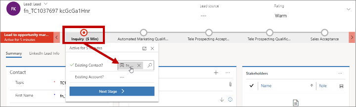
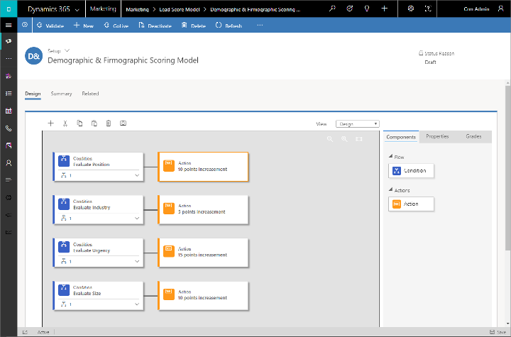
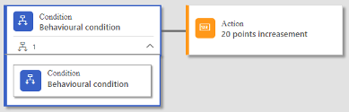
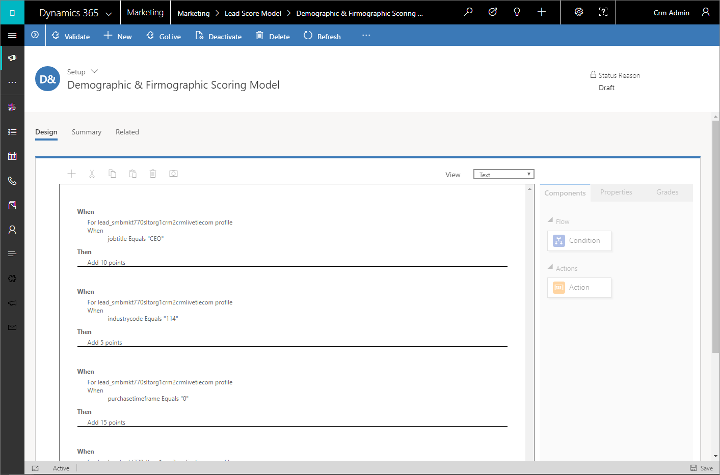
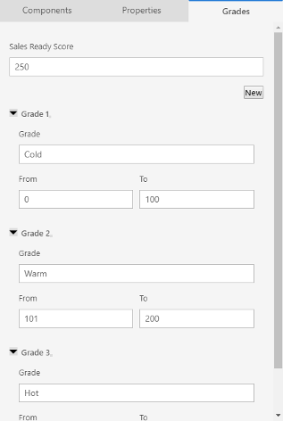
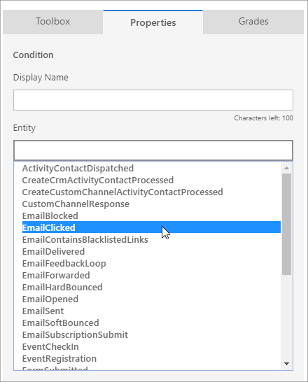
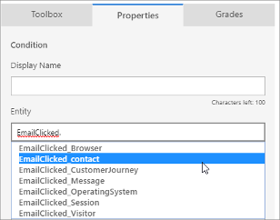
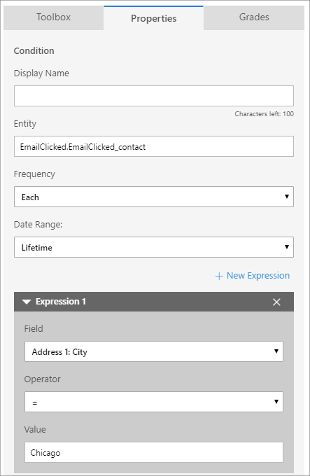
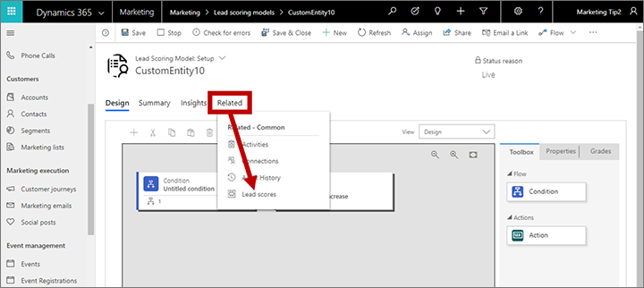

# Design lead-scoring models

<iframe src="https://www.microsoft.com/videoplayer/embed/ae6596f2-4df4-420e-9635-df776e4e5398" frameborder="0" allowfullscreen=""></iframe>

Dynamics 365 Marketing can calculate a score for each lead based on demographic details, firmographic details, and actions taken by the associated contact (or for account-based leads, contacts belonging to the associated account). Scorable interactions include, for example: opening an email, submitting a landing page, visiting your website, or attending an event.

Each scoring model includes a sales-ready threshold. When a lead's score passes this threshold, it gets marked as sales ready, which can trigger other events within Dynamics 365, including advancing the lead through its business process and alerting tele prospectors or salespeople to pick it up.

> [!IMPORTANT]
> Automatic lead scoring can introduce data-privacy issues that are regulated by laws such as the GDPR. It is your organization's responsibility to ensure that it is operating in full compliance with all relevant data-privacy regulations when you use lead scoring and all other features of Dynamics 365 Marketing. More information: [Data protection and the GDPR](gdpr.md)

## Lead-scoring prerequisites and requirements

The lead-scoring feature brings together many aspects of Dynamics 365 Marketing, including contacts, leads, customer journeys, marketing forms, interactions, insights, and more. Therefore, it's important that you understand a few things about the way the feature works and how you must configure and use your system to make it function as expected.

### Only leads associated with parent contacts or accounts can be scored

Automatic lead scoring only works for leads that are associated with a parent contact or an account. Scores won't appear for leads that don't have a parent contact or account associated with them.

For leads generated or updated by marketing forms configured to update both leads and contacts, the marketing form always finds or creates the records required to establish the lead/contact pair (but not all form configurations do this, as explained in the following section). Also, any user can manually associate a lead with a parent contact or parent account by opening the lead record and using the **Inquiry** stage of the **Lead to opportunity marketing sales process** business process. Here, the relevant fields are labeled **Existing contact?** and **Existing account?**, respectively.

In the database itself, the **Parent Contact for lead** lookup field of the lead entity identifies the associated contact, and the **Parent Account for lead** lookup field identifies the associated account. These are the same fields set by **Existing contact?** and **Existing account?** input fields of the **Lead to opportunity marketing sales process** business process. 

Also, segments in Dynamics 365 Marketing can only include contacts, not leads or accounts, which is another good reason to make sure all leads that you use for marketing have a contact or an account (with related contacts) associated with them.

### Form configuration can affect which leads and interactions are available for use with lead scoring

One major way that Dynamics 365 Marketing helps you generate new leads and contacts is through its marketing form and marketing page features. In a typical case, the solution works like this:

1. A Dynamics 365 user creates a marketing form, which defines a collection of fields and options to be presented to a known or prospective contact.
1. The Dynamics 365 user adds the marketing form to a marketing page design or embeds it on an external web page.
1. A known or prospective contact opens the page and submits the form.
1. Depending on how the form is configured, Dynamics 365 Marketing may update or create a lead and/or contact record based on the submission.
1. Dynamics 365 generates an interaction record for the form submission and associates it with the lead and/or contact based on how the form is configured. This interaction might be referenced by a lead-scoring model and therefore increase the related lead's score.

A standard form configuration allows the form to create and update both **Contacts and leads**. With this configuration, you'll always get new leads and interactions that have a contact correctly associated with them. However, you might also configure your marketing form so that it only creates/updates leads or only creates/updates contacts. Though these options can help prevent your lead or contact records from being updated unexpectedly, they can also interfere with automated lead scoring as follows:

- Forms set to update **Only leads** won't match, create, or update contact records. That means that leads created by these forms won't have any contact assigned and therefore won't be scored until one is assigned. Also, the interaction record generated for the form submission probably won't have a contact ID, which means that that interaction won't be available for scoring the lead even if you later associate the lead with a contact. (However, if a Dynamics 365 Marketing cookie is available on the contact's machine, this may be used to register the form-submission interaction with the contact identified by the cookie.)
- Forms set to **Only contacts** won't match, create, or update lead records. The form-submission interaction will still be correctly associated with the contact in all cases. Existing leads associated with the submitting contact can therefore be scored based on the submission, but if no lead exists, then the new or existing contact still won't have a lead and won't be scored because scores only apply to leads.

For more information about these settings and how they affect lead scoring, interaction records, and other aspects of Dynamics 365 Marketing, see [Create, view, and manage marketing forms](marketing-forms.md).

## Create, view, and manage your lead-scoring models

Lead-scoring models provide rules for how a lead's score will automatically increase or decrease based on specific activities and interactions, demographic information, and over time. The model also establishes a schedule of grades that characterize ranges of scores in plain language (such as hot, warm, and cold), and sets a specific score threshold as "sales ready", which means that the lead can now be forwarded to a salesperson.

A typical lead-scoring model would increase a lead's score slightly in response to a single email open or website visit, moderately in response to an email click or landing-page submission, and significantly in response to an event registration or attendance. The model could also stop counting interactions that happened some time ago, effectively reducing a lead's score as it ages. It might also increase or decrease a lead score based on information about the associated contact or company, such as location, purchase history, company size, industry, job title, and more.

You can create as many scoring models as you want. If you have more than one model, all leads will be scored according to each model and you'll be able to see the score and grade for each of them.

To view, edit, and create lead-scoring models, go to **Marketing** > **Lead management** > **Scoring models**. This opens a standard list view, where you can create, delete, search, sort, or filter items in the list. Select any item in the list to open it, or select **New** to create a new one.

You'll spend most of your time working on the **Design** tab, which opens when you first open or create the model. This is where you define the model's logic by dragging tiles from the **Toolbox** tab to the canvas to construct one or more condition/action tile pairs. Each pair starts with a **Condition** tile, which establishes a rule (such as email clicked) and ends with an **Action**, which defines how the score should be adjusted when the condition is met. Your model can include any number of condition/action pairs.

The scoring-model canvas is similar to the customer-journey canvas. Add tiles by dragging from the **Toolbox** tab. Select a tile and open the **Properties** tab to make settings for that tile. Use the toolbar above the canvas to cut, copy, paste, and delete a selected tile; you can also add a tile and take a snapshot from here.

### Name your model and choose the entity target

The first thing you should do when setting up a new lead-scoring model is to give it a name and choose which type of entity it will target (accounts or contacts). Proceed as follows:

1. Open the **Summary** tab.
1. Enter a descriptive name in the **Name** field.
1. Set the **Entity target** to **Account** or **Contact**. This setting establishes which type of leads the model will score.
    - *Contact-based leads* are associated with a contact record, and are scored based on information and interactions related to that contact only.
    - *Account-based leads* are associated with an account record. They are scored based on information from the account, plus information and interactions related to each contact that belongs to that account.
    - Leads associated with both a contact and an account are treated as contact-based leads.
1. Select **Save** to save your settings.

More information: [Account-based marketing](account-based-marketing.md)

### Set up a condition

The condition tile is a compound tile, which includes both parent and child tiles. When you add a condition, both the parent and one child are created. Use the expand/collapse button at the lower-right corner of the tile to show or hide the child tiles.

The parent condition tile just gives the condition group a name. Select the parent and open the **Properties** tab to assign the name. You can assign as many child conditions as you need by dragging additional condition tiles onto the parent.

> [!NOTE]
> All conditions belonging to the same parent are combined using an AND operator, which means that all sibling conditions must evaluate to TRUE for the attached action to be triggered.

The logic for the condition is contained in the child tile(s). Choose a child condition tile and open the **Properties** tab to establish the logic.

Set up the logic for a condition tile by making the following settings:

- **Display Name**: Shows the name for the tile, as shown on the canvas.
- **Entity**: Choose a Dynamics 365 entity to monitor or check for the condition. For example, choose **EmailClicked** to look for records where a contact has clicked a link in an email.
- **Frequency**: Choose how often the condition should be triggered. Choose **Each** to score on each occurrence (such as to increase the score on each email click). Choose **At least** to score just once (such as to increase the score on the first email click, but ignore subsequent ones). Choose **None** to score only when zero qualifying examples of the selected entity have occurred during the date range (for example, to lower the overall score for contacts having zero email clicks).
- **Date Range**: Enter a date before which scorable events won't be counted. For example, set this to a year to ignore all email interactions that occurred more than a year ago. This can result in scores going down over time as interactions age.
- **New Expression**: Select this button to add a new expression to the condition. The additional expression further tests the condition based on stored data. For example, you could add an expression for "City = New York", which would modify the condition so that only email clicks made by contacts in New York City would trigger the condition. You can add as many extra expressions as you like to create complex conditions.

    > [!NOTE]
    > All expressions belonging to the same condition are combined using an AND operator, which means that all expressions must evaluate to TRUE for the overall condition to be true. To score for all qualifying occurrences (for example, to score for any email open, regardless of message or journey) remove all expressions using their close box (including the expression added by default).

    > [!IMPORTANT]
    > [Calculated and rollup fields](../customerengagement/on-premises/developer/calculated-rollup-attributes.md) cannot be used in expressions.

There are two categories of conditions:

- *Fixed rules* are based on fixed demographic or firmographic data found in lead or contact records.
- *Behavior rules* are based on interactions like email clicked, event registered, or website visited.

### Set up an action

The action tile that comes after a condition tile controls how a lead's score will be modified when the condition is met. To set the action, select (or add) an action tile after a condition tile, then open the **Properties** tab, where you can set the score to either increase or decrease by any integer value.

### View all conditions at once as text

The canvas provides an easy, graphical way to assemble your scoring rules, but it leaves most settings hidden until you open a tile's **Properties**. To get a quick overview of all your logic, set the **View** drop-down list (above the canvas) to **Text**. This shows you a compact, text-based view of your rules, expressed in a way that's similar to an actual database query.

### Establish grades and the sales-ready score

The main reason for scoring leads is to provide a way to identify your best leads and to decide when a lead should be forwarded to a salesperson for more attention. Therefore, you'll nearly always set a sales-ready threshold for each lead-scoring model. You can also set up a schedule of grades as a way to offer an interpretation of the score (such as cold, warm, or hot) as it progresses toward sales-ready.

When a score reaches the sales-ready threshold, a plug-in automatically sets the sales-ready flag on the lead to **True**. If a lead is scored by multiple models, the flag is set as soon as any model reaches the threshold. This triggers a workflow called "Lead to Opportunity Stage Transition", which automatically moves the lead to the sales-acceptance stage of the lead lifecycle. You can customize this workflow as needed.

The grades and sales-ready score apply to the entire model, regardless of how many conditions it contains. To set them, open the **Grades** tab next to the canvas.

Enter an integer in the **Sales Ready Score** field to set the sales-ready score.

To add an additional grade, select **New**, which adds a new section to the tab, where you can enter a grade name and the score range where it applies. Grade ranges must be continuous and non-overlapping.

## Create advanced lead scoring conditions by using traversals

When you are setting up a condition tile for lead scoring, you can set up the **Entity** you are testing to include traversals across interactions and profiles by using a _dot notation_, where each hop is separated by a period. For example, you could start with an interaction such as _EmailClicked_ and traverse to the associated _Contact_ profile, and then test for values from the contact profile. Here's an example of how to set this up:

1. Open the **Properties** for a **Condition** tile. Then set the **Entity** to **EmailClicked**.  
    

1. In the **Entity** field, type a period after the **EmailClicked** entity you just added to open a new drop-down list that shows the various types of hops you can make from here. Choose **Contact** to hop to the contact profile.  
    

1. Now you can add **Expressions** to specify values that come from the contact record associated with each email click. For example, you might only want to score on clicks for contacts that live in Chicago.  
    

> [!NOTE]
> You can establish up to five hops by using this technique.

Here are a few more examples of how to use hops to create useful conditions:

* **Lead.Lead.Parent contact**: Lets you score leads associated with contacts who have particular properties (such as contacts who have a Microsoft email address&#8212;where <em>Email | contains | @microsoft.com</em>).
* **Lead.Parent contact.Parent customer account**: Lets you score leads associated with contacts who belong to accounts with particular properties (such as accounts where _Number of employees | > | 500_).
* **Lead.customeentity**: Lets you use a custom entity in your lead scoring model. The custom entity must have a 1:N relationship with the Lead entity and must be included to sync with the marketing-insights service in the [Marketing data configuration](mkt-settings-sync.md).

## Find leads that were scored by a selected model

To find all the leads that a selected model has scored:

1. Go to **Marketing** > **Lead management** > **Scoring models** to open a list of models and then open the one you want to inspect.

1. Select the **Related** tab to open a drop-down list of related entities and then select **Lead scores** from the list.

    

1. A new **Lead scores** tab is added and opened. Here you can see each lead that your selected model has scored, plus the score and grade for each of them. You can select any listed lead to open it, or select **Export lead scores** to download the list as an Excel file.

### See also

[Set up lead scoring](set-up-lead-scoring.md)  
[Register link clicks and website visits](register-engagement.md)  
[Manage customer information](manage-customer-information.md)  
[Accessibility and keyboard shortcuts](designer-shortcuts.md)  
[Go live with publishable entities and track their status](go-live.md)

[!INCLUDE[footer-include](../includes/footer-banner.md)]