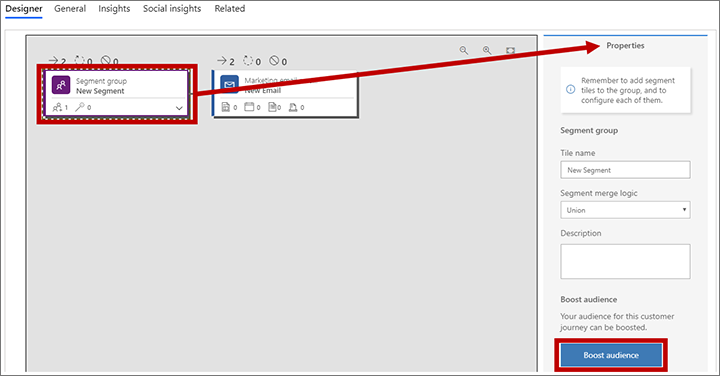
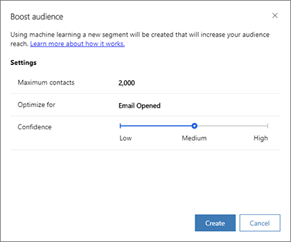
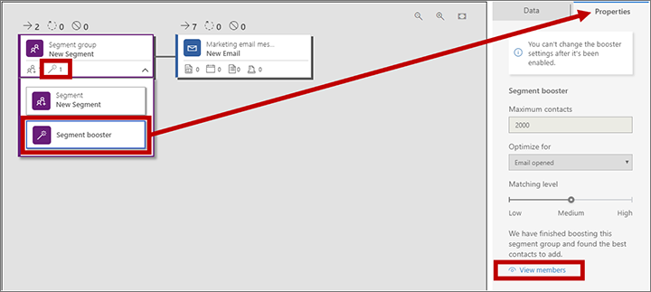

# Preview: Use segment boost to find and add promising contacts to a journey

> [!IMPORTANT]
> This is a preview feature. [!INCLUDE[cc_preview_features_definition](../includes/cc-preview-features-definition.md)]
> [!INCLUDE[cc_preview_features_no_MS_support](../includes/cc-preview-features-no-ms-support.md)]  

Segment boost uses AI to analyze your contact database to identify the best contacts to add to a running customer journey.

> [!NOTE]
> Before you can use segment boost, your admin must enable and configure it. If you don't see the features described in this topic, then please ask your admin to enable segment boost for your site. More information: [Enable and configure artificial intelligence features](admin-machine-learning.md)

To enable segment boost for an existing customer journey:

1. Go to **Marketing** > **Marketing execution** > **Customer journeys**, and then either create or open a journey.

1. When you're done designing the journey, select **Go Live** from the command bar if the journey isn't live already. (You can only enable segment boost for journeys that are already live.)

1. Select **Edit** on the command bar to put your journey in the live-edit state.

1. On the **Designer** tab, select the **Segment group** tile that starts the journey, go to the **Properties** panel, and select the **Boost audience** button.

    

1. The **Boost audience** dialog opens.

    

    Make the following settings here:

    - **Maximum contacts**: Set the maximum number of contacts that you'd like the feature to add to your target segment (it may add fewer). The AI will first rank the found contacts by confidence (best matches rank highest), so if more than this number of contacts is found, then the best of those will be included.
    - **Optimize for** : When finding your most engaged contacts, choose which type of email interaction to consider more heavily: **Email opens** or **Email clicks**.
    - **Confidence** : Choose the minimum level of confidence required for a contact to be added ( **Low** , **Medium** , or **High** ). A high-confidence match is one that the AI considers best according to the criteria it is using. If you set this to **High**, then you'll probably find fewer (but better) matches than if you set it to **Low** ( **Medium** is in between).

    Select **Create** to add the segment-boost segment to your segment group.

1. Select **Go live** on the command bar. Your journey now returns to the live state and the segment boost begins finding new contacts to add to  your journey.

1. Segment boost is now enabled for your customer journey.

    

    Note the following:

    - When segment boost is enabled, the segment group tile indicates this by showing a "1" next to the "magic wand" icon . It shows a zero when the feature is disabled. You can have at most one segment booster segment.
    - When segment boost is enabled, you'll see a segment called **Segment booster** nested under the segment group.
    - To view the list of contacts added by the segment booster, expand the segment group tile, select the **Segment booster** segment and open its **Properties** panel. Then select **View members** from this **Properties** panel.
    - To view the segment boost settings (read only), expand the segment group tile, select the **Segment booster** segment and open the **Properties** panel.
    - As a shortcut to the booster settings and members link, you can instead select the segment group tile (with or without expanding it), open the **Properties** panel and then select the **View booster properties** link at the bottom of the panel.
    - The members of the **Segment booster** segment never include contacts already included in the other segments; it only includes new contacts found and added to the journey by the AI.
