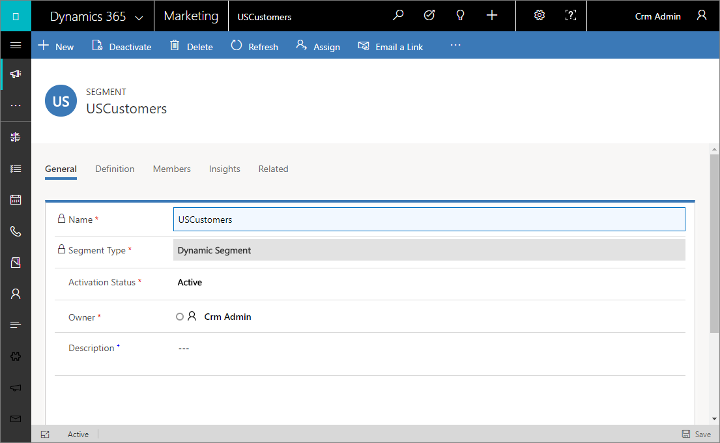
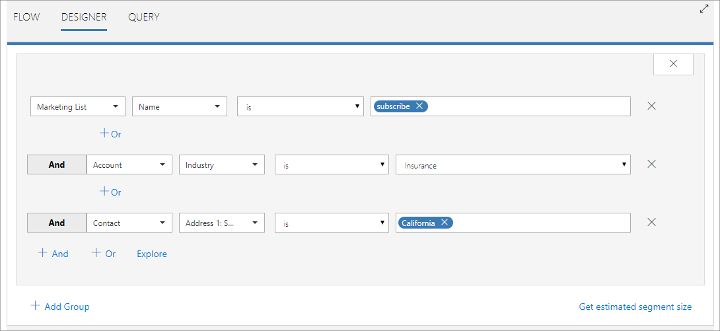
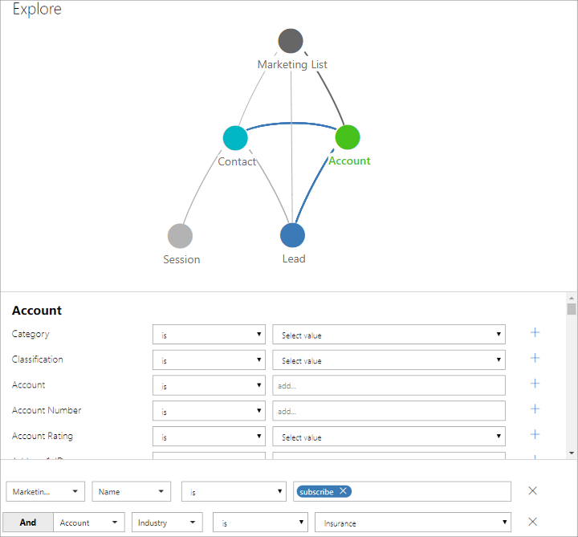
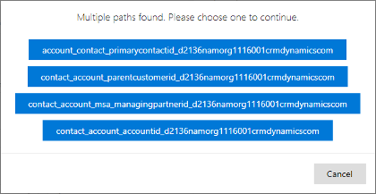

# Market segmentation, marketing lists, and subscription lists

[!INCLUDE[cc_applies_to_update_9_0_0](../includes/cc_applies_to_update_9_0_0.md)]

[!INCLUDE[cc-beta-prerelease-disclaimer](../includes/cc-beta-prerelease-disclaimer.md)]

This topic explains how to define your various target groups by setting up segments and lists. Each list or segment represents a collection of contacts that you can use to target a customer journey. You'll also use marketing lists in your subscription center to enable contacts to manually opt-in or opt-out of various types of newsletters and other marketing communications.

## Segments in [!INCLUDE[pn-marketing-business-app-module-name](../includes/pn-marketing-business-app-module-name.md)]

A market segment is the collection of contacts that you target in a marketing campaign. In some cases, you'll simply target all the contacts you have, but in most cases, you'll choose who you want to target based on demographic or firmographic data and other considerations. For example, if you're opening a new store in San Francisco, you'll probably promote the opening-day event at that store only to contacts who live near San Francisco. Or if you are running a sale on dresses, you might only send related marketing email messages to your contacts who are female. Decisions like these will typically also affect the way you communicate with the segment in terms of which channels you'll choose, what kind of graphics you'll pick, which kinds of arguments you make, and more.

[!INCLUDE[pn-marketing-business-app-module-name](../includes/pn-marketing-business-app-module-name.md)] uses segments in two important ways:

- **Customer journeys**: Most customer journeys start with a segment tile, which establishes the collection of contacts who will experience that journey. You can combine multiple segments here.
- **Subscription lists**: Subscription lists are static lists that contacts can add themselves to (or remove themselves from) by using a subscription center.

Segments can be dynamic, static, or compound.

- *Dynamics segments* are set up by using logical expressions, such as "all contacts from New York" or "all contacts who like The Mets." Membership in dynamic segments changes constantly to reflect new or removed contacts and updated contact information.
- *Static segments* establish a static list of contacts that are selected on a per-contact basis rather than created logically based on field values. Marketing and sales people might create and populate a static list based on private knowledge or offline interactions. Contacts can add or remove themselves from static segments by using a subscription center, which provides a list of available mailing lists (each of which is a static segment). In [!INCLUDE[pn-marketing-business-app-module-name](../includes/pn-marketing-business-app-module-name.md)], you'll base your static segments on lists created by using the marketing lists feature; more on this later.
- *Compound segments* combine static and dynamic criteria. They contain all contacts who match the dynamic criteria, plus all contacts added explicitly (as to a static list).

[!INCLUDE[pn-marketing-business-app-module-name](../includes/pn-marketing-business-app-module-name.md)] works together with another product called *[!INCLUDE[pn-customer-insights-full](../includes/pn-customer-insights-full.md)]* to provide advanced segment definitions and customer analytics. The integration is seamless and results in powerful combined functionality when the two systems work together. Your contact records and marketing lists are continuously synchronized between the two systems, which lets [!INCLUDE[pn-customer-insights-short](../includes/pn-customer-insights-short.md)] apply its powerful data processing and analytical tools to your contacts, and combine these with information from other types of [!INCLUDE[pn-microsoftcrm](../includes/pn-microsoftcrm.md)] records and information from other systems. You can also access [!INCLUDE[pn-customer-insights-short](../includes/pn-customer-insights-short.md)] directly to make use of its additional analytical tools and other features. For more information, see the [Customer Insights online help](https://go.microsoft.com/fwlink/p/?linkid=863946).

## View, create, and manage your segments

To work with your segments, go to **Marketing** &gt; **Customers** &gt; **Segments**. This opens a standard list view, which you can use to search, sort, filter, create, and delete your segments. Open any segment to view its details.

Segment records provide several tabs for describing, defining, and reviewing the segment. Tabs are shown as a set of headings under the header, which shows the name of the segment. Select any of these headings to go to the relevant tab. Each tab is described briefly in the following subsections.

### The General tab

The **General** tab provides general information about the segment, including:

- **Name**: Enter a name that will make the segment easy for you and others to identify while working in [!INCLUDE[pn-microsoftcrm](../includes/pn-microsoftcrm.md)].
- **Segment Type**: Set the segment to dynamic, marketing list, or compound. Dynamics segments are populated logically, based on a query you create on the **Definition** tab. Marketing lists (also called "static lists") are populated by choosing individual members, and are also used to create subscription lists on subscription centers, where contacts can add or remove themselves. Compound segments combine static and dynamic criteria.
- **Activation Status**: Enable or disable the segment. Only enabled segments are available for use elsewhere in [!INCLUDE[pn-microsoftcrm](../includes/pn-microsoftcrm.md)]. You might disable a segment if you don't need it anymore, or to keep people from using it until you have finished developing it.

### The Definition tab

Use the **Definition** tab to establish membership of the segment. For dynamic segments, you'll get a query builder here. For marketing lists, you'll be able to choose from lists created in [!INCLUDE[pn-microsoftcrm](../includes/pn-microsoftcrm.md)] and synchronized to [!INCLUDE[pn-customer-insights-short](../includes/pn-customer-insights-short.md)].

The settings on this tab are described in more detail later in this topic.

### The Related tab

This is actually a drop-down list that you can use to find other types of records (such as customer journeys) that use or reference the current segment. When you choose an entity name here, a new tab named for that entity opens, showing a list of all found records. The **Related** tab remains available, and you can still use it to find other types of records that reference the current segment.

## Set up marketing lists for use with static segments and subscription centers

As mentioned earlier in this topic, static segments are populated by adding contacts explicitly, one at a time, rather than by establishing logical rules (such as "all contacts from North Carolina"). This is especially important for creating lists for use in subscription centers, where contacts can add or remove themselves from each subscription list. But you could also create and populate static lists for other uses.

Use the marketing lists feature to set up a static list, which the system will automatically synchronize with [!INCLUDE[pn-customer-insights-short](../includes/pn-customer-insights-short.md)]. After you've set up the marketing list, you'll be able to use it to create your static or compound segments for use in customer journeys.

For details about how to create marketing lists and use them in subscription centers and segments, see [Set up subscription lists and subscription centers](set-up-subscription-center.md).

## Build a segment definition

Use the **Definition** tab to build your segment by combing _groups_ of _logical expressions_, each of which results in a set of contacts. Each group establishes a _path_ through one or more entities that must end at the **Contact** entity (the order matters).

### Define a segment group

Each group in your segment results in a list of contacts, which are selected by the logic define in that group. For example, you might build a path as follows:

1. Start with the **Marketing List** entity to find a marketing list named "subscribers".
1. Continue to the **Accounts** entity to find the accounts from that list, and find only companies working in the insurance industry.
1. End at the **Contacts** entity to find the contacts from those accounts, and find only contacts living in California.

Because the path ends with contacts, the result is a list of contacts that live in California and work for insurance companies that are on the "subscribers" list. (Many segment groups that you create will probably query the **Contacts** entity only, but even groups such as these might employ complex logic that combines multiple AND and OR clauses.)

When working in the **Designer** view, you can build this query using the **+ And** buttons and various drop-down lists to produce the following:

Another way to work here is to use the **Explore** view, which provides a graphical map of the path you are creating. To use that view, choose the **Explore** button for a group on the **Definition** tab. (It's also available on the **Flow** tab; more on that later.)

The map at the top of the explorer shows the entities that are available for use when creating segments. The map updates as you build your query group to indicate which paths are still valid. It uses the following colors and line weights to indicate this:

- **Turquoise circle**: marks the target entity—all paths must end here (currently, always **Contact**).
- **Green circle**: marks the currently selected entity. The attributes belonging to this entity are listed below the map. Use the drop-down lists and input fields here to build a query that finds the desired records from the selected entity. After setting up a row, click the + button on the right side to add that expression to the query.
- **Blue circles**: mark entities that are not yet used, but still available.
- **Gray circles**: mark entities that are no longer selectable because of settings you have already made for the current path.
- **Blue, bold lines**: mark paths that are not yet used, but still available.
- **Gray, bold lines**: mark paths that are already part of the query.
- **Gray, thin lines**: mark paths that are no longer available because of settings you have already made.

Close the **Explore** view by choosing **OK**. Your resulting query is then shown in the **Designer**, just as though you had created it there (as shown previously).

> [!NOTE]
> In the language of [!INCLUDE[pn-customer-insights-full](../includes/pn-customer-insights-full.md)], _entities_ are often referred to as _profiles_.

The following image shows the previous query midway through construction, where we are adding the account criterion. Note how the map colors indicate where you are, where you've been, and what you can do next (and what you can't).

> [!NOTE]
> On adding the final **Contacts** entity to the expression we've been describing in this example, you'll be asked to choose which of the available paths to use.
> 
> 
> 
> The correct one is **contact\_account\_accountid\__\<suffix\>_**, which establishes how the contact entity relates to the account entity.

### Combine segment groups

A simple segment might have just one group, but you can create and combine as many groups a need. As a result, you can create highly sophisticated queries into your [!INCLUDE[pn-customer-insights-short](../includes/pn-customer-insights-short.md)] database.

You combine groups, working first group to last, using the following operators:

- **Union**: combines all members of a group with the results of the previous group.
- **Exclude**: removes members of a group from the results of the previous group.
- **Intersect**: removes all members from the previous group that are not also members of the current group.

When you're working on the **Designer** tab, use the **+ Add Group** button to add a group and choose its operator.

The **Flow** tab provides another view of how your groups are combined. Here, you get a Sankey diagram of how your groups combine, and how contacts flow into and out of the segment as a result of the operation from each group.

You can also add new groups while working on the **Flow** tab, which provides the same **Explore** view described previously for defining the group.

## Create segments based on opportunities

The default [!INCLUDE[pn-marketing-app-module](../includes/pn-marketing-app-module.md)] setup does not sync opportunities with [!INCLUDE[pn-customer-insights-short](../includes/pn-customer-insights-short.md)], which means that opportunities are not initially included in the segment builder, but you can add them.

> [!IMPORTANT]
> Once you add a new entity to [!INCLUDE[pn-customer-insights-short](../includes/pn-customer-insights-short.md)], it will continue to sync and  consume storage space there and can't be removed again. You should only add those entities you are sure you will need.

Once opportunities are added, you'll be able to create segments that query the opportunities entity and find contacts associated with those opportunities.

### Sync opportunities with Customer Insights
If your Marketing instance isn't already set up to sync opportunities with Customer Insights, then talk to your admin about setting this up as follows:

1.	Go to **Settings > Marketing > Customer Insight Sync**. (Admin privileges required.)

1. The **Customer Insight Sync** page shows a list of check boxes, with one for each entity that you could sync with [!INCLUDE[pn-customer-insights-short](../includes/pn-customer-insights-short.md)]. Find **Opportunity (opportunity)** in the list and mark its check box (if it isn't already).

1.	Choose **Publish Changes** to apply your setting.

Allow some time for the new setting to propagate and the sync to complete.
Once the settings have propagated, you will be able to see the opportunity entity in your segment designer, and can use it to define segments by applying techniques similar to those described earlier in this topic. An example is given in the following section.

### An example of a segment that includes opportunities

Here is an example of how to define a segment that starts by finding a collection of opportunities and, as usual, ends by finding the contacts that belong to that segment. In this example, we'll find contacts associated with opportunities valued over $10,000.

1.	Create a new segment (or edit an existing one) as described earlier in this topic and go to the **Designer** tab.

1.	Start with an empty group. If you are creating a new segment with just one group, then remove the default group by choosing its close box; otherwise, choose **Add Group** to create your new group.

1.	Your group should now start with a drop-down list set to **Select a profile or relationship**. Choose **Opportunity** here, and then complete the row to create  
**Opportunity | Total Amount | Greater than or Equal To | 10000**.  
    

1.	Choose **+And** to add a new clause to the group. Now you must choose the relation between the opportunity entity and the contact entity, which is where we need to end up. Choose **opportunity&#95;contact&#95;customerid&#95;_&lt;suffix&gt;_** and set it to **All&#42;**.  
    

1.	Choose **+And** to add a final clause to the group, which must end with the contact entity. Set the new clause to use the **contact&#95;_&lt;suffix&gt;_** entity and set it to **All&#42;** to find all contacts associated with the selected opportunities.  
    

1.	Your group will now find contacts associated with opportunities valued over $10,000.

> [!NOTE]
> If you leave the **Designer** tab and then come back, you'll notice that the middle (relation) clause has disappeared. Don't worry, it's still there in the background (and you can still see it on the **Query** tab) but the interface hides it to make the group easier to read.

### See also

[Create a segment](create-segment.md)  
[Set up subscription lists and subscription centers](set-up-subscription-center.md)