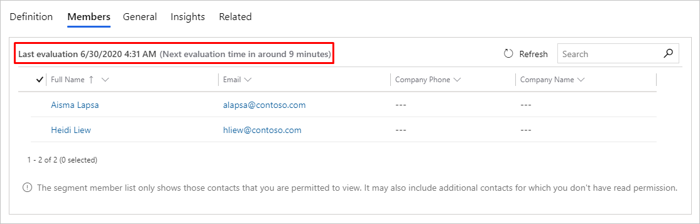

# Working with segments

Segments let you create groups of related contacts that you can target with customer journeys. Segments are created using the segment designer. One way to build segments is by querying across related entities including contacts, leads, accounts, events, marketing lists, and more. You can also query the marketing-insights service to find contacts that have engaged with your marketing initiatives. The marketing-insights service also allows you to query contacts that you aren't reaching because of issues such as email bounces.

The segment designer resembles other querying tools found in Dynamics 365 (such as the advanced-find feature), but is more flexible and powerful. The segment designer is the only tool that lets you query interaction records from the marketing-insights service.

> [!NOTE]
> Marketing *segments* are different than marketing *lists*. More information: [Marketing segments vs. marketing lists](segments-vs-lists.md)

## Segments in Dynamics 365 Marketing

A market segment is a collection of contacts that you target with a customer journey. In some cases, you'll target all the contacts you have. But in most cases, you'll choose who you want to target based on demographic, firmographic, behavioral data, and other considerations.

For example, if you're opening a new store in San Francisco, you'll probably promote the opening day event only to contacts who live near San Francisco. Or, if you're running a sale on dresses, you might only send related marketing email messages to your contacts who are female. You may want to target the contacts who have shown interest in the dresses in the past. In this case, you can narrow the segment by only targeting contacts who have opened emails related to dresses in the past. Decisions like these will affect how you communicate with the segment. These decisions will also influence which channels you'll choose, what kind of graphics you'll pick, which kinds of arguments you make, and more.

### Types of segments

Segments can be dynamic or static.

- *Dynamic segments* are set up by using logical expressions, such as "all contacts from New York" or "all contacts who like The Mets." Membership in dynamic segments changes constantly to reflect new or removed contacts and updated contact information. Both demographic and firmographic segments are examples of dynamic segments.
- *Static segments* establish a static list of contacts who are selected on a per-contact basis rather than created logically based on field values. Marketers and salespeople might create and populate a static list based on private knowledge or offline interactions.

Segments can have blocks of queries based on profiles, interactions, or other segments.

- *Profile blocks* query the _profile_ records stored in the marketing-insights service. Profiles records are synced between your Dynamics 365 organizational database and the marketing-insights service. Profile records include the entities you normally work with in the Dynamics 365 UI, such as contacts, accounts, leads, and any other entities that you [choose to sync](mkt-settings-sync.md).
- *Behavioral blocks* query the _interaction_ records stored in the marketing-insights service. Each of these records is generated automatically and related to a specific contact record. Interaction records are accessed to generate various insights displays in the Dynamics 365 Marketing UI. Interaction records _aren't_ synced to the Dynamics 365 organizational database. They are generated in response to contact interactions such as opening an email, clicking an email link, submitting a form, or registering for an event.

### Segments are synced with the marketing-insights service

Dynamics 365 Marketing works together with the marketing-insights service, which operates using its own marketing-insights database to provide advanced segment definitions and customer analytics. The integration results in powerful combined functionality when the two systems work together. Your contact records and marketing lists are continuously synchronized between the two systems, which lets the marketing-insights service apply its powerful data processing and analytical tools to your contacts, and combine this information with data from other types of Dynamics 365 records.

> [!IMPORTANT]
> The marketing-insights service processes changes to segment membership asynchronously, which means you can't predict the order in which changes are processed. In some cases, such as when processing very large databases, it can take up to six hours for a given segment to update. You therefore can't rely on any one segment being processed before or after a specific other segment, so be careful when orchestrating related campaigns or using  [suppression segments](customer-journeys-create-automated-campaigns.md#suppression-segment).

### Segments must be live before you can use them

When you first create a new segment, it is in a _draft_ state, which means that it is unlocked so you can work with its definition and other settings, but you won't be able to use it in customer journeys. When you are ready to use your segment, you must open it and select **Go Live** from the command bar, which enables it and moves to the _live_ state.

> [!IMPORTANT]
> While you are designing your segment, you can select the **Get estimated segment size** link to get an *estimate* for the number of contacts that will be included in the segment. Usually the estimate will be exact, but sometimes the final size may vary slightly (you must go live with the segment to view its exact size and membership).

If you need to edit a segment after it has gone live, open it and then select **Edit** from the command bar to put it into the "Live, Editable" state or **Stop** from the command bar to put it back into the "Draft" state.

More information: [Go live with publishable entities and track their status](go-live.md)

## View and manage your segments

To work with your segments, go to **Marketing** > **Customers** > **Segments**. This opens a standard list view, which you can use to search, sort, filter, create, and delete your segments. Open any segment to view its details, or select **New** to create a new one.

## Create and go live with a new segment

Read this section to get a basic overview of how to create a segment and start it running so you can see its members and use it to target a customer journey.

1. Go to **Marketing** >**Customers** > **Segments** to open a list of current segments.

1. Select **New** to start creating your new segment, and select the type of segment you would like to create:

  - **Dynamic segment**: Creates a dynamic segment that can query contact records and interaction records, as well as include, intersect, or exclude contacts in existing segments. While querying contact records, you can add relations as needed to create a more complex query.
  - **Static segment**: Creates a segment where you manually select each member rather than creating a logical query that automatically adds them. For details about how to work with this kind of segment, see [Design static segments](segments-static.md)

3. If you selected a **dynamic segment**: The **Segment template** dialog box opens, showing a list of available [templates](segments-templates.md). Each template provides a fully or partially defined query designed for a particular purpose, as indicated by the template name. Select any template to read more information about it in the information panel. **Filter** and **Search** features are provided to help you find the template you're looking for. Select a listed template and then choose **Select** to load the template, or choose **Cancel** to start building a new segment from scratch.

    

  - If you selected a template, your template will load and you skip this step. If you selected **Cancel** on the **Segment template** dialog, a blank designer opens, allowing you to start your segmentation from scratch. You can begin by selecting a query block (referred to as a profile block above, an interaction block, or a segment. You can add other blocks to this block, and pick the relationship between the blocks. You can choose contacts that appear in either of the blocks by selecting "or," contacts that appear in both blocks by selecting "and also," or contacts that appear in the first block but not in the second by selecting "but not."
  - Next, the segment designer opens, showing settings and tools that are appropriate for your selection or template. Start by naming your segment at the top of the segmentation canvas.

4. If you selected a **static segment**: A quick create menu appears, asking you to set a name for the segment and select a few primary options. You can create a description for the segment, select the timezone of the segment, and select if the [scope](#the-general-tab) of the contacts queried for the segment includes the entire organization or just your business unit.

  - In the static segment designer, you can handpick contacts individually by selecting the "Add" button on the "General" tab.
  - You can also use a query to quickly filter your contacts, and then select some (or all) of them to be added to your static segment by selecting the **Add by Query** button. Similarly, you can use a query to quickly select certain contacts that you want to remove from a segment by selecting the **Remove by Query** button.
    - Using queries to add or remove members from the static segment: When the "Add by Query" or "Remove by Query" option is selected, the Manage Segment Members dialog opens. Here you can craft queries based on contact properties, as well as properties of entities related to the contact (Account, Lead, Event Registration) to fetch a list of contacts who fit that query. **Note that these contacts have not yet been added to your static segment.**
    - You can select one or multiple contacts from the query results and click on the **Add selected** button to add them to the segment. If you are removing segment members, click the **Remove selected** button. You can also add/remove all the contacts that your query fetched by selecting the **Add all** or **Remove all** button.
    - If you would like to edit the query that fetched the list of contacts, click on the **Edit query** button.

5. Select **Save** on the toolbar to save your segment.

1. Use the tools provided by the designer to establish your segment membership criteria, as described elsewhere in this topic, for your selected segment type.

1. When you're done designing the segment, select **Go live** on the toolbar to start running the segment, find all of its members (as needed), and make it available for use with your customer journeys. Once your segment is live, it will include a **Members** tab, where you can go to see exactly which contacts are part of the segment.

> [!NOTE]
> After you go live with a dynamic segment, you can check when it was last evaluated and the next evaluation time at top of the segment **Members** tab.
>
> 

## Tabs and settings for segments

Tabs are shown as a set of headings under the header, which shows the name of the segment. Select any of these headings to go to the relevant tab. Each tab is described briefly in the following subsections.

### The Definition tab

Use the **Definition** tab to establish the membership of the segment. For dynamic segments, you'll find a query builder here. For static segments, you'll select specific contacts one at a time.

### The General tab

The **General** tab provides a few basic settings and general information about the segment. Many of the values here are established when you first create the segment and then become read only. Some fields are only present if your application is configured to use them. All fields are read-only when the segment is live. The fields you see may include some or all of the following:

- **Name**: The name of the segment as it appears in the segment list and when selecting segments for a customer journey.
- **Created on**: The date the segment was created.
- **Segment Type**: Shows the [segment type](#segment-types) (dynamic or static). This is permanently established when you first [create the segment](#create-segment).
- **External source**: For segments that are synced from an external source, such as Dynamics 365 Customer Insights, information about the external source is shown here.
- **External segment URL**: For segments that are synced from an external source, such as Dynamics 365 Customer Insights, the URL of the external source is shown here.
- **Time Zone**: Shows the time zone of the segment. This is the timezone that the segment uses to calculate dates relative to the current time. For example, if you choose the partial date operator "All contacts who registered for an event in the last three days," the three-day duration is calculated using the segment time zone.
- **Activation status**: Shows whether the segment is in a draft or live state. Only live segments are available for use in customer journeys. (This is also referred to as the **Status reason**.)
- **Owner**: Shows the name of the user who owns the segment.
- **Scope**: This setting only appears when business-unit scopes are enabled for your instance. When scopes are enabled, this can have a setting of **Business unit** or **Organization**, but only privileged users (such as managers or admins) will be able to change it.  When set to **Business unit**, the segment will only contain contacts that belong to the same business unit as the segment owner, even when the query would normally find more contacts than this. When set to **Organization**, the segment will contain all contacts that match the query, regardless of who owns the contacts or the journey. When this feature is disabled, the segment behaves as though it were set to **Organization**. More information: [Use business units to control access to Marketing records](business-units.md)
- **Description**: A description of the segment.
- **Members**: The number of contacts that are currently included in the segment.

### The Members tab

The **Members** tab is only shown after your segment has gone live at least once. Use it to see which contacts are part of the segment. It typically takes a few minutes for the Members tab to populate after you go live with a segment.

### The Insights tab

Many types of entities, including segments, show a tab labeled **Insights** after a record has gone live at least once. This tab shows results, analytics, KPIs, and other information about how that record has been used and how contacts have interacted with it. More information: [Analyze results to gain insights from your marketing activities](insights.md)

### The Related tab

Almost all types of entities in Dynamics 365 Marketing include a **Related** tab. Use it to find records that are related to the currently open record. This "tab" is just a drop-down list where you can select the type of related records you'd like to see. On selecting a record type (entity), a new tab named for that entity is added to the page where you can see a list of the related records of the selected type. When you select a new entity from the Related tab, it replaces the one currently shown.

> [!NOTE]
> The **Related** tab for segments sometimes includes an entry for **Customer journeys**, but this entry only finds journeys where the current segment is a *suppression segment*. It doesn't find journeys that use the current segment as a target segment. The reason for this is that suppression segments are related directly to the customer journey entity, while target segments are linked to journeys less directly, through a tile configuration, and therefore aren't resolved in the **Related** tab.

### See also

[Work with segment templates](segments-templates.md)  
[Create a segment](create-segment.md)  
[Set up subscription lists and subscription centers](set-up-subscription-center.md)  
[Go live with publishable entities and track their status](go-live.md)

[!INCLUDE[footer-include](../includes/footer-banner.md)]