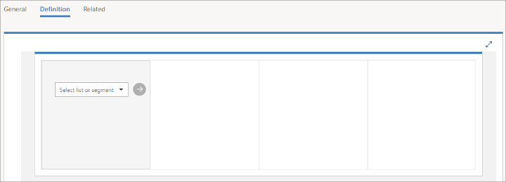
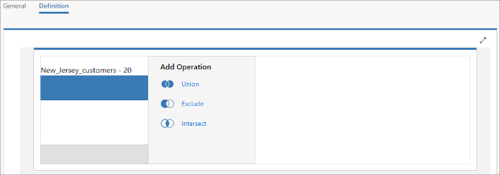
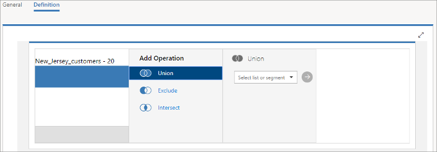
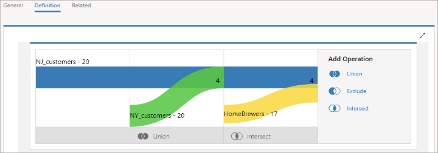

# Combine segments into a compound segment

[!INCLUDE[cc_applies_to_update_9_0_0](../includes/cc_applies_to_update_9_0_0.md)]

A compound segment applies logical operators to combine one or more existing segments into a single new segment. To create a compound segment:

1. Create or edit a segment and, on the **General** tab, set its **Segment type** to **Compound segment**.

1. Go to the **Definition** tab, which shows a drop-down list for selecting your first member segment. Choose an existing segment and then select the submit button next to the list.  
    
    > [!TIP]
    > Only existing, live segments are shown in the list. If you don't see a segment here that you are expecting, check to make sure it's live (not draft).

1. Your chosen segment is added, and a new **Add Operation** block is shown. If you want to combine another segment with the current result, then choose an operation here.  
    

    The operations work as follows:
    - **Union**: will combine all members of the next segment with the results so far.
    - **Exclude**: removes members of the next segment from the results so far.
    - **Intersect**: removes all members from the results so far that are not also members of the next segment.

1. A new block is added, which once again asks you to choose a segment. As before, choose a segment and select the submit button to apply it.  
    

1. Continue to compose your segment by adding more segments as needed and choosing an operation for each. As with the **Flow** view for dynamic, segments, you'll build a Sankey diagram of how your segments are combined, and how contacts flow into and out of the segment as a result of each operation.  
    
    > [!TIP]
    > To edit or remove a segment already shown in the diagram, hover over the upper-right corner of a displayed tile to reveal edit and delete buttons, which you can select to edit or delete that tile.

### See also

[Working with segments](segmentation-lists-subscriptions.md)
