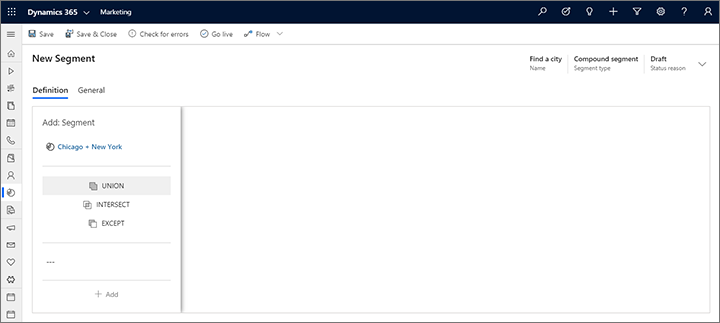
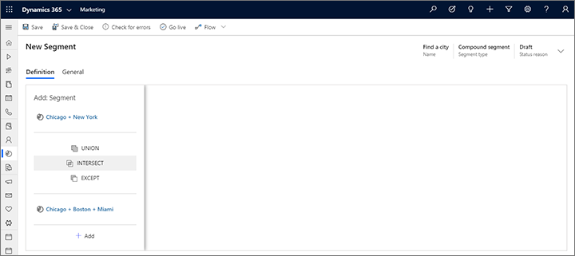
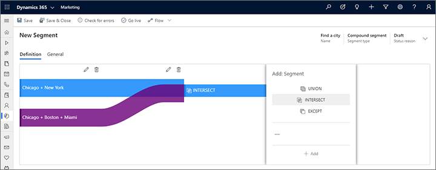
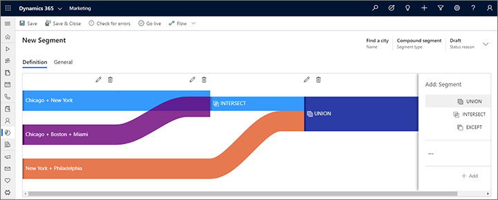

# Combine segments into a compound segment (combined audiences)

_Compound segments_ combine two or more existing segments using union, exclude, and/or intersect operators to create a new segment based on the original segments. You can combine any or all other types of segments to create a compound segment, as needed.

To create a compound segment:

1. Create a segment and then select the **Combined audiences** option, as described in [Create and go live with a new segment](segmentation-lists-subscriptions.md#create-segment).

1. The compound segment designer opens. Select your first segment at the top of the **Add: Segment** panel.

    

    > [!TIP]
    > Only existing, live segments are shown in the list. If you don't see a segment here that you are expecting, check to make sure it's live (not draft).

1. Select the segment that you want to combine with the first one in the field at the bottom of the **Add: Segment** panel.
1. In the space between your two segments in the **Add: Segment** panel, select an operator for combining your first two segments. The operators work as follows:

   - **Union**: combines all members of the next segment with the results so far.
   - **Exclude**: removes members of the next segment from the results so far.
   - **Intersect**: removes all members from the results so far that are not also members of the next segment.

    

1. Select **Add** at the bottom of the **Add: Segment** panel to add your first two segments. The display updates to show a Sankey diagram. This makes it easy to visualize the how the various groups are being combined by the logic you design. It indicates how two incoming groups will be combined, the order of the combination, and the approximate effect that the combination logic will have on the resulting, combined group.

    

1. The **Add: Segment** panel now moves one position forward. To add another segment, choose a segment in the field at the bottom of the panel, select an operator, and then select **Add**.

    

1. Continue to compose your compound segment by adding more segments as needed and choosing an operation for each. As you work, you'll build a Sankey diagram of how your segments are combined, and how contacts flow into and out of the segment as a result of each operation.

    > [!TIP]
    > To remove a segment, replace a segment, or change operators, use the **Edit** button  or **Delete** button  provided at the segment intersection where you want to modify in the diagram.

1. When you're done, save your segment and go live.

### See also

[Working with segments](segmentation-lists-subscriptions.md)
