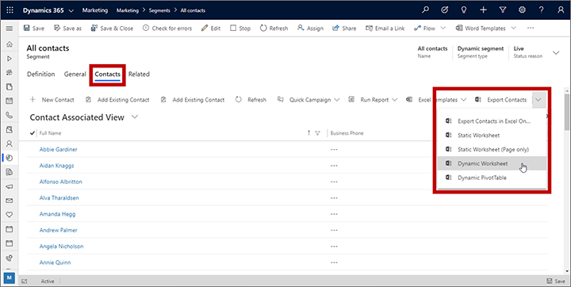

# Export dynamic segment members to Excel

You can export the contacts that are members of a dynamic segment straight to an Excel file and with just a few clicks, no matter how large the segment is. To do this:

1. Go to **Marketing** > **Customers** > **Segments**.
1. [Open or create a dynamic segment](segmentation-lists-subscriptions.md). It can be a demographic, firmographic, or interaction segment, but not a static segment.
1. If the segment isn't live, then select **Go live** on the command bar. Only live segments are fully resolved to include all relevant contacts.
1. Select the **Related** tab (which is really a drop-down list) and select **Contacts** to add a **Contacts** tab to your segment record.
1. Use the **System Views** menu above the contacts list here to select the view you'd like to export. This will affect the columns you will export and may also filter the collection of members included in your export.
1. Select **Export Contacts** from the command bar for the **Contacts** tab and choose the Excel format you would like.
    
1. Your Excel file is generated according to your selected options.

### See also

[Working with segments](segmentation-lists-subscriptions.md)  
[Design dynamic demographic or firmographic segments](segments-profile.md)  
[Design behavioral segments](segments-interaction.md)

