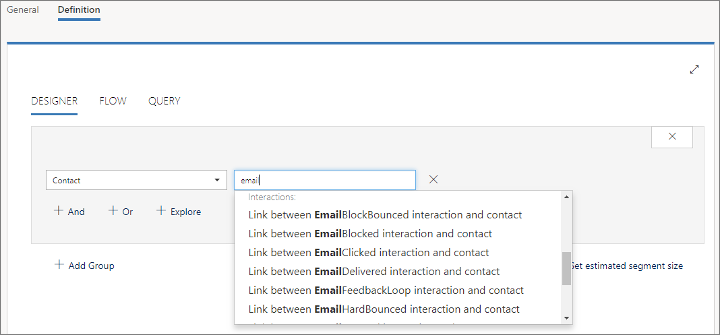
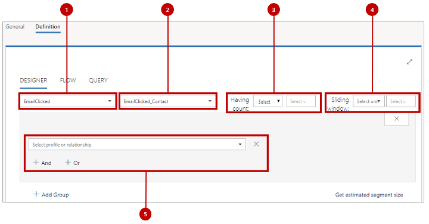

# Design interaction-based dynamic segments

[!INCLUDE[cc_applies_to_update_9_0_0](../includes/cc_applies_to_update_9_0_0.md)]

The segmentation tool always works in one of two modes, which enable it to create either of the following two types of segments:

- **Profile segments** query the _profile_ records stored in the customer-interaction database. Profile records are synced between your [!INCLUDE[pn-microsoftcrm](../includes/pn-microsoftcrm.md)] database and the customer-interaction database and include the entities you normally work with in the [!INCLUDE[pn-microsoftcrm](../includes/pn-microsoftcrm.md)] UI, such as contacts, accounts, leads, and any other entities that you [choose to sync](marketing-settings.md#matching-strategy).

- **Interaction segments** query the _interaction_ records stored in the customer-interaction database. Each of these records is generated automatically and related to a specific contact record. Interaction records are accessed to generate various insight displays in the [!INCLUDE[pn-microsoftcrm](../includes/pn-microsoftcrm.md)] UI, but they _aren't_ synced to the [!INCLUDE[pn-microsoftcrm](../includes/pn-microsoftcrm.md)] database. They are generated in response to contact interactions, such as opening an email, clicking an email link, submitting a form, or registering for an event.

Unlike profile segments, interaction segments allow for only a single query group, which means that the **Flow** tab isn't available, and your entire query must contain just a single group. However, you can combine interaction segments with other interaction or profile segments by [creating a compound segment](segments-compound.md).

This topic describes how to work with interaction segments. For more about profile segments, see [Profile-based dynamic segments](segments-profile.md).

[!INCLUDE[proc-more-information](../includes/proc-more-information.md)] [Working with segments](segmentation-lists-subscriptions.md)

## Create an interaction segment

To create a segment based on interaction records:

1. Go to **Marketing** > **Customers** > **Segments**.

1. Select **New** on the command bar to create a new segment.

1. Give the new segment a suitable **Name** on the **General** tab, set its **Segment type** to **Dynamic**, and then open its **Definition** tab.

1. Your new segment already has a query group set to the **Contact** entity. Select the combo box next to this (currently showing a value of **All\*)** and start to type the name of the interaction you want to look for; a drop-down list will open and quickly shrink to show contact fields and interaction types with names that match your text. For example, type "email" to list all available email interactions, "event" to list event interactions, or "form" to list form interactions. If you're not sure what to look for, you can just scroll through the list to find a likely match under the **Interactions** heading near the bottom of the menu.

    

    Here are some of the interaction types that are used most often (but there are many more):
    - EmailClicked
    - EmailHardBounced
    - EmailOpened
    - EventCheckIn
    - EventRegistration
    - EventRegistrationCanceled
    - FormSubmitted
    - FormVisited
    - SegmentSubscribed
    - SegmentUnsubscribed
    - WebsiteVisited
1. When you select an interaction, the layout of the **Designer** forms changes to _interaction mode_, which provides the features called out in the illustration provided after this procedure. Use these features to design your query.

1. When you're done designing your segment, select **Save** and **[Go live](go-live.md)**.

Legend:

1. **Interaction name** : This is the type of interaction the segment will look for.
1. **Relation to contacts** : This is how your selected interaction relates to the contact entity. All segments must resolve to a collection of contact entities, and this value shows how the two entities are connected. For the most common interactions, there is only one choice here so you don't need to worry about it, but some types of interactions have multiple connections to the contact entity through different field values on either the interaction record or the contact record.
1. **Having count** : Use these settings to limit results to include contacts that have some minimum or exact value of interactions, such as "at least 3 email opens" or "exactly 1 event registration". If you leave these blank, then your segment will find contacts with at least one of the selected interaction type.
1. **Sliding window** : Use these settings to consider interactions that occurred only recently, such as in the last two weeks, last three months, or last year. The date is always calculated based on the current date, so if you apply a limit here, then some contacts may slip out of the segment with each passing day.
1. **Additional restrictions** : These settings work just like they do for profile segments, but here they enable you to filter results based on values for the selected type of interaction records. For example, you might want to find clicks on a specific email message, or registrations for a specific event. You can add as many additional clauses as you want using the **And** and **Or** buttons.

> [!NOTE]
> Interaction segments can include only a single group, so don't use the **Add Group** button (your settings in any additional groups will be ignored). However, you can combine interaction segments with other interaction or profile segments using logical operators by [creating a compound segment](segments-compound.md).

## Find record IDs

Often, you'll want to find interactions associated with a specific form, customer journey, message, event, or other specific record. To do this, you'll need to find the ID of the record you're looking for. To do this:

1. Open the record (such as event or email) that you want to refer to.
1. Check the address bar in your browser, which should show a URL such as:

    `https://<MyOrg>.crm.dynamics.com/main.aspx?appid=c8cba597-4754-e811-a859-000d3a1be1a3&pagetype=entityrecord&etn=msevtmgt_event&id=5acc43d5-356e-e811-a960-000d3a1cae35`

1. Find the part of the URL that starts with **&amp;id=**, which is followed by the ID number of your current record. Copy that number (the value only) and use it in your expression.

### See also

[Working with segments](segmentation-lists-subscriptions.md)
