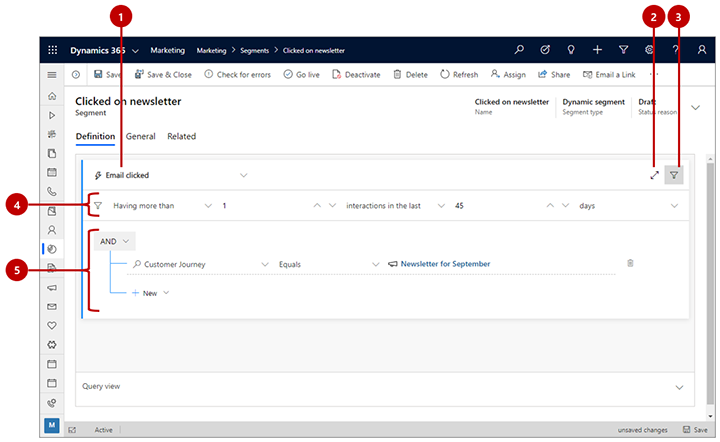

# Design behavioral segments

_Behavioral segments_ query the _interaction_ records stored in the marketing insights database. Each of these records is generated automatically in response to something a contact did (such as open an email or visit a web page), and is related to the specific contact record associated with that action (if known). Interaction records are used to generate various insights displays in the Dynamics 365 Marketing UI, but they aren't synced to the Dynamics 365 Marketing organizational database.

The result of a behavioral segment query is always a set of contacts who performed the relevant type of interaction according to the conditions established by the query.

This type of segment is _dynamic_ because its membership is defined as a query, whose results can change from moment to moment in response to new interactions being added to the database.

To create a behavioral segment, create a segment and then select the **Behavioral** option, as described in [Create and go live with a new segment](segmentation-lists-subscriptions.md#create-segment).

The following image shows an example of typical behavioral segment query and outlines key features of the designer user interface.

Legend:

1. **Interaction name**: Use this drop-down list to select the type of interaction the behavioral segment will look for.
2. **Full-screen editor**: Select this button to open the segment designer in full-screen mode, which provides more screen real estate for viewing and editing your query.
3. **Show/hide interaction filters**: Select this button to show or hide filters for setting limits on the total number of interactions and/or a moving-window time period.
4. **Interaction filters**: Use these to set a minimum or exact number of interactions that a contact must have performed to be included in this segment. You can also set a moving-window filter to only consider interactions that occurred recently, such as in the last two weeks. To enable the moving-window filter, change the third drop-down list from **interactions** to **interactions in the last**. The date of the moving window is always calculated based on the current date, so if you enable this, then some contacts may slip out of the segment with each passing day unless they remain engaged. In this example, the filter will find contacts who clicked on a message at least once in the past 45 days.
5. **Additional restrictions**: These settings work just like they do for demographic and firmographic segments, but here they enable you to filter results based on values for the selected type of interaction records. For example, you might want to find clicks on email messages sent by a particular customer journey (as shown here). As with [demographic and firmographic segments](segments-profile.md), you can add as many clauses and clause groups as you need here.

> [!NOTE]
> Unlike profile segments, behavioral segments allow for only a single query block, which means that the **Flow view** tab isn't available, and your entire query must contain just a single block. However, you can combine behavioral segments with other interaction or profile segments by [creating a compound segment](./segmentation-lists-subscriptions.md).

## View and edit the raw query

The segment designer provides a graphical interface for creating the logic for a dynamic segment. As  you work with the settings, you are actually creating a text-based query in the background. This is the query that the system will actually run against your database. Usually you don't need to use the query for anything, but sometimes it can help in troubleshooting. You can also copy/paste queries into the designer, which you might use to create a copy of an existing segment or to share a query design through email.

To find, view, and edit the query, scroll to the bottom of the page and open the **Query view** tab here.

## Find record IDs

Often, you'll want to find interactions associated with a specific form, customer journey, message, event, or other specific record. To do this, you'll need to find the ID of the record you're looking for. To do this:

1. Open the record (such as event or email) that you want to refer to.
1. Check the address bar in your browser, which should show a URL such as:

    `https://<MyOrg>.crm.dynamics.com/main.aspx?appid=c8cba597-4754-e811-a859-000d3a1be1a3&pagetype=entityrecord&etn=msevtmgt_event&id=5acc43d5-356e-e811-a960-000d3a1cae35`

1. Find the part of the URL that starts with **&amp;id=**, which is followed by the ID number of your current record. Copy that number (the value only) and use it in your expression.

### See also

[Working with segments](segmentation-lists-subscriptions.md)  
[Generate dynamic segments from customer journey results](generate-segment-from-journey.md)

[!INCLUDE[footer-include](../includes/footer-banner.md)]