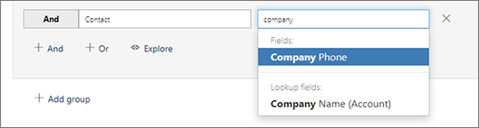
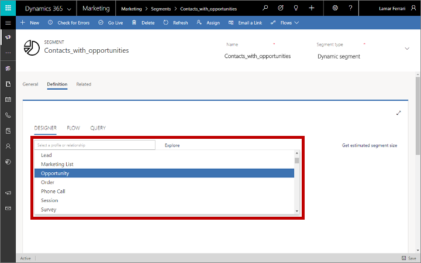
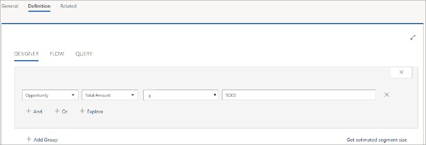
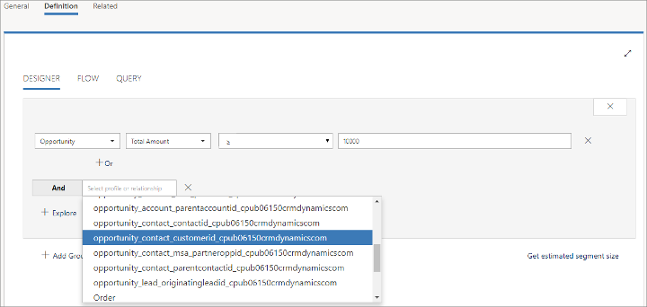
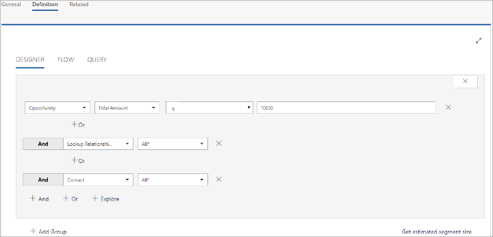
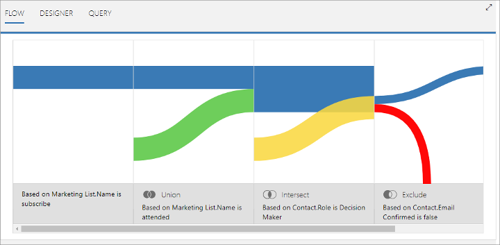

# Design profile-based dynamic segments

[!INCLUDE[cc_applies_to_update_9_0_0](../includes/cc_applies_to_update_9_0_0.md)]

The segmentation tool always works in one of two modes, which enable it to create either of the following two types of segments:

- **Profile segments** query the _profile_ records stored in the marketing insights database. Profiles records are synced between your [!INCLUDE[pn-microsoftcrm](../includes/pn-microsoftcrm.md)] database and the marketing insights database and include the entities you normally work with in the [!INCLUDE[pn-microsoftcrm](../includes/pn-microsoftcrm.md)] UI, such as contacts, accounts, leads, and any other entities that you [choose to sync](marketing-settings.md#dci-sync).

- **Interaction segments** query the _interaction_ records stored in the marketing insights database. Each of these records is generated automatically and related to a specific contact record. Interaction records are accessed to generate various insights displays in the [!INCLUDE[pn-marketing-business-app-module-name](../includes/pn-marketing-business-app-module-name.md)] UI, but they _aren't_ synced to the [!INCLUDE[pn-microsoftcrm](../includes/pn-microsoftcrm.md)] database. They are generated in response to contact interactions such as opening an email, clicking an email link, submitting a form, or registering for an event.

This topic describes how to work with profile segments. For more about interaction segments, see [Design interaction-based dynamic segments](segments-interaction.md).

[!INCLUDE[proc-more-information](../includes/proc-more-information.md)] [Working with segments](segmentation-lists-subscriptions.md)

## Set up a new dynamic segment

To create a dynamic segment, go to **Marketing** > **Customers** > **Segments** and then select **New** on the command bar. A new segment is created. Set its **Segment type** to **Dynamic** on the **General** tab. Then use the **Definition** tab to build your dynamic segment by combing _groups_ of *query clauses*, each of which results in a set of contacts. Each group establishes a _path_ through one or more entities that must end at the **Contact** entity (the order matters).

## Define a query group

Each group in your segment query must result in a list of contacts, which are selected by the logic defined in that group. Each group must therefore establish a path through various entities, each linked through relations, and which ends with the contact entity. A simple query group might query the contact entity alone, but a more complex one could pass through several entities.

> [!TIP]
> The segmentation designer now supports fields of all data types supported by Dynamics 365 for Customer Engagement, including: option set, two option set, multiple option set, single line of text, multiple line of text, whole number, floating number, decimal number, currency, look up, date time, and customer.

> [!NOTE]
> While you are designing your segment, you can select the **Get estimated segment size** link to get an *estimate* for the number of contacts that will be included in the segment. This is only an estimate, and can be somewhat different from your actual segment size. You must go live with the segment to view its exact size and membership.

### Build a clause that finds standard field values

*Standard fields* are fields where users can freely enter any value (of the appropriate data type). A typical example is the **First Name** field of the contact entity. Users are free to enter any text in this field, and the field is directly part of the contact entity. The following illustration shows how to construct a clause based on a standard field.

Legend:

1. **Entity name**: This is the entity that the field comes from. This clause will return records of this type.
1. **Field name**: This is the field that the clause will test. This drop-down list is organized into the following categories: **Fields** (includes standard and option-set fields), **Lookup fields** (described later in this topic), **Type** (a wildcard that lets you find all records of the selected entity) and (for contacts) **Interactions** (see [Design interaction-based dynamic segments](segments-interaction.md) for details about this category). If you know the name of the field you want to specify here, then start typing it's name in this field to filter the drop-down list.
1. **Operator**: This is how the clause will test the values of the specified field. The choices here depend on the data type of the field. For example, string fields allow operators such as *is*, *is not*, *contains*, *begins with*, *ends with*, and more. Number fields offer comparisons such as *equal to*, *less than*, and *greater than*.
1. **Value**: This is the value the clause will test for using the specified operator. With standard fields, this is free text, so you can type anything you like. Press return to add the value you've typed. After adding a value you can add more values by typing them and pressing return again. If you enter more than one value here, then the clause will find records that match any of these values (as if they were separate clauses combined with an OR operator). To remove a value from here, select its close icon, which looks like an X.

> [!NOTE]
> You can only select entities that are available to the marketing insights service. If you need an entity that isn't listed, please ask your administrator to enable it. For instructions, see [Choose entities to sync with the marketing insights service](marketing-settings.md#dci-sync).

### Build a clause that finds option-set values

*Option-set fields* are fields that accept a limited set of specific input values. They are typically presented to users as drop-down lists in input forms. For example, the contact entity might include a **Role** field that provides specific options such as **Decision Maker**, **Employee**, and **Influencer**.  The available values are part of the entity itself, so they don't refer to any related entities.

Option-set fields work in nearly the same way as the standard fields described in the previous section. The only difference is that when you are entering the value(s), you'll only be able to choose from among the values defined in the entity for that option set. As with standard fields, you can specify multiple values, which are combined with an OR operator.

### Build a clause that finds multiple option-set values

*Multiple option-set fields* are nearly the same as option-set fields, but they allow each record to accept multiple values while option-set fields accept just a single value. For example, the contact entity might include a **Favorite pets** field that provides the values **Dogs**, **Cats**, and **Birds**, and each contact might have none, one, two, or all three of these values applied to it.

In the segment designer, multi option-set fields provide operators that appropriate for processing multiple values. For example, you can list several values and set the operator to **contains all of** (to only find contacts where *all listed values* are present) or **contains any of** (to find all contacts that have *at least one* of the listed values).

### Create a clause that finds a lookup value

*Lookup values* are values that come from a related entity. For example, the contact entity has a lookup field called **Company Name (Account)**, which relates to the account entity. In the contact record, this field stores the unique ID of a related account record, but the system displays the name of the company, which is found by looking up the account ID and finding the value of the matching account record's **Name** field.

When you're selecting the field name for a clause, lookup fields are shown under the **Lookup fields** section of the drop-down list. Lookup fields show both the local field name and the name of the related entity (in parenthesis).

In the previous screenshot, you can see that the **Contact** entity has a field called **Company Name**, which comes from a related **Account** record.

Provided the related entity is available to the marketing insights service, you'll be able to select from among available values when you assign a value for your clause. In the previous example, you'd be able to choose from a list of available company names. If the related entity is not available to the marketing insights service, then you'll have to look up and enter the [record ID](dynamic-email-content.md#record-ids) instead. Your administrator can add whatever entities you need to the marketing insights service as required; for instructions, see [Choose entities to sync with the marketing insights service](marketing-settings.md#dci-sync)

Lookup fields also provide a special operator called **has**. Use this operator to test for the value of any field from the related entity, rather than just the value displayed by the local entity. For example, if you are querying the **Company Name (Account)** field of the **Contact** entity, you can use the **is/is in** operator to test for values of the **Name** field of the related account entity. But if you use the **has** operator, you can test for any field value from the related account record (such as **Address 1: City**). In the following illustration, this clause will find contacts who work for companies with street addresses in New York or Chicago.

### Example: Define a simple segment based on contacts

A simple query uses a single group that references the contact entity only. When you create this type of segment definition, set up a query with clauses that test various field values from your contact records and combine the various clauses using the logical operators AND and OR. For an example, see the tutorial [Create a dynamic segment](create-segment.md).

### Move between entities with relationships

When you create a new segment, it automatically starts with a default group based on the contact entity, as we saw in the [previous example](create-segment.md). So long as you only want to query values directly on the contact entity, then it's straightforward to add various clauses and combine them with AND/OR operators until you've defined the set of contacts you're looking for. However, you can also build much more complex queries that start from some other entity (such as accounts), queries that entity according to some criteria (such as number of employees) and then *transverses* to the contact entity to find the contacts associated with those accounts. All segments must end with the contact entity, so any time you start with a non-contact entity you must eventually traverse back to the contact entity using *relationships*.

Relationships are listed in the first drop-down list (together with the entities) when you add a new clause. When you select a relationship instead of an entity, then no further settings are available for that clause.

When you are selecting a relation, the options are displayed using the following naming convention:

_PrimaryEntity_ **->** _SecondaryEntity_ **(**_FieldName_**)**  

Where:

- ***PrimaryEntity*** is an entity at the starting side of the relationship. It is always shown on the left side of the arrow. For example, a *contact* (primary entity) can be related to an *account* (secondary entity) through the account's *primary contact* field (field name).
- ***FieldName*** is the name of the field through which the relation is established. It is always shown in parenthesis. The named field belongs to the primary entity, and displays a value from the secondary entity (but actually contains the ID of the related record that value is drawn from). In some cases, you might see two or more relationships between the same two entities, each of which flows through a different field.
- ***SecondaryEntity*** is the destination of the relationship. It is always shown on the right side of the arrow.

When you're choosing relationships, either the primary entity or the secondary entity must be the entity of the previous clause, while the other entity must the be one you are changing to with the next clause after the relation. Relationships work in both directions, so it doesn't matter which is the primary and which is the secondary.

For example:

- **Account -> Contact (Primary Contact)**: This relationship is used by the **Account** entity to display information from the **Contact** entity in a contact record's **Primary Contact** field. In other words, it links to the primary contact for an account.
- **Contact -> Account (Managing Partner)**: This relationship is used by the **Contact** entity to display information from the **Account** entity in a contact record's **Managing Partner** field. In other words, it links to the company (account) that is the managing partner for a contact.
- **Event Registration -> Contact (Contact)**: This relationship is used by the **Event Registration** entity to display information from the **Contact** entity in an event-registration record's **Contact** field. In other words, it links to the contact that registered for an event.
- **Lead -> Contact (Parent Contact for lead)**: This relationship is used by the **Lead** entity to display information from the **Contact** entity in a lead record's **Parent Contact** field. In other words, it links to the contact associated with the lead.

> [!IMPORTANT]
> Your segment must always end on the contact entity. If you start with some other entity, then you must always end with a relation back to the contact entity.

> [!TIP]
> While you're designing your query, select the **Explore** button to see a graphical map of how the current entity relates to other entities. This tool can help you figure out how to traverse the various entities to create a path that ends at the required **Contact** entity (shown in turquoise). Available paths and entities are shown in blue, while entities and paths that aren't directly available to the current entity appear in light gray. Already used paths and entities are shown in dark gray.
> 
> 

### Example: Define a more complex segment based on opportunities

Here's an example of how to define a segment that starts by finding a collection of opportunities and, as usual, ends by finding the contacts that belong to that segment. In this example, we'll find contacts associated with opportunities with an estimated revenue over $10,000 and then build a relation to the contacts entity.

1. If your [!INCLUDE[pn-marketing-app-module](../includes/pn-marketing-app-module.md)] instance isn't already set up to sync the **Opportunity (opportunity)** entity with the marketing insights service, talk to your admin about setting this up. If you are the admin, then see [Choose entities to sync with the marketing insights service](marketing-settings.md#dci-sync) for instructions.

1. Go to **Marketing** > **Customers** > **Segments** and select **+ New** from the command bar. A new segment record opens with the **Definition** > **Designer** tab showing.  
    

    Do the following:

    - Enter a **Name** for the segment at the top of the page.
    - Select the close button to remove the default contact-based query group from the **Designer** area. Many of your segments will probably start and end with the contact entity, but for this example we will start with opportunities instead.

1. When default group closes, it's replaced by a **Select a profile or relationship** drop-down list. Select **Opportunity** from here. (If you don't see the **Opportunity** entity listed here, then you probably need to set up syncing for this entity as described in the first step of this procedure; note that it can take up to half an hour for a new entity to appear in this list after the first sync.)  
    

1. Complete the row to create the clause:  
    **Opportunity | Est. Revenue | &ge; | 10000**.  
    

1. Select **+And** to add a new clause to the group. Now you must choose the relation between the opportunity entity and the contact entity, which is where we need to end up. Choose **Opportunity -> Contact (Contact)** and leave it set it to match **All&#42;**.
    

1. Select **+And** to add a final clause to the group, which must end with the contact entity. Set the new clause to use the **Contact** entity and leave it set it to match **All&#42;** to find all contacts associated with the selected opportunities.  
    

1. Select **Save** and then **Go live** on the command bar.

1. Your segment is now live and will now find contacts associated with opportunities valued over $10,000.

## Combine query groups

A simple segment might have just one query group, but you can create and combine as many groups as needed. As a result, you can create highly sophisticated queries.

You combine groups, working first group to last, by using the following operators:

- **Union**: combines all members of a group with the results of the previous group.
- **Exclude**: removes members of a group from the results of the previous group.
- **Intersect**: removes all members from the previous group that are not also members of the current group.

When you're working on the **Designer** tab, use the **+ Add Group** button to add a group and choose its operator.

The **Flow** tab provides another view of how your groups are combined. Here, you get a Sankey diagram of how your groups are combined, and how contacts flow into and out of the segment as a result of the operation from each group.

### See also

[Working with segments](segmentation-lists-subscriptions.md)
