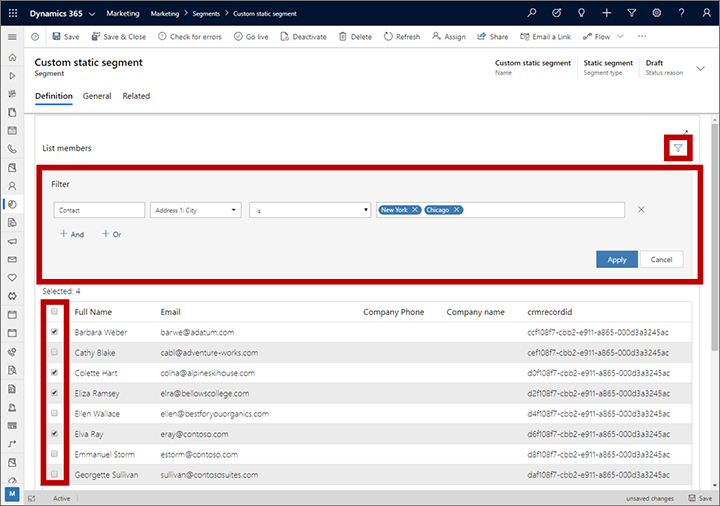

# Design static segments

_Static segments_ let you select individual contacts, one by one, to create custom segments without requiring any logical expressions.

> [!IMPORTANT]
> Static segments can contain a maximum of 1,000 members. If you need to curate a larger list than this, then please create a static marketing list instead. You can bring a static marketing list into a dynamic profile segment using relations if needed. For more information about marketing lists and how they are different from segments, see [Marketing segments vs. marketing lists](segments-vs-lists.md) and [Create a marketing list using in-app marketing (Sales)](../sales-enterprise/create-marketing-list-using-app-marketing-sales.md).

When you are working with a static segment, you'll see a list of all of the contacts from your database, with a check box shown for each. Select the check box for each contact you want to include in the segment and clear the check box for all other contacts.

To create a static segment, create a segment and then select the **Static** option, as described in [Create and go live with a new segment](segmentation-lists-subscriptions.md#create-segment).

Because your database probably includes many contacts, the designer often can't show all of them on one page. It provides paging controls at the bottom and a search filter at the top. Select the filter button at the top of the list to open a form where you can build a query that can help you find the contacts you want to add.

When you're done picking contacts for your static segment, select Go live on the command bar, as usual. Once the segment is live, it will include a **Members** tab, which lists all contacts in the segment.

> [!TIP]
> Each time you adjust the filter settings, you must select the **Apply** button to update the list.

### See also

[Working with segments](segmentation-lists-subscriptions.md)  
[Manage segment memberships from a contact record](manage-segments-from-contacts.md)
