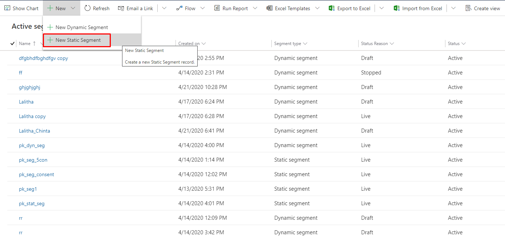
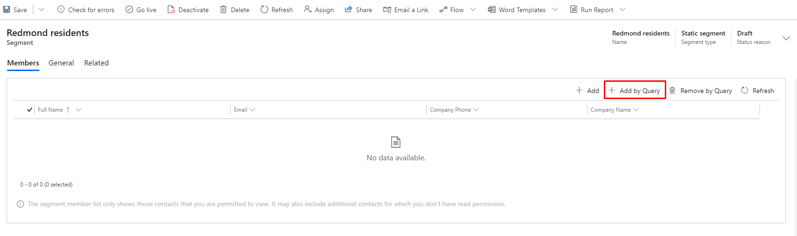

# Design static segments

Static segments enable you to choose and add segment members manually based on existing lists or search results.

To create a static segment, go to **Customers** > **Segments**. Click the **New** dropdown on the top ribbon. Then, select the **Static Segment** option, as described in [Create and go live with a new segment](segmentation-lists-subscriptions.md#create-segment).

## Using static segments

When you create a new static segment, you can add segment members manually (one by one) or with a query (selecting multiple contacts once).

### Adding segment members manually

To add segment members manually, click the **Add** button in the **Members** tab of the static segment editor. After you click the button, the Lookup Records pane will appear on the right. To search for a specific record, enter a contact name in the **Look for Records** search box. To see the full list of contacts, click the **Look for Records** search box and press **Enter**.

To add contacts, click each name you want to add. The selected contacts will be shown in the gray field on top of the pane. When you’re done with selection process, click **Add** at the bottom of the pane. The selected contacts will be added to your segment.

### Adding segment members by query

Because your database may contain many contacts, the segment designer now includes an **Add by Query** option. Adding contacts by query differs from dynamic segments in that it is executed only once. You can use the Add by Query option to find the right group of contacts to add to a static segment without choosing them individually.

To add segment members by query, click the **Add by Query** button in the **Members** tab of the static segment editor. A window titled Manage Segment Members will appear. In the Manage Segment Members window, you can edit the query and execute it by clicking the **Find** button.

In the list of query results, you can manually select contacts by clicking to the left of the contact name. You will see a check mark appear next to each selected contact. To add the selected contacts to your segment, click the **Add Selected** button at the bottom of the window and close the query window. To add the entire query list, click the **Add All** at the bottom of the window. If you need to refine your query, click the **Edit Query** button.

When you're done choosing contacts for your static segment, you will see all of them listed on the **Members** tab. To start using the segment, select **Go Live** in the top menu, as usual.

### See also

[Working with segments](segmentation-lists-subscriptions.md)  
[Manage segment memberships from a contact record](manage-segments-from-contacts.md)

[!INCLUDE[footer-include](../includes/footer-banner.md)]