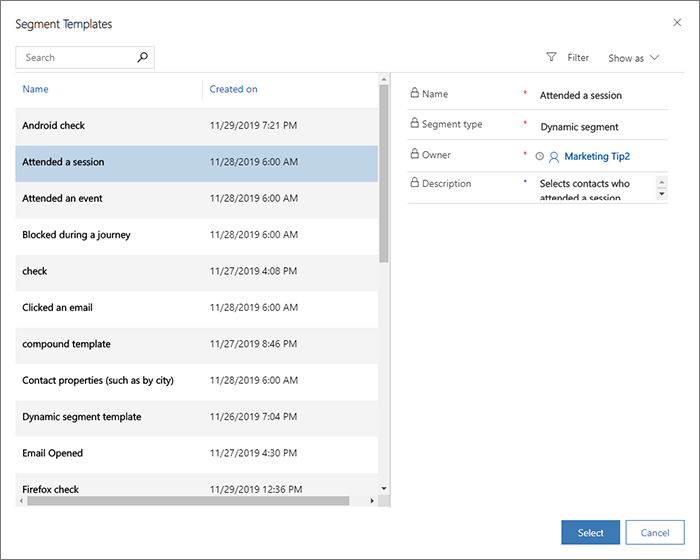
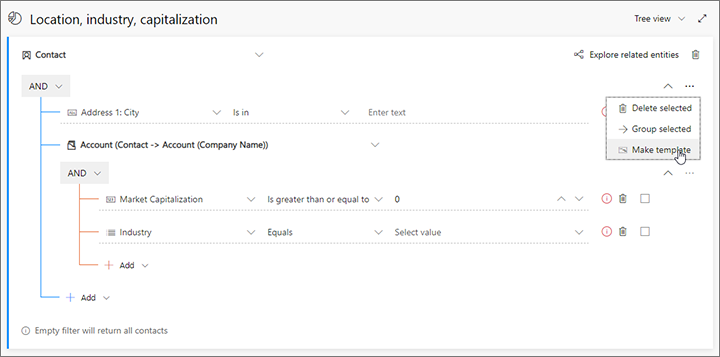
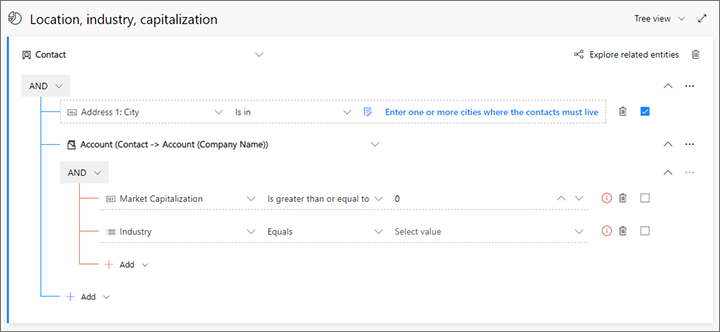
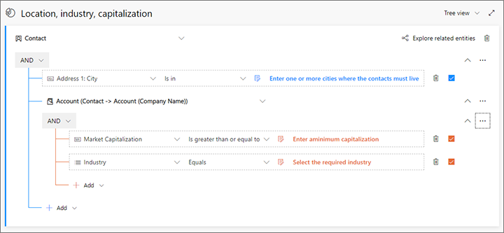

# Work with segment templates

Like many entities in Dynamics 365 Marketing, segments support templates, each of which provides an initial collection of settings that help users get started creating common types of segments more quickly.

## Create a segment based on a template

Each time you create a new segment, the **Segment templates** dialog box opens, showing a list of available templates. Each template provides a fully or partially defined query designed for a particular purpose, as indicated by the template name. Select any template to read more information about it in the information panel. **Filter** and **Search** features are provided to help you find the template you're looking for. Select a listed template and then choose **Select** to load the that template, or choose **Cancel** to start [building a new segment from scratch](segmentation-lists-subscriptions.md).

Segment templates can sometimes include "parametrized" rows, in which a row provides help text instead of a value. This helps make each template flexible enough to use in multiple situations. If you see these, be sure to replace the help text with the value you'd like to define for your current segment.

## Use the standard templates

Dynamics 365 Marketing comes with a collection of standard templates designed to help get you started creating a variety of common segments. Each provides an initial query structure, but you'll usually need to finish the query by supplying the values you are looking for and/or by adding new rows and groups as needed.

The standard templates also provide good examples that can help you learn common techniques for designing your own segments.

You'll find the standard templates listed together with any custom templates you've created under **Marketing** > **Marketing templates** > **Segment templates**. You can freely customize, rename, and delete (or deactivate) the standard templates as needed.

## Save a standard segment as a template

To save any standard segment as a segment template, go to **Marketing** > **Customers** > **Templates** and either open an existing template or [create a standard segment as usual](segmentation-lists-subscriptions.md). When your segment includes all of the logic you want to include in your template, select **Save as template** on the command bar. A flyout slides in from the side of your screen. Use it to name and describe your template and select **Save and close** to add it to your template collection.

You can now find your new template in the **Marketing** > **Marketing templates** > **Segment templates** area, and can edit it as needed as described in this topic. 

## Manage your segment templates

All of the segments listed in the **Segment templates** dialog box can be found under **Marketing** > **Marketing templates** > **Segment templates**, which provides a list of available templates. You can view, create, and edit all types of segment templates while working here. The basic procedure is the same as when [creating a standard segment](segmentation-lists-subscriptions.md)

To edit a listed template, select it and then choose **Edit** on the command bar (or double-click a listed template). Then edit the template just as you would a [standard segment](segmentation-lists-subscriptions.md) of that type.

To delete a listed template, select it and then choose **Delete** on the command bar (or double-click a listed template).

Each template listed on the **Active segment templates** view will be shown in the **Segment template** dialog box each time a user creates a new segment. Templates listed on the **Inactive segment templates** view are saved, but not shown in the **Segment template** dialog box. To change the activation status of a template, select the target template and then use the **Activate** and **Deactivate** buttons on the command bar to set its activation status.

## Enter template descriptions and metadata

The information shown for each template in the **Segment templates** dialog box comes directly from the template itself. You can edit these values by going to on the **General** tab of each template while working in the **Segment templates** area.

## Create or edit a segment template with parameters

> [!WARNING]
> Due to a known issue, you must only create parameterized rows, as described in this section, for fields that are *directly on the contact entity itself*&mdash;not for any related entities such as account or other entities. If you parameterize a row for a related entity, then your template will become permanently broken and you'll have to start over. We expect to solve this issue in the next monthly update or very soon thereafter.

When you create or edit a template while working in the **Segment templates** area,  you can create query rows that function as parameters that show help text rather than predetermined values. These are called *parameterized* template rows, and you can only create them when working in the **Segment templates** area, not when saving as a template from the **Segments** area.

To include one or more parameterized rows in a segment template:

1. Go to **Marketing** > **Marketing templates** > **Segment templates** and select **New** to create a new template or open any existing template for editing.

1. Design your basic segment logic as needed.

1. For any row that you want to parameterize, mark the checkbox at the end of the row. Then open the **More options** menu for that row, which looks like an ellipsis (...), and select **Make template**.

    

1. The value field for your selected row turns into a parametrized value. Enter some help text here so users will know what kind of value to enter when they create a segment based on this template. Note also that the parameterized value now shows a template icon.

    

1. Repeat these steps until you've configured all rows as needed. (If you need to de-parametrize a row, open the **More options** menu for that row, which looks like an ellipsis (...), and select **Make clause**)

    

1. Select **Save** in the bottom corner to save your work.

## Template labels

As with other types of templates in Dynamics 365 Marketing, segment templates support adding visual labels that help users identify and find the templates they are looking for when using a template gallery or list. More information: [Work with email, page, and form templates](email-templates.md)

### See also

[Working with segments](segmentation-lists-subscriptions.md)  
[Design dynamic demographic or firmographic segments](segments-profile.md)  
[Design behavioral segments](segments-interaction.md)  
[Design static segments](segments-static.md)  
[Combine segments into a compound segment (combined audiences)](segments-compound.md)

[!INCLUDE[footer-include](../includes/footer-banner.md)]