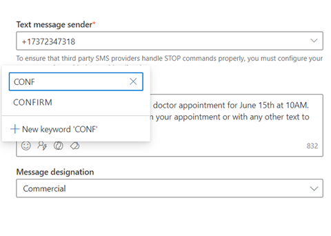
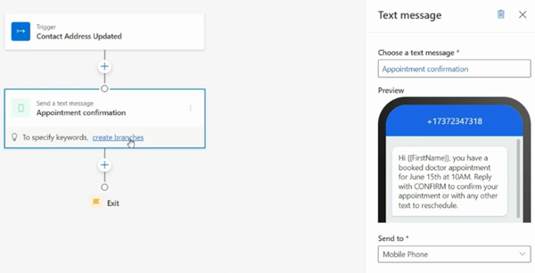
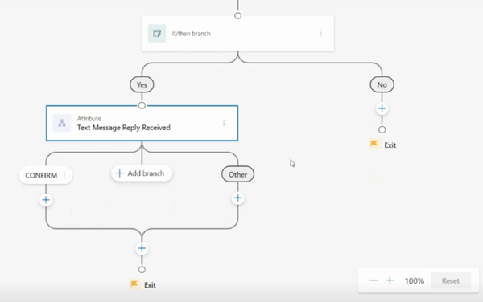
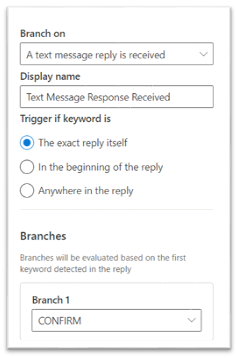

# Set up an automated text message keyword flow

[!INCLUDE[consolidated-sku-rtm-only](../includes/consolidated-sku-rtm-only.md)]

Text messages allow you to quickly communicate with your customers. But to continue the conversation effectively, you need to be able to act on customer responses. Keyword flows allow you to branch journeys based on customer replies to text messages.

## Add SMS keywords to text messages

Adding SMS keywords to your text messages allows you to branch customer journeys based on your customers' responses to your text messages.  

To add a keyword to a text message:

1. Select the keyword icon.
1. Type the keyword that you’d like to add.
1. Select it from the list if it has been used previously in the journey, or select the **New keyword** button to create it.

The following screenshot shows how to add SMS keywords to a text message:

> 

All keywords created through the SMS editor are also added to the [SMS keywords page](manage-sms-keywords.md ).

## Set up the keyword flow in a journey

Using the **Send a text message** tile in your journey, you can define custom keywords that will direct a customer's journey based on their responses. You can even set a default text message reply for unrecognized keywords.

To create a keyword flow:

1. Select the **Send a text message** tile and choose a text message template that includes keywords. In this example, the sender has created a keyword called **CONFIRM** that allows the recipient to confirm a doctor's appointment.
1. Select **create branches** to automatically branch your customer journey based on the keywords.

    > [!div class="mx-imgBorder"]
    > 

1. Specify the next actions for each keyword and branch.

    > [!div class="mx-imgBorder"]
    > 

1. Choose how strict the keyword identification method should be.

    > [!div class="mx-imgBorder"]
    > 

Finally, you can create additional branches and select keywords from the text message keywords page that weren't included in the text message template, in case you’d like to include branching for keywords that were communicated to customers in past text messages.

[!INCLUDE[footer-include](../includes/footer-banner.md)]
