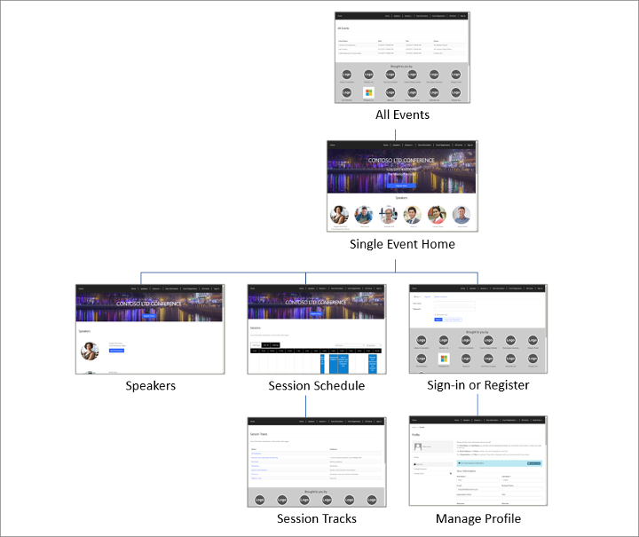
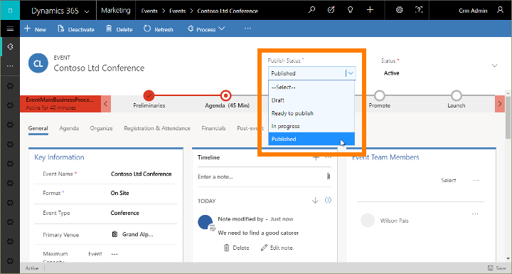
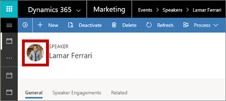

# Set up the event portal

[!INCLUDE[cc_applies_to_update_9_0_0](../includes/cc_applies_to_update_9_0_0.md)]

The event portal is a customer-facing website that people can use to read about your event and its speakers, create an account, register for the event, purchase passes, view their session schedule, and more. The following image shows a site map of your event portal as your attendees will see it.

The event portal is built by using the standard portals capabilities for [!INCLUDE[pn-microsoftcrm](../includes/pn-dynamics-365.md)] solution, so you can see all its constituent elements by going to the **Portals** work area of [!INCLUDE[pn-microsoftcrm](../includes/pn-dynamics-365.md)]. However, you usually won't need to work with any of these elements unless you want to customize the portal. The event portal is preconfigured to publish all the relevant information about each published event, and to enable visitors to register for the event, create an account (including username and password), edit their profile, and choose session passes. [!INCLUDE[proc-more-information](../includes/proc-more-information.md)] [Engage with customers online with Dynamics 365 portals](portals.md)

[!INCLUDE[cc-marketing-cookies](../includes/cc-marketing-cookies.md)]

## Publish an event to the portal

Most of the information shown on the portal comes directly from your event model and its various related records, so all you need to do get the portal online is make sure that all the information is available in [!INCLUDE[pn-microsoftcrm](../includes/pn-dynamics-365.md)] and that the event itself, plus its relevant sessions and tracks, are set to be published on the portal. To publish any of these items, open the relevant record and set its **Publish Status** in the drop-down list (usually shown in the upper-right corner of the form) to **Published**. Other relevant information related to the event, like speakers and sponsorships, will be published automatically so you don't need to publish them separately. Set the **Publish Status** to any other value to unpublish an event, session, or track if needed, thus removing it from your event portal.

The following table summarizes which types of information are publish to the portal. Be especially careful and thorough when entering values for these fields, because they are exposed to the public.

| **Entity**    | **Where it gets published** | **Which fields get published**|
|---------------|-----------------------------|-------------------------------|
| Events         | All published events are listed on the **All Events** page of the portal.|**Event Name**
**Start and end dates**

**Primary Venue**

**Description**
|
| Sessions       | Each published session is listed on the **Sessions** page for the event it belongs to, on the **Speaker** page for the speaker presenting it, and on the **Session Tracks** page for tracks it belongs to.| **Session Title**
**Start Date & Time**

**End Date & Time**

**Session Summary**

**Session Detail Description**

**Session Tracks**

**Duration**
|
| Speakers       | Published speakers are listed on the front for each event where they are speaking, on the **Speakers** page, and on session pages for each session they are running. A speaker profile page shows additional details and a schedule of sessions for that speaker. |**Name**
**Photo**

**Title**

**About**

**[!INCLUDE[pn-linkedin](../includes/pn-linkedin.md)]**

**[!INCLUDE[tn-twitter](../includes/tn-twitter.md)]**

**Website**
|
| Session Tracks | Published external tracks are listed on the **Session Tracks** page for the event they belong to. Each session track shows its name and a list of sessions that belong to it (with links).
You can only publish external tracks (not internal ones).
|**Name**
**Audience**
|
| Passes         | All passes associated with a published session track are listed on the **Pass Information** page for the event the track belongs to. The system tracks the number of passes available and the number assigned, and indicates when passes are sold out.|**Name**
Track **Name** from the related track record

**Pass Price**

Sold out status, indicated when the **Passes Remaining** field for a pass reaches zero
|
| Sponsors       | Sponsors associated with published events are displayed at the bottom of most pages of the portal for those events.|**Event Sponsor** (the **Account Name** of the related account record)

**Logo** (taken from the related account record for each sponsor)
|

## Customize portal graphics

The portal features a banner image for each event, and also shows speaker photos and sponsor logos.

- You can customize the banner image shown for any event by editing the event record, going to the **General** tab and changing the **Portal banner image** setting. (A default banner image is shown for all events that don't have their own custom banner.) For details about how to customize the banner, see this blog post: [How to Change Portal Banner Images in the Dynamics 365 for Marketing Event Portal](https://blogs.technet.microsoft.com/lystavlen/2018/02/26/how-to-change-portal-banner-images-in-the-dynamics-365-for-marketing-event-portal/).

- Speaker images come from each speaker record (not from the associated contact record). To upload a speaker image, go to **Events** > **Participants** > **Speakers** and open the relevant speaker record. Then select the existing photo (or generic placeholder) in the heading area of the page to open a dialog where you can upload an image. [!INCLUDE[proc-more-information](../includes/proc-more-information.md)] [Set up an event](set-up-event.md)  
    

- Sponsor images come from each sponsorship record, which you can edit by working in the event record where the sponsorship applies (found on the **Agenda** tab, which links to related sponsorship records), or by finding the appropriate sponsorship record under **Events** > **Sponsorship management** > **Sponsorships**. As with speaker images, you can edit the image by selecting the existing photo (or generic placeholder) in the heading area of the sponsorship record page.

### See also

[Engage customers online with portals](portals.md)
[Set up an event](set-up-event.md)  