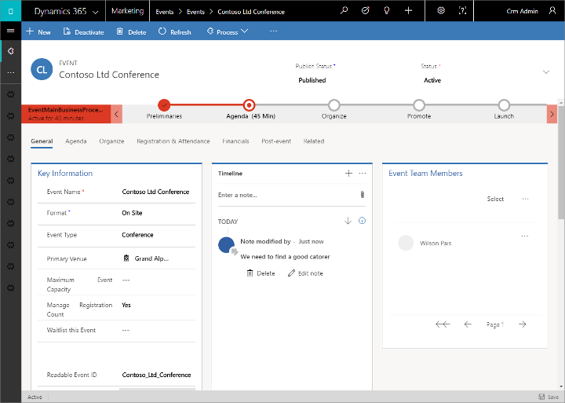

# Set up an event

The event planning process in Dynamics 365 Marketing starts with creating an event record. The event record guides you through each step of event planning. The record collects all of your planning details, gives links to related records, and provides a business-process timeline. After you create the event record, you can set up your event team, manage speakers and sessions, set up event passes, and set up a venue.

## Create the root event record

Creating an event record is the first step when setting up your event in Dynamics 365 Marketing. Everything related to a given event will be stored either directly in the event record or in other records that are linked to that event.

Though Marketing offers many views into other record types, you'll probably do most of your work directly in the relevant event record. When working in the event record, you'll be able to view and create most types of related records and everything that you do will automatically be related to that event.

You can see a list of all your event records by [opening the **Events** work area](open-events.md) and going to **Events** > **Event** > **Events**. From here you can use the standard list-view controls to search, sort, and filter the list to find and open an existing event, or to create a new event record.

If you often run similar events, you can save time by creating one or more [event templates](event-templates.md) and then choosing an appropriate template when you first create a new event.

As with many other forms in Dynamics 365, the event form provides a summary of its most important settings at the top, where you'll also find the business workflow timeline, which helps organize your work at each stage of the event-management process. A standard business workflow for events is provided out of the box, but you can customize it to match the process in place at your organization.

The first time you create a new event, you must specify values for each of the required fields (marked with a red asterisk). We recommend that you fill out the business-critical fields as well (marked with a blue plus sign). All required and business-critical fields are available at the top of the page in the business workflow, where you can fill them out quickly and easily. All settings that you enter in the business workflow will also be visible among the other event details further down the page. You can still view and edit these settings even after you move forward to the next stage in the workflow.

After you enter values for all the required fields, you can save the record. You'll probably return to the event record many times over several days while you plan your event. Use the workflow as a to-do list and to track your progress during each stage.

The main body of the page repeats all the important information requested by, and shown in, the workflow, plus much more. The main body is organized into tabs, which you can navigate by using the links near the top of the page body. You can enter your planning details in the main body of the page whenever you want to&mdash;you don't have to wait until you get to a specific part of the workflow. The following subsections give a summary of how to use each available tab.

Only live events, sessions, and tracks are shown on the event website. When you're ready to take an event, session, or track live, open the relevant record and go live as described in [Publish events, sessions, tracks, and related records to the website](set-up-event-portal.md#publish-event).

### The General tab

Here you can see and edit your basic event information, including:

- **Key information**: Includes the name of your event and other basic details. The following settings are provided:
  - **Event name**: Enter a name for the event.
  - **Event type**: Choose the type of event. The event type is for information only and won't affect any features. Use it to make your event easier to find and identify.
  - **Format** Set up your event as a [webinar](set-up-webinar.md),  webinar simulcast, or on-site only.
  - **Registration count**: Shows the number of people who registered for the event. The maximum value that can be shown here is 50,000, but you can still store more registrations in the system.
  - **Check-in count**: Shows the number of attendees that checked in during the event. The maximum value that can be shown here is 50,000, but you can still store more check-ins in the system.
  - **Event URL**: Shows the address of your [event website](set-up-event-portal.md). If you're using the default location on your Power Apps portals solution, the event URL value is read-only and provided automatically. If you are hosting your website at a custom location, then select the **Custom event URL** check box and edit the value here. Select the globe button next the event URL field to open the site. More information: [Open the event website](set-up-event-portal.md#open-site)
- **Schedule**: Provides settings for specifying the time zone, start, and end dates for your event. You can also set up a [recurring event](event-recurring.md) here. If you change the start date for an event that's already been saved, you'll be asked whether you want to change the end date and the session schedule to match it.
- **Timeline**: As with most types of entities in Dynamics 365, you can use this section to build a record of the activities (such as calls, emails, and appointments) that you and others do in relation to the current record. You can also share notes here. Use the links, buttons, and menus at the top of this area to create new items and to search and sort the list.
- **Location**: Specify the location where your event will take place. The location is hierarchical, and you can specify only as much detail as you need. For example, you can specify just a building. But to specify a room, you must first choose the building that contains that room. You can assign a separate location to each session if applicable. You can create location records from here, or choose from among existing [venue records](#venues). Each location record can contain useful information such as address, facilities, capacity, and more.
- **Venue constraints**: The venue constraints section only appears for on-site events. Each time you set a new **Location**, the **Maximum event capacity value** shown here updates to match the capacity configured for your last selected building, room, or layout (if available). You can then edit the value manually to override the capacity figure if needed. You can also enable the [waitlist](event-waitlist.md) here to handle registrations that arrive after the event is full.
- **Waitlist**: The waitlist section only appears if you enable the waitlist in the **Venue constraints** section. Use the waitlist to configure options regarding how to [invite waiting contacts](event-waitlist.md) when space becomes available.
- **Webinar setup**: The webinar setup section only appears for webinar and hybrid events. Use the settings here to [set up your webinar configuration](set-up-webinar.md) and find the URLs for viewing and presenting the webinar.

### The Agenda tab

The **Agenda** tab includes details about the schedule of sessions happening during your event. Here you can find, create, and edit each of the following options for the current event:

- **Allow registrants to create their own agenda**: This setting is only available for events that don't have any [passes](#event-passes) set up. It's shown above the calendar when no passes are defined, but is hidden when passes are defined. It affects the way checkout works on the [event website](set-up-event-portal.md) as follows:
    - When this is set to **Yes**, the website offers [session-level registration](session-level-registration.md). When a registrant selects **Register now**, the event website shows a list of all of the available sessions, and the registrant can add one, some, or all of them as needed.
    - When this is set to **No** (or if the setting is hidden), the website offers event-level registration. When a registrant selects **Register now**, the event website shows a list of [passes](#event-passes) available, each of which provides access to one or more specific sessions and can also show a different price. Registrants can choose the pass that best matches their needs, but can't make custom session selections.
- **Sessions calendar**: Shows a calendar of sessions defined for your event. You can create and edit sessions using the calendar. More information: [Work with marketing calendars](marketing-calendar.md).
- **Sessions list**: Each [session](#sessions) is typically a single presentation, class, discussion, or webinar. This table repeats the information also shown in the calendar. You can also create or edit sessions here.
- **Tracks**: Each (external) [track](#sessions) is a collection of related, non-conflicting sessions that likely would be of interest to the same audience. Attendees might sign up for a specific track, which you can manage by using [passes](#event-passes). You can also set up internal tracks, which are not exposed to attendees but can help you with your planning.
- **Speaker engagements**: Each [speaker engagement](#speakers) maps a speaker to a session occurring at your event.
- **Sponsors**: Companies who are [sponsoring the event](manage-event-sponsorships.md).

### The Website and form tab

The **Website and form** tab provides options for creating a custom [event website](set-up-event-portal.md) and integrating [marketing forms](marketing-forms.md) for event registration. In this tab you can set a custom event URL, set a registration end date, and set registration parameters. The following options are available:

- **Custom event URL**: If you are [hosting your event website](set-up-event-portal.md) on your own server, or in a custom location of your Power Apps portals solution, select this check box and edit the **Event URL** as needed.
- **Readable event ID**: This is a unique ID for the event. It is generated the first time you save the event, and is based on the event name. The readable event ID becomes [part of the URL](set-up-event-portal.md#open-site) for opening the event website to a particular event.
- **Event image**: Choose a banner image to show on the event website when browsing the event. You can choose any image that is already [uploaded to your file library](upload-images-files.md), or upload a new one from here.
- **Portal payment gateway**: To enable online payment during online event registration, set up an account with a third-party online payment provider and then [prepare a payment page](event-payment-gateway.md) on your portal according to their instructions. Then choose that page here. This setting only has an effect for event websites [hosted on the Power Apps portal](set-up-event-portal.md#customize) (it has no effect on externally hosted event websites).
- **Set registrations end date**: Set this toggle to **Yes** to set a date and time after which contacts will no longer be able to register for the event. Setting an end date for registrations is useful if you would like a cutoff to allow you to finalize your attendee list before the event starts. You can also include a **Website message** regarding the event registration stop date. Set the toggle to **No** to leave registration open until the start of the event.
- **Use marketing form for registration**: Set the toggle to **Yes** to use a previously prepared [marketing form](marketing-forms.md) for event registration. When the toggle is set to yes, a **Marketing form** option appears below, allowing you to search for the marketing form you would like to use. If you select **No**, the event will use the default event marketing form.
- **Enable CAPTCHA**: Set the toggle to **Yes** to include a [CAPTCHA](https://www.captcha.net/) on the [registration page](set-up-event-portal.md#registration) of your event website. Set the toggle to **No** to disable the CAPTCHA.
- **Enable multi-attendee registration**: Set the toggle to **Yes** to allow users of the event website to register several attendees at once. Set the toggle to **No** to allow just one attendee per registration.
- **Allow anonymous registrations**: Controls whether contacts can freely register themselves for an event on the event website, or if they must first set up an account with a user name and password. Contacts who create an account have several advantages including: the ability to register any number of attendees and the ability to return to view schedules or edit their registrations at any time. This setting only has an effect for event websites [hosted on the Power Apps portal](set-up-event-portal.md#customize) (it has no effect on externally hosted event websites).
- **Create leads for event registrations**: Set to **Yes** to create a new lead for each contact that registers for the event. Set to **No** to turn off lead generation for events. More information: [Generate and match contacts and leads from event registrations](set-up-event-portal.md#generate-leads).
    > [!NOTE]
    > As mentioned, the **Registration count** and **Check-in count** fields can each count up to a maximum of 50,000 contacts. The system can easily handle more registrations and/or check-ins than this, but for values higher than 50,000, these fields are no longer accurate.
- **Custom registration fields**: Here you can [view and create custom registration fields](custom-registration-fields.md), which enable registrants to provide extra information  (such as dietary restrictions or gift options) when they register for the event.

### The Registration and attendance tab

Use the **Registration and attendance** tab to see who registered for the event, who attended, and who canceled. You can also create registrations and check-ins here. The following sections are available:

- **Passes**: View and create types of [passes](#event-passes), which function as tickets to your events, sessions, and tracks.
- **Event registration**: This table provides a list of people who  [registered](invite-register-house-event-attendees.md) for your event. You can also [register people manually](invite-register-house-event-attendees.md) here. If you are using [custom registration fields](custom-registration-fields.md), then you can also view the values submitted by each attendee here.
- **Event check-ins**: Here you can see who attended the event and enter attendance records.
- **Waitlist**: See who's on the [waitlist](event-waitlist.md) for this event.
- **Contacts who canceled**: Lists contacts who were registered for the event but who have now canceled their registration. The list includes cancellations made by contacts using the event website and by users using the Marketing app. If you'd like to communicate with contacts who canceled from one or more events, you can set up a behavioral segment based on `EventRegistrationCancelled` interactions and then use that segment to target a customer journey.

    > [!NOTE]
    > With the February 2020 Marketing release, canceled event registrations are deactivated, not deleted. To cancel an event registration from within Marketing, simply deactivate the record.
    >
    >To determine your current Marketing version, refer to [Find out which version of Dynamics 365 Marketing you are running](apply-updates.md#find-out-which-version-of-dynamics-365-marketing-you-are-running).

### The Additional information tab

Use the **Additional information** tab to set up your event team and record general information, goals, and financial details. The following sections are provided here:

- **Additional information**: Enter a basic description and outline your goals.
- **Financials**: [View and record financial details](event-financials.md) for your event. These values appear in dashboard charts and analytics, but are intended for information only, not for formal accounting or bookkeeping.
- **Team members**: [Set up your event team](#set-up-your-event-team) by adding links to coworkers and external contacts who are helping you organize the event. The table shows each team member's name and role, so you can easily see who to call and find their contact info when needed.

### The Post event tab

Here you can [view and create online surveys](surveys.md) related to your event. You'd typically use these surveys to collect attendee opinions about how the event went. A second table provides links to individual survey responses.

Surveys are provided by the [Dynamics 365 Customer Voice](https://docs.microsoft.com/dynamics365/customer-voice/help-hub) feature.

### The Room reservations tab

The **Room reservations** tab provides a calendar that shows the rooms assigned to the currently displayed event and its sessions. Unreserved rooms aren't shown, nor are events or sessions without assigned rooms. This calendar is read-only, so you can't create sessions or reservations here. More information: [Work with marketing calendars](marketing-calendar.md).

### The Related menu

The **Related** menu provides links to event-related topics ranging from activities to speakers. If you select a topic in the related menu, a new temporary tab for that topic appears to the left of the related menu. 

Although you can edit and save items related to the selected topic in the temporary tab, the temporary tab will not remain next to the Related menu after the event is saved and closed.

## Set up your event team

Your event team includes coworkers and external contacts who are helping you organize the event. Each event record lists each team member's name and role, plus links for more information, so you can easily see who to call and find their contact info when needed.

- You can view and edit the list of all team members who worked, are working, or will work on all your events by going to **Events** > **Event** > **Event Team Members**. Use this area to set up a database of people who are available to help with your various events.
- You can view and edit the list of team members associated with a specific event by going to **Events** > **Event** > **Events**, opening the appropriate event, and looking at the **Event Team Members** section of the **Additional information** tab. The list on the **Events** page works the same as the list on the **Event Team Members** page, except that it only shows and adds team members who are assigned to the current event.

Each team member record can be associated with a contact or user record.

- *Users* are people who work for your organization and have a Dynamics 365 license.
- *Contacts* come from your contact database, which will include customers, potential customers, vendors, partners, and other external people (or internal people who don't use Dynamics 365).

When you create a new team member record, you'll be able to choose whether to associate it either with a user or a contact. If you choose to associate the record with a contact, the team-member record will display relevant information from that contact record. User records don't include any contact information, so if you associate the record with a user, the association will be shown but no additional information will be loaded. The team-member record also provides information about the member's role and which events the team member has worked on. You can create team members from either the **Event Team Members** list page or directly from a specific **Event** record.

When you're looking at a list view of team members, the list includes both a **User** and a **Contacts** column, but only one of the columns will show a value. From the list, you can go to the user or contact record by selecting the name in the list, or you can open the team-member record itself by double-clicking on a row anywhere away from the person's name.

## Manage event sessions and speakers

The core attractions of your event offering will typically be its sessions and speakers. A simple event might have just one session, whereas a conference will typically have several sessions spread over several days.

### Set up event sessions and tracks

A session represents a subdivision of things that are happening at your event. Each session is usually a something like a seminar or keynote, but the concept is flexible so you can adapt it as needed. For example, if your event is a trade show rather than a conference, you can use sessions to represent booths.

A large conference might have several sessions running concurrently, and might even feature several session *tracks*, which organize multiple related and non-conflicting sessions by audience so attendees can easily choose the best track for themselves without having to study the entire offering. Later, you'll be able up event and session passes to manage ticketing.

There are two types of tracks: _internal_ and _external_. Use internal tracks during the planning phase to group sessions along organization lines, such as according to team resources or required equipment. Use external tracks to group sessions by content or audience. External tracks are published on customer-facing platforms such as event websites and mobile apps. As needed, you can set up a pass type for each relevant external track, but you wouldn't set up passes for internal tracks. Use the **Track Type** setting, at the top of the form to set the track to internal or external.

Use the **Agenda** tab of an event record to view and set up sessions and sessions tracks for that event.

- Each session is associated with a specific event and speaker, and includes scheduling details. You can view, create, and edit sessions using either the [calendar display](marketing-calendar.md) or the table.
- Only live sessions and tracks are shown on the event website. When you're ready to go live with a session or track, open the relevant record and go live as described in [Publish events, sessions, tracks, and related records to the website](set-up-event-portal.md#publish-event).
- For each track, you can assign an audience and a few other descriptive details and then add member sessions, one at a time. All sessions in a track must be from the same event.

### Set up and assign session speakers

Use the following pages to manage your speakers and speaker engagements:

- **Events** > **Participants** > **Speakers**: Lists all speakers who are available for previous, current, or future events, and lets you set up new speakers.
- **Events** > **Event** > **Events**: Work on the **Agenda** tab of the appropriate event record to set up speaker engagements for that event. You can also create new speaker records here if needed while setting up speaker engagements.

Each speaker record can include a photo, contact details, and biographical details that you can eventually publish to the event website for attendees to review. It also includes a record of all speaking engagements and sessions where the speaker has presented or will present. You can choose to link a speaker to a contact record, but it's not required. The contact, photo, and biographical information in the speaker record is independent from the contact record, so you can safely keep private contact information (possibly stored in the contact record) away from the public speaker information (stored in the speaker record) that will be published to your event website. More information: [Set up the event website](set-up-event-portal.md)

When setting up a speaker engagement, you map a speaker to a specific session for the event record you are working with. To set up a speaker engagement:

- A speaker record must exist.
- If you're assigning a session, a session record must exist. (For single-session events, you might not have a session record and instead will treat the event itself as a session.)

## Set up event passes

Event passes are essentially tickets that you can sell or give away to grant access to your event and/or its various sessions and tracks. Passes are optional, but if you want to use them, you'll start by setting up the basic types of passes that you need for an event and adding the applicable sessions to each of them. Later, you'll assign a pass of the appropriate type to each attendee by mapping each event registration to one or more pass types. Passes can also be shown on the event website, so attendees can register for the passes they want while registering for the event itself; in this case, the registration/pass mapping is made automatically. For each assigned pass, Dynamics 365 Marketing generates a unique QR code, which you can print onto a physical badge that event personnel can quickly scan on entrance to confirm eligibility and record attendance.

For each pass type, you'll set the event where it applies and then assign a category (attendee, speaker, sponsor, journalist, and so on), a price, an allocation (the number available), and other details. You can also assign a collection of one or more sessions for the pass, which grants access to all the sessions in that track, but not necessarily to all sessions at the event.

For a simple event, you might set up a single pass type that grants access to all sessions for all types of attendees. For a complex event, you might have passes for each of several session tracks, and might require specific pass types for accessing certain areas of the venue (such as a lounge just for journalists). Passes only make sense for physical attendees—you wouldn't set up passes for webinar-only attendees, events, or sessions.

To view and create passes for an event, open the appropriate event record and go to its **Registration & Attendance** tab. You can view, edit, and create passes by working in the **Passes** area here. To add sessions to a pass, first create and save it here, then open it for editing and use its **Eligible sessions** tab to add sessions to it.

> [!NOTE]
> You can add sessions to a pass individually or add an entire track at once. If you choose to add a track, all of the sessions that currently belong to that track will be added to your pass. However, when you add by track, you won't create a link to the track itself; instead, you just add all the sessions that currently belong to that track to the current pass. Future edits to the track won't affect the pass, so you must edit each existing pass specifically if you need to change the sessions that belong to it.

When setting up a pass, pay attention to the **Passes Allocated** field, where you set the number of passes available, and its related fields: **Passes Sold** and **Passes Remaining**. Each time a pass is granted to an attendee, the **Passes Sold** number automatically increases and the **Passes Remaining** number decreases. When **Passes Remaining** reaches zero, that pass will be shown on the event website as "sold out" and will no longer be available for purchase by further attendees. If you set **Passes Allocated** to zero, that pass won't be shown on the website at all; you might do this for VIP passes, or to keep a pass as a draft until you're ready to publish it by setting **Passes Allocated** to a positive value.

## Set up the event venue

A venue is any physical location where you hold an event or session. It might be a single building with just one room, or one of several rooms in a building. For each venue, you can register many types of important details, including name, location, facilities, capacity, layout, events that will or have occurred there, and more. After you've set up a venue, you can assign events and sessions to it as needed.

Use the various types of venue entities in the **Events** > **Venue Management** area to construct a hierarchical model of your event location. Later, you'll be able to assign events and sessions to each venue space from your model. You only need to include as much detail as you need, so a simple building with just one room doesn't need to have any rooms defined for it, and a simple room with just one layout doesn't need to have any layouts defined for it. But you can't set up a room without a building or a layout without a room.

Use the following entities to model your venues:

- **Events** > **Venue Management** > **Buildings**: Buildings represent free-standing structures that might or might not be divided into rooms.
- **Events** > **Venue Management** > **Rooms**: Rooms represent subdivisions of buildings, and each must be assigned to a building record also stored in the system.
- **Events** > **Venue Management** > **Layouts**: During an event, you might use a single room to host several types of sessions, each of which might require a different arrangement of chairs and other facilities. The room layout might have practical consequences that affect, for example, seating capacity. Each layout must be associated with a particular room, but you can set up any number of layouts for each room.
