# Set up automatic lead generation and scoring

<iframe src="https://www.microsoft.com/videoplayer/embed/ae6596f2-4df4-420e-9635-df776e4e5398" frameborder="0" allowfullscreen=""></iframe>

A big part of marketing has to do with finding new leads, qualifying them, and then sending sales-ready leads to salespeople. To help you identify the hottest leads, Dynamics 365 Marketing scores each one based on criteria that includes each lead's demographic details and interaction record. A lead who meets your target demographic profile and has interacted with your marketing materials (for example, by opening emails, registering for downloads, browsing your website, or attending an event) will probably get a high score, provided you've set up your scoring model correctly.

> [!TIP]
> You can create any number of lead-scoring models, with each lead being scored according to each model. That means that if you have several models, each lead will also have several scores. A lead becomes sales-ready as soon as at least one model produces a sales-ready score for that lead.

To create a lead scoring model:

1. Go to **Marketing** > **Lead management** > **Scoring models**. This takes you to a list of existing models. On the command bar, select **New**.

2. The **New Lead Scoring Model** page opens, with the **Design** tab shown. This designer is similar to other designers in Dynamics 365 Marketing. You use it to build scoring models by creating a collection of condition/action tile pairs, where the **Condition** tile establishes a condition (such as **email opened**) and the **Action** tile establishes how the score should change when the condition is met (such as, **add 50 points**).  
    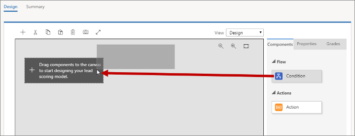

    Drag a **Condition** tile from the **Toolbox** tab to the first position on the canvas.

3. When you drop the tile, it stays selected and the **Properties** tab opens to show its settings. In this case, the only setting is a name for the tile. You're going to create a condition that looks at the city where a lead is living, so set the **Display Name** to **City**.  
    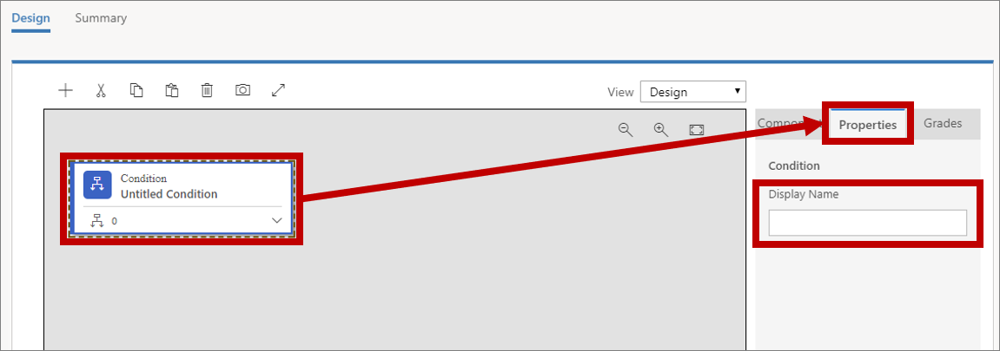

4. Expand the new **Condition** tile by choosing the expansion button in its lower-right corner. Here you can see that your new **Condition** tile already has a child **Condition** tile. The parent **Condition** tile simply establishes a name for the stack, whereas the child establishes a logical condition. If the child condition resolves to true, the lead score will be updated as specified in the **Action** tile that follows (you'll add that in a few minutes).  
    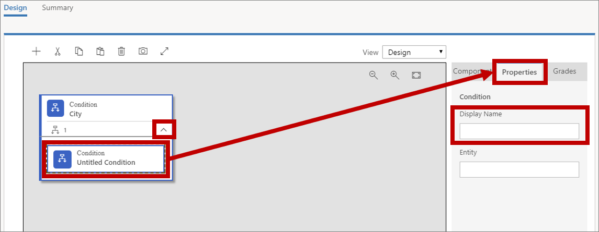  

    Select the child **Condition** tile, open the **Properties** tab, and then enter a **Display Name** for the tile. You're going to increase the score for leads from London, so name it something like **City of London**.

    > [!TIP]
    > You can add more child conditions by dragging more **Condition** tiles onto the same parent. If you do this, all child conditions are combined with an AND operator, which means that *all* of them must evaluate to true for the following **Action** to be applied.

5. Select in the **Entity** field to place the insertion point. Dynamics 365 Marketing fetches a list of scorable entities (which can take a few seconds) and displays them as a drop-down list. The list includes all relevant entities that can be related to a lead record, plus the lead entity itself.  
    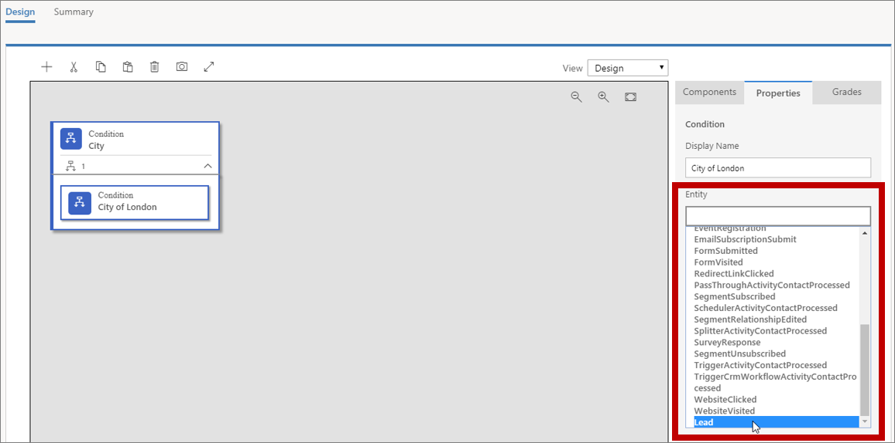  

    You're looking for the name of the city where the lead works, which is recorded on the lead itself, so choose the **Lead** entity here.

6. After you've chosen an **Entity**, an **Expression** box is added that provides choices appropriate for that entity. Use the **Field**, **Operator**, and **Value** fields here to establish an expression that evaluates to true where **City = London**.  
    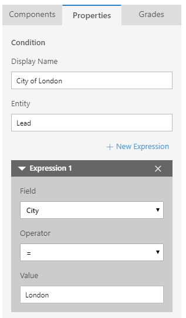

    > [!TIP]
    > You can add more expressions here by choosing **+ New Expression**. When multiple expressions are present, they are always combined using an AND operator, so they must *all* evaluate to true for the condition to be true.

7. Drag an **Action** tile from the **Toolbox** tab to the space immediately to the right of the **Condition** tile you just set up.  
    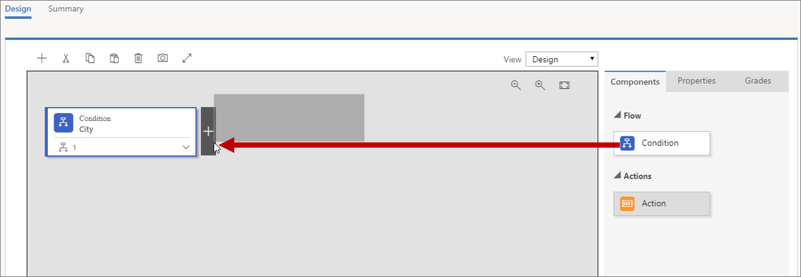

8. When you drop the tile, it stays selected and the **Properties** tab opens to show its settings. This is where you set how a lead's score is changed when the **Condition** resolves to true.  
    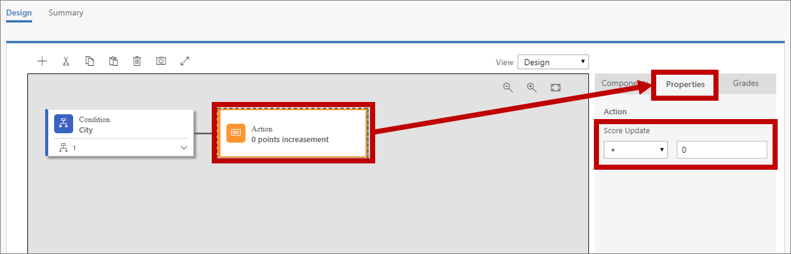

    Set **Score Update** to **+70**. The rule will now give 70 points to any lead working in London.

9. By using a process like the one you used to create the first rule, add a new rule below the first one and set it to give +40 points to leads living in England (check the **Leads** entity where **Country/Region = England**).  
    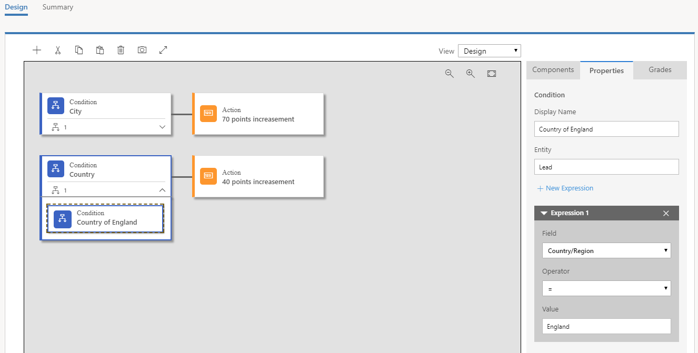

    > [!TIP]
    > When your model includes several rules, like this one does, each rule can affect the lead score independently. For example, the model you built so far will increase a lead score by 110 points for leads who live in London, England. Likewise, leads from Manchester, England will get +40 points and leads from London, Ohio will get +70 points.

10. Open the **Grades** tab in the rightmost column.  
     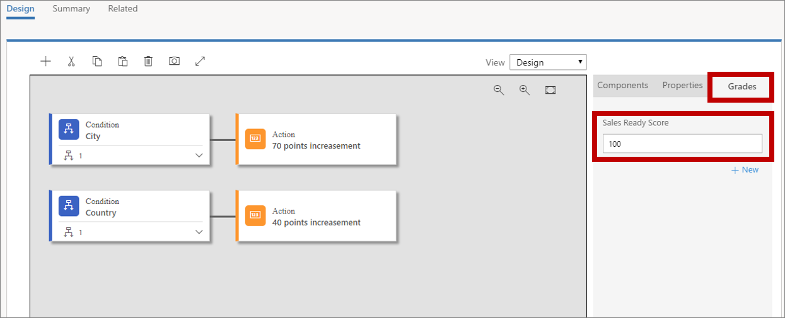

     You can use **Grades** to establish a schedule of grades associated with each of several score ranges, but the most important setting here is the **Sales Ready Score**. When a lead reaches this score, the system will consider it sales-ready (marketing-qualified) and therefore ready to be forwarded to a salesperson for further attention. Let's suppose that any lead located in London, England is sales-ready, so set this to 100.

     > [!TIP]
     > You can add any number of additional grades to help classify a lead according to its score (such as 0-25=Cold, 26-60=Warm, 61-100=Hot). Choose **+ New** on the **Grades** tab to add and define each required grade.

11. Like customer journeys, landing pages, and email messages, your lead scoring rule must go live before it can have any effect. Do the following to finish the model:
    - Go to the **Summary** tab and give your rule a **Name** (such as "London, England").
    - On the command bar, select **Save** to save your model.
    - On the command bar, select **Check for Errors**, and then read the results and fix any problems reported.
    - On the command bar, select **Go Live** to activate the model. Dynamics 365 Marketing runs a final error check, and then updates the **Status Reason** to **Going Live**. It might take a few minutes for the process to be completed, at which time the **Status Reason** will change to **Live**.

12. Go to **Marketing** > **Lead management** > **Leads** to open a list of available leads. On the command bar, select **+ New** to create a new lead.  
     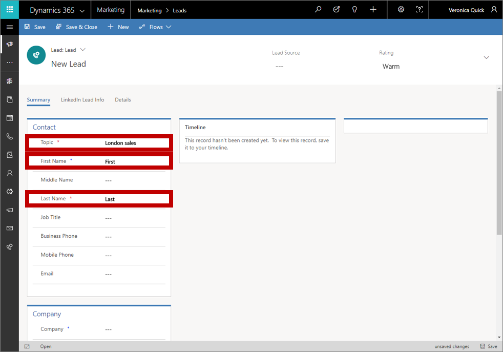

     Do the following:
    - In the **Contact** section, fill out the **Topic**, **First Name**, and **Last Name** fields. The values aren't important for this exercise.
    - In the **Company** section, set the **City** to **London** and the **Country/Region** to **England**.
    - On the command bar, select **Save**.

      When it's saved, the page is refreshed and a business process flow (BPF) is added at the top of the page and several new sections are added to the body.

13. Choose the first step of the business process flow to open its menu, and then make an assignment in the **Existing Contact?** field. Choose any contact you can find&mdash;the one you choose isn't important for this exercise. Then save the lead. The associated contact is now listed in the **Stakeholders** section for the lead.  
     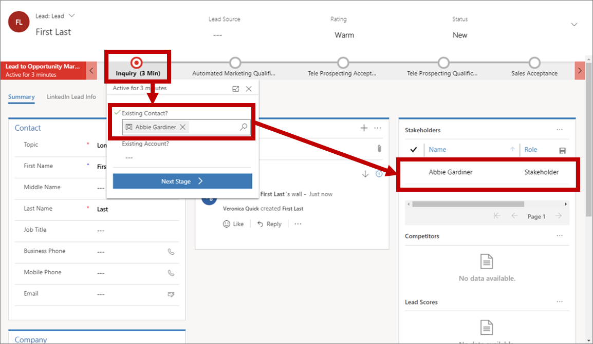

    > [!IMPORTANT]
    > Automatic lead scoring only works for leads that are associated with a contact. Scoring fails for leads that don't have a contact associated with them. Also, segments in Dynamics 365 Marketing can only include contacts, not leads, which means that you can only address marketing emails to contacts.
    > 
    > Your landing pages will typically either create a lead/contact pair when you create a new contact, or associate new leads with existing contacts when they're available. But when you create a lead manually, as you did here, you must also associate it with a contact manually to enable lead scoring.

14. Look for the **Lead Scores** section near the lower-right corner of the page (you might need to scroll). Each lead scoring model is listed here, including your new one. It might take a few minutes for the score to be calculated, but after it is, you should see that it shows a score of 110 points.

### See also

[Design lead-scoring models](score-manage-leads.md)  
[Register link clicks and website visits](register-engagement.md)  
[Manage customer information](manage-customer-information.md)

[!INCLUDE[footer-include](../includes/footer-banner.md)]