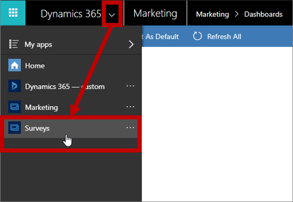
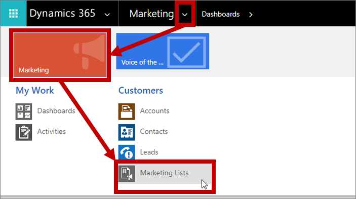
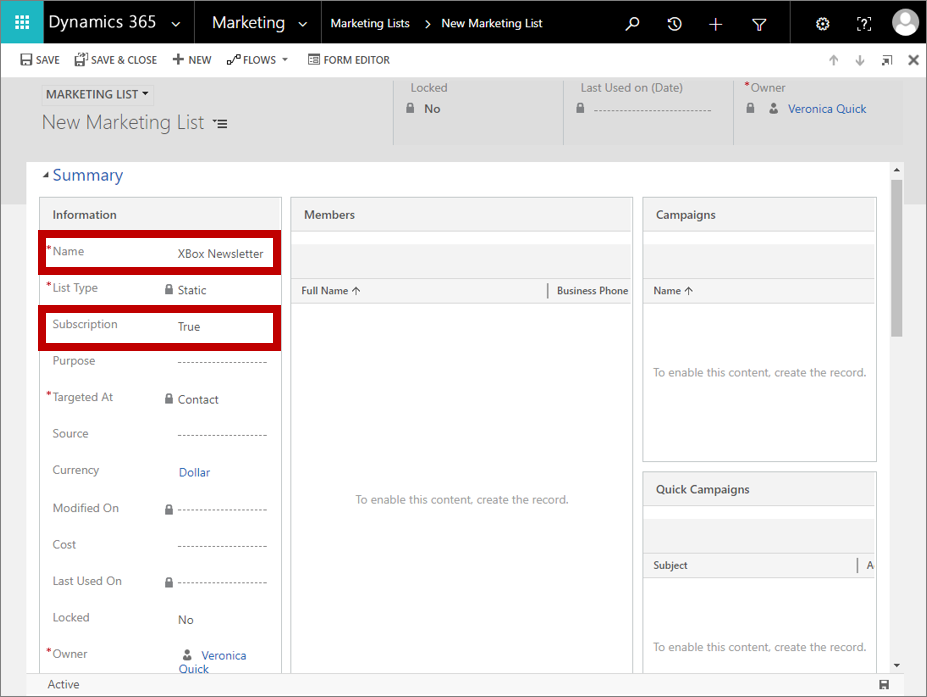
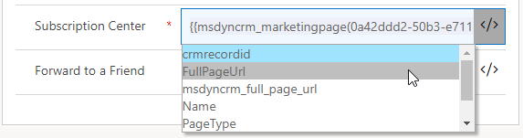

# Set up subscription lists and subscription centers

[!INCLUDE[cc_applies_to_update_9_0_0](../includes/cc_applies_to_update_9_0_0.md)]

A subscription center is a marketing page that known contacts can use to manage their communication preferences and contact details with your organization.

All marketing email messages that you create by using [!INCLUDE[pn-marketing-business-app-module-name](../includes/pn-marketing-business-app-module-name.md)] must include a link to a subscription center, and they will fail the error check if you try to go live with a message that lacks this link. There are two good reasons for requiring a subscription center link in all marketing email messages:

- **Legal requirements**: Many countries/regions have laws that require all marketing email messages to include an unsubscribe link.
- **Deliverability**: Spam filters and internet reputation monitors can identify marketing email messages, and might remove those that don't include an unsubscribe link.

All subscription centers include a **do not email** check box. When a contact chooses this option, the **do not bulk email** flag gets set on his or her contact record and [!INCLUDE[pn-crm-2016-shortest](../includes/pn-crm-2016-shortest.md)] will never send any marketing email messages to that contact. Optionally, your subscription center can present several additional subscription options, such as a list of available newsletters. By presenting several different mailing lists on your subscription center, you gain an opportunity to learn more about your contacts' specific interests while also giving contacts more options beyond the legally required "do not bulk email" option.

Each subscription list exists as a static marketing list in [!INCLUDE[pn-crm-2016-shortest](../includes/pn-crm-2016-shortest.md)], while **do not bulk email** is an explicit attribute of the contact entity. That means that **do not bulk email** overrules subscription list memberships, but it also means that list memberships will be reactivated if a contact later clears **do not bulk email**.

The only way a contact can access a subscription center is by clicking a link sent to them in email. Email links are always personalized for the recipient, which means that [!INCLUDE[pn-crm-2016-shortest](../includes/pn-crm-2016-shortest.md)] always knows which contact has requested the subscription center and therefore populates it with that contact's current details and subscriptions. Note that you can also add subscription lists to standard marketing pages, which enables inbound (previously unknown) contacts to sign up for one or more mailing lists at the same time they register with your site.

A default subscription center is provided with [!INCLUDE[pn-marketing-business-app-module-name](../includes/pn-marketing-business-app-module-name.md)], but it is very simple: it includes the minimum contact fields and the required **do not bulk email** check box. In this exercise, we'll walk through the process of creating a subscription list and adding it to a subscription form. We'll also point out how to choose a subscription center in content settings and how to assign content settings to a customer journey.

## Create a subscription list

Subscription lists are based on the standard (static) marketing lists feature of [!INCLUDE[pn-crm-2016-shortest](../includes/pn-crm-2016-shortest.md)]. To create one:

1. In [!INCLUDE[pn-crm-2016-shortest](../includes/pn-crm-2016-shortest.md)], open the app selector, and then select the **Surveys** app module. (Marketing lists aren't included in the current version of the Marketing work area, so one place you can find them is in the Surveys app, which is included with [!INCLUDE[pn-marketing-business-app-module-name](../includes/pn-marketing-business-app-module-name.md)]. You could also use the [!INCLUDE[pn-custom-app-module](../includes/pn-custom-app-module.md)] app.)  
    

1. The navigator for the Surveys app is a bit different from the [!INCLUDE[pn-marketing-app-module](../includes/pn-marketing-app-module.md)] app: it's horizontal and displayed at the top of the screen. Use it to navigate to **Marketing** &gt; **Customers** &gt; **Marketing Lists**.  
    

1. You now see a list of existing marketing lists, if any. On the toolbar, select **New** to create a new list.

1. The **New Marketing List** page opens.  
    

    Make the following settings (at minimum):
    - **Name**: Enter a descriptive name
    - **Subscription**: Set to **True**.

    > [!TIP]
    > When you set **Subscription** to **True**, the **List Type** is automatically set to **Static** and **Targeted At** is automatically set to **Contact**. Both of these settings are consistent with the requirements of a subscription list, and they remain locked unless you change the **Subscription** setting.

1. On the command bar, select **Save** to save your new subscription list.

## Add a subscription list to a subscription form

Now that you have a subscription list available, you can add it to a subscription form. The procedure is nearly the same as when you add other types of input fields to a form.

1. If you are still in the **Surveys** app, use the app selector to go back to the **Marketing** app.

1. In the [!INCLUDE[pn-marketing-app-module](../includes/pn-marketing-app-module.md)] app, go to **Marketing** &gt; **Internet Marketing** &gt; **Marketing Forms**.

1. You now see a list of forms. On the command bar, select **New** to create a new one.

    > [!TIP]
    > You could instead edit an existing form by choosing it from the list, but for this exercise we'll describe how to create a new one. Note that if you edit an existing form, your edits will affect all marketing pages that use that form because forms are imported by reference, not copied to the page like template content.

1. The **Select a Form Template** dialog box opens.  
    

    Do the following:
    - It's important to select a template of the correct type (subscription center), so start by filtering the template list by choosing the **Type** tab, and then choose **Subscription center** from the drop-down list here.
    - Choose a template (we'll show the **1-Column Subscription Center** for this exercise), and then choose **Select**.

1. Your selected template is now copied to your new form design.  
    

    As you can see, the template has already provided the following:
    - A basic contact-information form that includes several typical fields
    - A **Do not email** check box (which is required for all subscription forms)
    - A **Submit** button (which is required for all forms)
    - Two headings with placeholder text surrounded with square brackets.

    Work directly on the canvas to select each of the placeholder headings (including the brackets) and replace them with actual headings (for example, **Update your contact information** and **Newsletter subscriptions**).

    > [!TIP]
    > Many of the supplied templates for emails, pages, and forms employ this convention of using square brackets to mark instructional placeholder text. They also typically use pseudo-Latin ("lorem ipsum") text as a placeholder for body text, and sometimes example text for headlines, but these don't use square brackets because the text isn't instructional.

1. On the **Toolbox** tab, scroll down until you find the **Subscription Lists** heading. You should see the subscription list that you just made listed here, plus any others that were already in your system. Drag it from the **Toolbox** to the space under the **Newsletter subscriptions** heading.  
    

    > [!TIP]
    > Only forms of type Subscription Center show subscription lists in the **Toolbox**.

1. On the command bar, select **Save** to save your new form.

## Create a subscription center marketing page

Go to **Marketing** &gt; **Internet Marketing** &gt; **Marketing Pages** and create a subscription center page by using the same basic procedure that you used to create a landing page, but be sure to do the following:

1. Make sure the page **Type** is **Subscription Center**, or choose a marketing page template where **Type** is **Subscription Center**.

1. Include a **Form** block that references the subscription form you just made.

1. Enter values for all other required fields (**Name** and **Partial URL**).

1. Select **Check for Errors** and address any issues reported.

1. Select **Go Live**.

For a detailed walkthrough of how to create a marketing page, see [Create a landing page with a form](create-landing-page.md).

## Identify a subscription center in content settings

As you saw in [Create a marketing email and go live](create-marketing-email.md), content settings hold common values that you can place into an email message as dynamic text by using assist-edit (or by typing the correct code). You can create as many Content Settings records as you need, and you must assign one to each customer journey. Because of this architecture, you can use the same email message in several customer journeys, but the subscription center link (and other content settings) included in the message can be different for each journey.

To work with content settings records, go to **Marketing** &gt; **Templates** &gt; **Content Settings**. This brings you to a list of current content settings. As usual, you can edit any listed record or select **New** on the command bar to create a new one.

> [!TIP]
> Like email messages and customer journeys, content settings must be published to the [!INCLUDE[pn-crm-2016-shortest](../includes/pn-crm-2016-shortest.md)] email marketing service (by choosing **Go Live**). After a Content Settings record is published, you can't edit its values. If you need to edit a live Content Settings record, choose **Stop** from the toolbar after opening the record, and then make your changes. Remember to **Go Live** again when you are done editing.

Each field shown here (besides the **Name** and **Default** setting) can be referenced dynamically in your email messages. The two fields, **Address Main** and **Subscription Center** must be referenced in all marketing emails, so they are likewise required here.

To specify a subscription center:

1. Select the **Subscription Center** field.

1. Select the assist-edit button **&lt;/&gt;** for the **Subscription Center** field.

1. A drop-down list opens. Select **Marketing Page**. This identifies the type of entity you are referencing.  
    

1. Assist-edit adds some code and then opens a new drop-down list that shows each marketing page available in your system. Select the name of the subscription page you want to reference.  
    

1. Assist-edit adds the GUID (a unique ID code) for the page you selected, and then opens a third drop-down list that shows the names of several relevant attributes from the Marketing Page entity. We are looking for the page URL, so choose **FullPageUrl**.  
    

    > [!TIP]
    > The expression you just created by using assist-edit is of the form:
    >
    > **{{*EntityName*(*EntityID*).*AttributeName*}}**
    >
    > This expression evaluates to the value of the named attribute (in this case, the URL of a marketing page) from a record of the named entity and ID.
    >
    > Using similar techniques, you can also reference a **Forward to a Friend** page and you can even construct **Address Main** by grabbing field values from an account record.

1. Make other content settings as needed. When you are done, **Save**, **Check for Errors**, and then **Go Live**.

## Identify the content settings to use in a customer journey

As mentioned, content settings are defined on the customer journey level, and apply to all email messages sent by that journey. To view and edit the content settings applied to a journey:

1. Go to **Marketing** &gt; **Marketing Execution** &gt; **Customer Journeys**.

1. Find your journey in the list, or select **New** in the command bar to create a new one.

1. Go to the **General** page of the customer journey record.  
    

1. Use the **Content Settings** field to choose the Content Setting record that applies to the current journey.

## Include a subscription center link in a marketing email

To add a subscription center link to a marketing email:

1. While working in a text block, add some link text (such as **manage subscriptions**) at an appropriate place.

1. Select the anchor text, and then select the **Link** button  from the floating toolbar, which opens the **Link** dialog box.

1. Select the assist-edit button for the **Link** field, and then choose **msdyncrm\_contentsettings** from the first drop-down list and **msdyncrm\_subscriptioncenter** from the second one to build the expression: **{{msdyncrm\_contentsettings.msdyncrm\_subscriptioncenter}}**.  
      

1. Select **OK** to create the link.

[!INCLUDE[proc-more-information](../includes/proc-more-information.md)] [Create a marketing email and go live](create-marketing-email.md)

## Set up a customer journey that targets a subscription list

After you've set up a subscription list, you'll probably want to send regular email messages to your subscribers. To do this, place a segment tile configured to load a subscription list as the first tile in a customer journey that automates your email deliveries and other initiatives.

To set up a segment tile to target a subscription list:

1. Set up a customer journey that starts with a segment group tile, as usual.

1. Select a child segment tile and open the **Properties** tab.

1. Set the **Segment source** to **Subscription Marketing List**, which activates the **Marketing List** field. Then set the **Marking List** to the name of the subscription list you want to use for this journey.  
    

> [!IMPORTANT]
> When a customer journey targets a subscription list, then any contact that unsubscribes from that list using a subscription center will automatically be removed from that journey, even if they are already partway through it. However, if a [!INCLUDE[pn-microsoftcrm](../includes/pn-dynamics-365.md)] users removes a contact from the list manually using the [!INCLUDE[pn-microsoftcrm](../includes/pn-dynamics-365.md)] interface, that contact will continue to be processed by any journeys they already are on, and may continue to receive messages until all active journeys are complete. For this reason, it is always best to request all contacts to manage their own subscriptions using the subscription center.

### See also

[Create and deploy marketing pages](create-deploy-marketing-pages.md)
[Create a simple customer journey](create-simple-customer-journey.md)  
[Use customer journeys to create automated campaigns](customer-journeys-create-automated-campaigns.md)  
[Customer journey tiles reference](customer-journey-tiles-reference.md)  
[Segmentation, lists, and subscriptions](segmentation-lists-subscriptions.md)
[Find your way around](navigation.md)  
[How Dynamics 365 for Marketing uses cookies](cookies.md)

