# Set up subscription lists and subscription centers

A subscription center is a marketing page that known contacts can use to manage their communication preferences and contact details with your organization. All marketing email messages that you create by using Dynamics 365 Marketing must include a link to a subscription center. Marketing email messages will fail the error check if you try to go live with a message that lacks this link.

There are two reasons for requiring a subscription center link in all marketing email messages:

- **Legal requirements**: Many countries and regions have laws that require all marketing email messages to include an unsubscribe link.
- **Deliverability**: Spam filters and internet reputation monitors can identify marketing email messages, and might remove messages that don't include an unsubscribe link.

All subscription centers include a **do not email** check box. When a contact chooses this option, the **do not bulk email** flag gets set on his or her contact record and Dynamics 365 Marketing will never send any marketing email messages to that contact. Optionally, your subscription center can present several additional subscription options, such as a list of available newsletters. By presenting several different mailing lists on your subscription center, you gain an opportunity to learn more about your contacts' specific interests while also giving contacts more options beyond the legally required "do not bulk email" option.

Each subscription list exists as a static marketing list in Dynamics 365, while **do not bulk email** is an explicit attribute of the contact entity. That means that **do not bulk email** overrules subscription list memberships, but it also means that list memberships will be reactivated if a contact later clears **do not bulk email**.

The only way a contact can access a subscription center is by clicking a link sent to them in email. Email links are always personalized for the recipient, which means that Dynamics 365 Marketing always knows which contact has requested the subscription center and therefore populates it with that contact's current details and subscriptions. You can also add subscription lists to standard marketing pages, which enables inbound (previously unknown) contacts to sign up for one or more mailing lists at the same time they register.

> [!IMPORTANT]
> Subscription lists are managed at the *contact* level. If multiple contacts share the same email address, only the specific contact who opted out will stop receiving communications. Other contacts using the same email address will continue to receive communications. If you require opt-outs to be processed at the email level, you will need to create custom processes. More information: [Manage subscriptions at an email level](set-up-subscription-center.md#manage-subscriptions-at-an-email-level).

## How and where to publish your subscription centers

A good subscription center is vital for any organization doing email marketing. As mentioned previously, the feature is required by law in many jurisdictions, and you must link to it from every marketing email you send. You can run as many subscription centers as you like, for example to support various brands or product families, but you must always have at least one. Each subscription center can offer as many different subscription lists as you like, but each subscription center must provide an option for contacts to opt-out of all marketing emails.

### The default subscription center

A default subscription center is provided with every Dynamics 365 Marketing instance. This default page runs natively on the service fabric for your instance and doesn't require a Dynamics 365
portal or external website. This is to ensure that all organizations running Dynamics 365 Marketing can provide this essential feature, even if they don't have a Dynamics 365
portal or external website.

To find, customize, and view the default subscription center:

1. Go to **Marketing** > **Internet marketing** > **Marketing pages** to open a list of available marketing pages.
1. Find the page called **Default Marketing Page** in the list. This is the default subscription center.
1. Select the **Default Marketing Page** to open it.
1. Go to the **Summary** tab and look at the **Full page URL**. This URL uses the same domain as your Dynamics 365 Marketing instance. Select the globe button here to open the page in a new browser tab.
1. The page is already live by default. If you'd like to customize it, select **Edit** in the command bar and then work with it just as you would with any other marketing page. More information: 
1. Select **Save** when you are done customizing. The page automatically publishes your changes and returns to the live state.

> [!IMPORTANT]
> Never delete the default subscription center page! This is the only page that is published on the service fabric rather than on a portal or external site. There is no way to create a new page that is published in this way, so if you delete the default subscription center, you'll need to create an alternative on your portal or external site.

As with all marketing pages, the subscription form on the default marketing page is a marketing form that is defined separately and placed on the page using a form design element. You can edit the form directly and don't need to open the page to do so. To find, customize, and view the default subscription form:

1. Go to **Marketing** > **Internet marketing** > **Marketing forms** to open a list of available marketing forms.
1. Find the form called **Default Subscription Center Form** in the list. This is the default subscription form.
1. Select the **Default Subscription Center Form** to open it.
1. The form is already live by default. If you'd like to customize it, select **Edit** in the command bar and then work with it just as you would with any other marketing form.
1. Select **Save** when you are done customizing. The form automatically publishes your changes and returns to the live state. All pages that use the form will now automatically use your updated version.

### Custom or additional subscription centers

You can publish subscription centers as a native marketing page running on a Dynamics 365
 portal, or set up a marketing form that's embedded on an external site. You can use either of these types of pages as your primary subscription center if you prefer not to use the default one.

## Create a subscription list

To create a subscription list using easy subscription lists:

1. Go to **Marketing** > **Customers** > **Subscription lists** to open a list of existing subscription lists.

1. Select **New subscription list** on the command bar.

1. A new list is created, preconfigured to function as a subscription list. Enter **Name** for the list and fill out the other information as needed.

    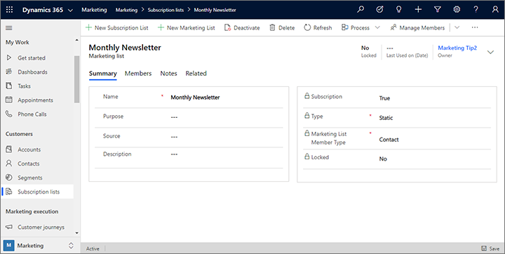

1. Select **Save** to create the subscription list. After saving, you can use the **Members** tab to view, edit, or remove members for the list. Usually, however, you should allow your contacts to manage their own subscriptions using your subscription center.

## Add a subscription list to a subscription form

Now that you have a subscription list available, you can add it to a subscription form. The procedure is nearly the same as when you add other types of input fields to a form.

1. Go to **Marketing** > **Internet Marketing** > **Marketing Forms**.

1. You now see a list of forms. On the command bar, select **New** to create a new one.

    > [!TIP]
    > You could instead edit an existing form by choosing it from the list, but for this exercise we'll describe how to create a new one. Note that if you edit an existing form, your edits will affect all marketing pages that use that form because forms are imported by reference, not copied to the page like template content.

1. The **Marketing form templates** dialog box opens, which helps you find and choose a template to help get started quickly. Select the **Filter** button near the top of the dialog box.

1. The **Filter** panel opens. It's important to select a template of the correct type (subscription center), so start by filtering the template list by setting the **Form type** to **subscription center**. Then select the close button of the **Filter** panel to view the results.

    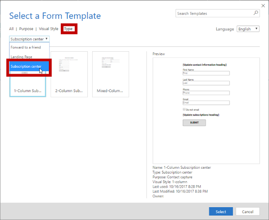

1. Select one of the subscription forms now shown in the gallery. We're using the **heraklion** template as the example in this procedure, so choose that if it's available. Then choose **Select**.

1. Your selected template is now copied to your new form design.  
    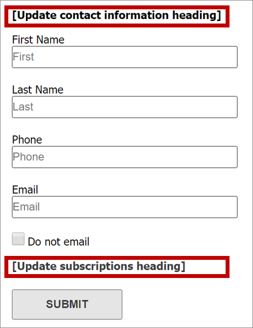

    As you can see, the template has already provided the following:
   - A basic contact-information form that includes several typical fields
   - A **Do not email** check box (which is required for all subscription forms)
   - A **Submit** button (which is required for all forms)
   - Two headings with placeholder text surrounded with square brackets.

    Work directly on the canvas to select each of the placeholder headings (including the brackets) and replace them with actual headings (for example, **Update your contact information** and **Newsletter subscriptions**).

    > [!TIP]
    > Many of the supplied templates for emails, pages, and forms employ this convention of using square brackets to mark instructional placeholder text. They also typically use pseudo-Latin ("lorem ipsum") text as a placeholder for body text, and sometimes example text for headlines, but these don't use square brackets because the text isn't instructional.

1. On the **Toolbox** tab, scroll down until you find the **Subscription lists** heading. You should see the subscription list that you just made listed here, plus any others that were already in your system. Drag it from the **Toolbox** to the space under the **Newsletter subscriptions** heading.  
    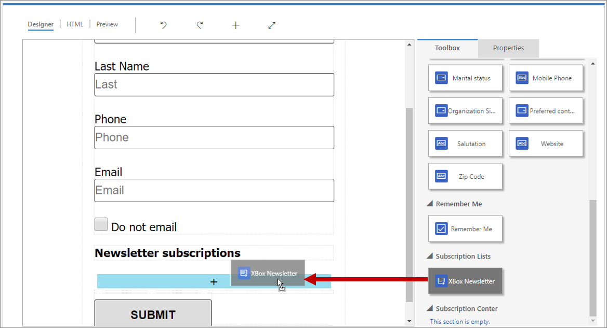

    > [!TIP]
    > Only forms of type *subscription center* show subscription lists in the **Toolbox**.

1. On the command bar, select **Save** to save your new form.

1. On the command bar, select **Go live** publish the form, which makes it available for use on marketing pages.

## Create a subscription center marketing page

Go to **Marketing** > **Internet Marketing** > **Marketing Pages** and create a subscription center page by using the same basic procedure that you used to create a landing page, but be sure to do the following:

1. Make sure the page **Type** is **Subscription Center**, or choose a marketing page template where **Type** is **Subscription Center**.

1. Include a **Form** element that references the subscription form you just made. Configure the form's **Submission behavior** with relevant messages and a **Redirect URL**.

1. Enter values for all other required fields (**Name** and **Partial URL**).

1. Select **Check for Errors** and address any issues reported.

1. Select **Go Live**.

For a detailed walkthrough of how to create a marketing page, see [Create a landing page with a form](create-landing-page.md).

## Identify a subscription center in content settings

Content settings hold common values that you can place into an email message as dynamic text by using assist- edit (or by typing the correct code). You can create as many content-settings records as you need, and you must assign one to each customer journey. Because of this architecture, you can use the same email message in several customer journeys, but the subscription center link (and other content settings) included in the message can be different for each journey.

To work with content settings records, go to **Marketing** > **Marketing templates** > **Content Settings**. This brings you to a list of current content settings. As usual, you can edit any listed record or select **New** on the command bar to create a new one.

> [!TIP]
> Like email messages and customer journeys, content settings must be published to the Dynamics 365 Marketing email marketing service (by selecting **Go Live**). If you need to edit a live content-settings record, choose **Edit** on the toolbar after opening the record, make your changes, and then select **Save**; on save, it automatically publishes your changes and returns to the live state.

Each field shown here (besides the **Name** and **Default** setting) can be referenced dynamically in your email messages. The two fields, **Address Main** and **Subscription Center** must be referenced in all marketing emails, so they are likewise required here.

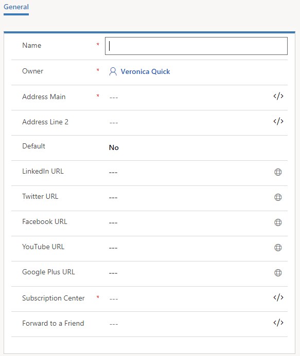

To specify a subscription center in the content settings:

1. Select the **Subscription Center** field.

1. Select the **[Assist edit](dynamic-email-content.md#assist-edit)** button  for the **Subscription Center** field.

1. The assist-edit dialog opens. Select the **Static** radio button.    
    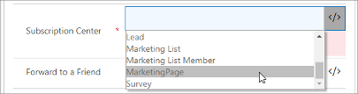

1. From the **Select an option** combo box, select **Marketing page**.

1. From the **Choose a record** combo box, select the name of the subscription center page you want to use. If you have a large number of pages, you can enter some text here to filter the list, which can make the page you want easier to find. You have now identified the marketing-page record that will be your subscription center for this content-setting record.

1. Select **Next** to continue.

1. Select the **Property** radio button.
    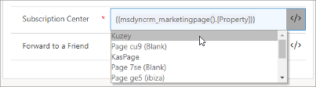 

    Note the code shown at the bottom of the dialog&mdash;this is the actual expression that you have built based on your choices so far

1. From the **Select field** combo box, select **FullPageUrl**. This is the field from the marketing-page entity that holds the URL for the marketing-page record you identified on the previous page. 

1. Select **OK** to add the dynamic expression you have built to your content settings.

    > [!TIP]
    > The expression you just created by using assist edit is of the form:
    >
    > **{{*EntityName*(*EntityID*).*AttributeName*}}**
    >
    > This expression evaluates to the value of the named attribute (in this case, the URL of a marketing page) from a record of the named entity and ID.
    >
    > Using similar techniques, you can also reference a **Forward to a Friend** page and you can even construct **Address Main** by grabbing field values from an account record.

1. Make other content settings as needed. When you are done, **Save**, **Check for Errors**, and then **Go Live**.

For more information about content settings and the assist-edit tool, see [Add dynamic content to email messages](dynamic-email-content.md).

## Identify the content settings to use in a customer journey

As mentioned, content settings are defined on the customer journey level, and apply to all email messages sent by that journey. To view and edit the content settings applied to a journey:

1. Go to **Marketing** > **Marketing Execution** > **Customer Journeys**.

1. Find your journey in the list, or select **New** in the command bar to create a new one.

1. Go to the **General** page of the customer journey record.  
    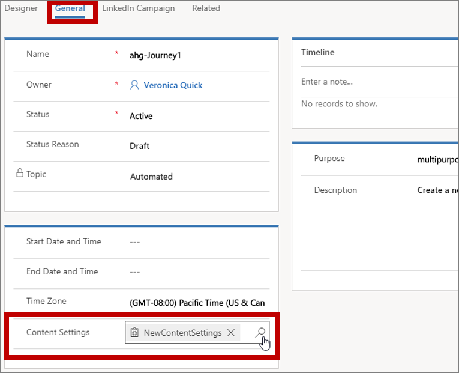

1. Use the **Content Settings** field to choose the Content Setting record that applies to the current journey.

## Include a subscription center link in a marketing email

To add a subscription center link to a marketing email:

1. While working in a text element, add some link text (such as **manage subscriptions**) at an appropriate place.

1. Select the anchor text, and then select the **Link** button  from the floating toolbar, which opens the **Link** dialog box.    
      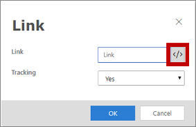  

1. Select the **[Assist edit](dynamic-email-content.md#assist-edit)** button  for the **Link** field. In the assist-edit dialog, select **Contextual** and then **ContentSettings** on the first page. Select **Next** and then pick **Property** and **msdyncrm_subscriptioncenter** on the second page. Select **OK** to place the expression `{{msdyncrm_contentsettings.msdyncrm_subscriptioncenter}}` into the **Link** field. 

1. Select **OK** to create the link.

More information: [Create a marketing email and go live](create-marketing-email.md)

## Test your subscription center

To test your subscription center, you must send yourself a subscription-center link in a live email from a live customer journey. The subscription center won't work correctly if you open its URL directly, or select a link sent in a test message.

Subscription centers only work when they "know" who they are talking to. This enables the subscription center to display existing contact information in editable fields (like name and email), and also to indicate which of the available subscription lists the viewer already belongs to. The only way most people will be able to open the subscription center is by selecting a link sent to them in a marketing email from a customer journey. Links such as these include an ID that lets the subscription center know which contact has requested the page. (In fact, all links in marketing emails include an ID that's linked to both the contact and the message, which enables the system to report which link each contact has selected in each message.)

If you open a subscription center by opening its URL directly (or by using  a link sent in a test message), an error message will display indicating that the system is not able to verify your contact information.

To fully test your subscription center, set up a simple customer journey that targets a single contact record with your email address and sends out a simple marketing email that links to your subscription center (similar to the journey presented in the previous section, but be sure to use a limited segment). When you receive the message, select the subscription center link and test its features.

## View and edit which lists each contact subscribes to

### View, add, or remove subscription list memberships for a displayed contact

To view, add, or remove list memberships for a displayed contact:

1. Go to **Marketing** > **Customers** > **Contacts**.
1. Open the contact you want to view or edit.
1. Open the **Details** tab of the contact record and find the **Subscription lists** section.

    - Each subscription list that the contact already belongs to is listed here.
    - To remove the contact from any of these subscriptions, select the **More options** button (which looks like an ellipsis) next to the target list and then select **Remove**.
    - To add the contact to any existing subscription list, select the **More commands** button (which looks like an ellipsis) in the **Subscription lists** heading and then select **Add existing marketing list**. A flyout opens. Use it to search for and select each list that you want to add the selected contact(s) to. The select **Add** to add the contacts and close the flyout.

    

### Add contacts to lists from a contact list or form view

To add displayed contacts to a subscription list or static marketing list: 

1. Go to **Marketing** > **Customers** > **Contacts**.

1. Do one of the following:

    - Set filters and view options to find a collection of one or more contacts. Then place a check mark in the left-hand column for each contact you want to add or remove.
    - Open or create a contact record.

1. On the command bar, open the **Lists and segments** drop-down list and select one of the following:
    - **Add to subscription list**: To add the currently shown or selected contacts to one or more existing subscription lists.
    - **Add to marketing list**: To add the currently shown or selected contacts to one or more existing static marketing lists.

    (Note that you can also add or remove the contact(s) to/from static segments using this drop-down list. More information: [Manage segment memberships from a contact record](manage-segments-from-contacts.md))

1. A flyout opens. Use it to search for and select each list that you want to add the selected contact(s) to. The select **Add** to add the contacts and close the flyout.

## Manage subscriptions at an email level

Depending on your Marketing setup and the region in which you operate, you may need to process opt-outs at an email level. The following are ways to process email level opt-outs:

### Don’t allow users to create multiple contacts with the same email address

If an email address is linked to existing contact, you can prohibit users from creating a new contact with the same email address. Limiting each email address to a single contact eliminates duplication, ensuring that opt-outs apply to the correct contact every time.

You can apply duplicate detection rules [to your entire organization](business-management-settings.md) (**Settings** > **Advanced** > **Business Management** > **Duplicate detection**). This function is enabled by default. Dynamics 365 includes duplicate detection rules for accounts and contacts. The email address rule specifically detects, “*Contacts where the same email address is found.*” If duplicate detection is enabled, duplicates are detected when:

- **A record is created or updated:** The system checks for duplicates when a user enters or updates records.
- **During data import:** When you use the Import Data wizard to load contacts or accounts, the wizard detects duplicate records.

The global duplicate detection rule only applies to the “Email” field.

> [!div class="mx-imgBorder"]
> 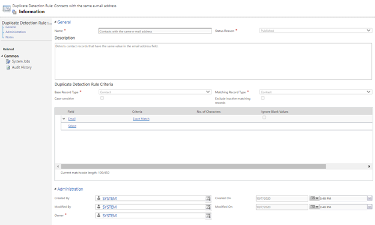

If you need to create additional duplicate detection rules, for example, for an “Email Address 2” field, you can add another rule by following the instructions in [this Power Platform guide](https://docs.microsoft.com/power-platform/admin/set-up-duplicate-detection-rules-keep-data-clean).

> [!NOTE]
> Changing or deleting system rules may cause duplicate detection to not function as expected.

> [!NOTE]
> When Business Units are enabled, the Business Unit that owns the form is included in the matching criteria. This means that forms could create contacts with the same email in a different Business Unit. If you require unique email addresses per org, turn the Business Unit feature off.

> [!NOTE]
> When configuring a contact matching strategy, it makes sense to keep matching on the email only (default) for forms and events matching strategies.

### Run bulk system jobs to detect email duplication

As some changes to the customer database are not captured by the global duplicate detection rules (for example, when merging contact records or activating them), you can check for duplicates periodically using [scheduled jobs](https://docs.microsoft.com/power-platform/admin/run-bulk-system-jobs-detect-duplicate-records). To create a scheduled job, go to the Power Platform admin center then select **Settings** > **Data management** > **Duplicate detection jobs**. Create a new job, add the email address fields you want to check, and define the schedule.

> [!div class="mx-imgBorder"]
> 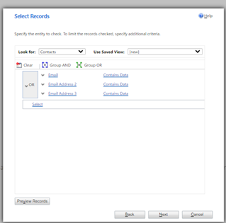

After detecting duplicate email records, you can choose a master record and merge, delete, or edit other duplicates.

If you need to further customize duplicate email processing, refer to the [Detect duplicate data using code](https://docs.microsoft.com/powerapps/developer/data-platform/detect-duplicate-data-with-code) article.

### Update consent for all contacts sharing the same email address once one contact has opted out

You can create a marketing form to capture your customers’ preferences. You can configure the form to collect data, but not to create new contacts or update existing contacts at the time of submission. This feature provides you with flexibility to decide how to handle the form submission entity before creating or updating contacts.

You can then set up a workflow that will extract the email address from the submission and query the database with it to get the list of contacts with the same email address and update their preferences.

> [!NOTE]
> The **No update** setting only works with landing page form types.

For more information, see [Mapping form data to entities with custom Workflows](entity-mapping.md) and other documents in the [Developer guide](developer/marketing-developer-guide.md).

### See also

[Create and deploy marketing pages](create-deploy-marketing-pages.md)  
[Create a simple customer journey](create-simple-customer-journey.md)  
[Use customer journeys to create automated campaigns](customer-journeys-create-automated-campaigns.md)  
[Customer journey tiles reference](customer-journey-tiles-reference.md)  
[Working with segments](segmentation-lists-subscriptions.md)  
[How Dynamics 365 Marketing uses cookies](cookies.md)

[!INCLUDE[footer-include](../includes/footer-banner.md)]