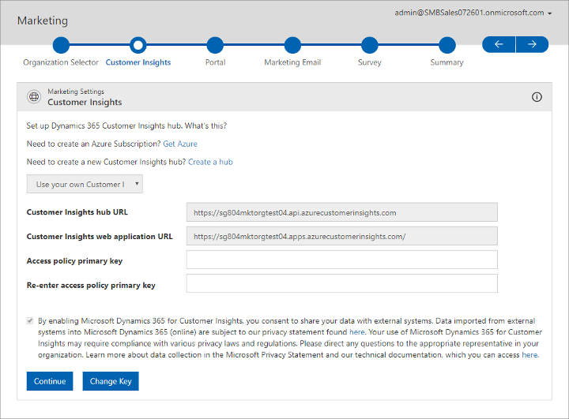

# Use a full [!INCLUDE[pn-customer-insights-full](../includes/pn-customer-insights-full.md)] account with [!INCLUDE[pn-marketing-business-app-module-name](../includes/pn-marketing-business-app-module-name.md)]

[!INCLUDE[Pre-release disclaimer](../includes/cc-beta-prerelease-disclaimer.md)]

[!INCLUDE[pn-marketing-business-app-module-name](../includes/pn-marketing-business-app-module-name.md)] uses [!INCLUDE[pn-customer-insights-full](../includes/pn-customer-insights-full.md)] to process contact information, define market segments, and more.

You can choose to use a [!INCLUDE[pn-customer-insights-short](../includes/pn-customer-insights-short.md)] account created and managed by [!INCLUDE[cc-microsoft](../includes/cc-microsoft.md)] specifically for [!INCLUDE[pn-marketing-business-app-module-name](../includes/pn-marketing-business-app-module-name.md)], but you might instead choose to use your own, fully licensed account to gain access to more [!INCLUDE[pn-customer-insights-short](../includes/pn-customer-insights-short.md)] features. 

It's easiest to use the limited [!INCLUDE[pn-customer-insights-short](../includes/pn-customer-insights-short.md)] account created by the [!INCLUDE[pn-marketing-business-app-module-name](../includes/pn-marketing-business-app-module-name.md)]. To do that, just follow the instructions given in [First-time setup](purchase-setup.md) and ignore this topic. But to use your own full-featured account, follow the instructions provided here.

> [!IMPORTANT]
> Your [!INCLUDE[pn-customer-insights-short](../includes/pn-customer-insights-short.md)] account must be running on the same tenant as [!INCLUDE[pn-marketing-business-app-module-name](../includes/pn-marketing-business-app-module-name.md)].

If you don't already have a fully licensed [!INCLUDE[pn-customer-insights-full](../includes/pn-customer-insights-full.md)] account and would like to set one up while setting up [!INCLUDE[pn-marketing-business-app-module-name](../includes/pn-marketing-business-app-module-name.md)], the setup wizard will help you by providing the required links.

1. Start by running the [!INCLUDE[pn-marketing-business-app-module-name](../includes/pn-marketing-business-app-module-name.md)] setup wizard as described in [First-time setup](purchase-setup.md). When you get to the page of the setup wizard called **[!INCLUDE[pn-customer-insights-short](../includes/pn-customer-insights-short.md)]**, follow the link back to this page.

1. On the **[!INCLUDE[pn-customer-insights-short](../includes/pn-customer-insights-short.md)]** page of the wizard, choose **Use your own** from the drop-down list. The page updates to show more settings.  
    

1. If you don't already have a [!INCLUDE[cc-microsoft](../includes/cc-microsoft.md)] [!INCLUDE[pn-azure-shortest](../includes/pn-azure-shortest.md)] subscription, click the first link provided near the top of the page. This opens a new browser window that will help you set up a new subscription. [!INCLUDE[cc-microsoft](../includes/cc-microsoft.md)] [!INCLUDE[pn-azure-shortest](../includes/pn-azure-shortest.md)] is a subscription-based cloud-computing platform on which [!INCLUDE[pn-customer-insights-short](../includes/pn-customer-insights-short.md)], and many other [!INCLUDE[pn-microsoftcrm](../includes/pn-microsoftcrm.md)] services, run.

1. If you don't already have a [!INCLUDE[pn-customer-insights-short](../includes/pn-customer-insights-short.md)] subscription, select the second link provided near the top of the page. This opens a new browser window that will help you set up a new [!INCLUDE[pn-customer-insights-short](../includes/pn-customer-insights-short.md)] Hub, which is the service that provides the [!INCLUDE[pn-customer-insights-short](../includes/pn-customer-insights-short.md)] feature. [!INCLUDE[pn-customer-insights-short](../includes/pn-customer-insights-short.md)] runs on [!INCLUDE[pn-azure-shortest](../includes/pn-azure-shortest.md)], so you must already have an [!INCLUDE[pn-azure-shortest](../includes/pn-azure-shortest.md)] account before you can set up [!INCLUDE[pn-customer-insights-short](../includes/pn-customer-insights-short.md)].

1. After you have your [!INCLUDE[pn-azure-shortest](../includes/pn-azure-shortest.md)] and [!INCLUDE[pn-customer-insights-short](../includes/pn-customer-insights-short.md)] Hub subscriptions in place, you're ready to fill out the rest of the settings on this page, which will enable [!INCLUDE[pn-marketing-business-app-module-name](../includes/pn-marketing-business-app-module-name.md)] to access those services. Start with the **[!INCLUDE[pn-customer-insights-short](../includes/pn-customer-insights-short.md)] Hub URL**. To find this value, sign in to your [!INCLUDE[pn-azure-shortest](../includes/pn-azure-shortest.md)] account and copy the **API Endpoint** value shown on the **Overview** page (shown in the following image) to the **[!INCLUDE[pn-customer-insights-short](../includes/pn-customer-insights-short.md)] Hub URL** field in the [!INCLUDE[pn-microsoftcrm](../includes/pn-microsoftcrm.md)] setup.

    

1. Now find your **[!INCLUDE[pn-customer-insights-short](../includes/pn-customer-insights-short.md)] web application URL**, which is also on the **Overview** page in [!INCLUDE[pn-azure-shortest](../includes/pn-azure-shortest.md)]. Select the link shown under the **Application** heading to open the application in your browser, then copy the URL itself from your browser's **Address** bar into the **[!INCLUDE[pn-customer-insights-short](../includes/pn-customer-insights-short.md)] web application URL** field in the [!INCLUDE[pn-microsoftcrm](../includes/pn-microsoftcrm.md)] setup.

    

1. Finally, you need your **Access policy primary key**, which functions as a password that authenticates [!INCLUDE[pn-microsoftcrm](../includes/pn-microsoftcrm.md)] to communicate with [!INCLUDE[pn-azure-shortest](../includes/pn-azure-shortest.md)] and [!INCLUDE[pn-customer-insights-short](../includes/pn-customer-insights-short.md)]. You'll also find this value in your [!INCLUDE[pn-azure-shortest](../includes/pn-azure-shortest.md)] portal, but on a different page. Do the following:
    1. Select **Keys** in the leftmost column, and then select the **Policy Name** shown.

        

    1. Details about your selected policy now appear. Copy the value shown for the **Primary Key** from here into the **Access policy primary key** field in [!INCLUDE[pn-microsoftcrm](../includes/pn-microsoftcrm.md)] setup.

        

1. Paste the same key value that you just found into the **Re-enter access policy primary key** field too.

1. Carefully read the check box text at the bottom of the form, and follow and read all the links provided. This text and its links provide important privacy information and describe the privacy policy for [!INCLUDE[pn-customer-insights-short](../includes/pn-customer-insights-short.md)]. If you agree with the policies described, select the check box. If you don't accept these terms, quit the setup wizard.

1. Select **Continue** to start the setup and integration process for [!INCLUDE[pn-customer-insights-short](../includes/pn-customer-insights-short.md)] and continue with the wizard.

1. Return to [First time setup](purchase-setup.md) and continue from [Step 3: The Portal page](purchase-setup.md#step-3-the-portal-page).

## Privacy notice

[!INCLUDE[cc-privacy-marketing-fre](../includes/cc-privacy-marketing-fre.md)]

### See also

[First time setup](purchase-setup.md)