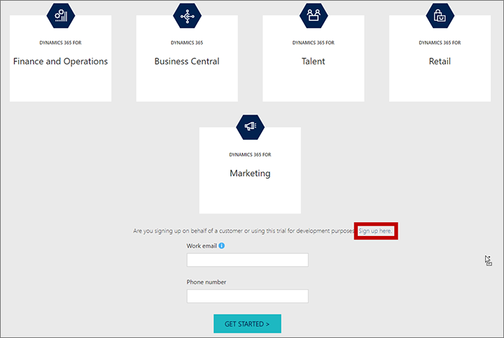
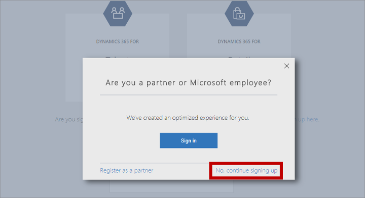
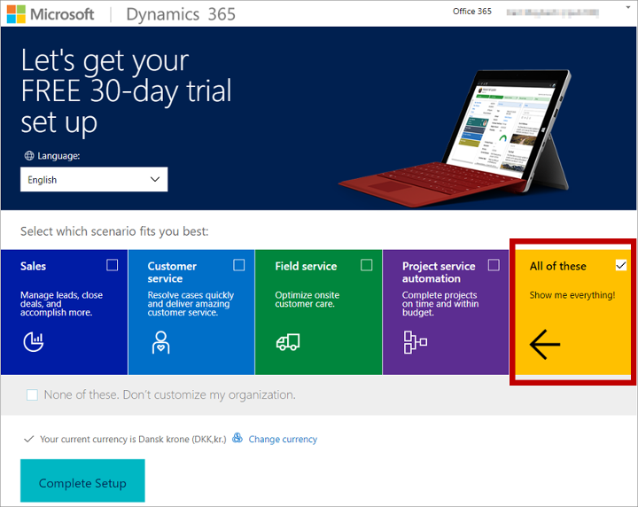

# First time setup FAQ and troubleshooting

[!INCLUDE[cc_applies_to_update_9_0_0](../includes/cc_applies_to_update_9_0_0.md)]

Read this topic to find answers to common questions and solutions to known issues that can sometimes occur during the initial setup of [!INCLUDE[pn-marketing-business-app-module-name](../includes/pn-marketing-business-app-module-name.md)].

## How can I set up a [!INCLUDE[pn-marketing-app-module](../includes/pn-marketing-app-module.md)] trial?

You can install and use a trial version of [!INCLUDE[pn-marketing-business-app-module-name](../includes/pn-marketing-business-app-module-name.md)] for free. Prerequisites for the trial are the same as those for the production version of the product, but you can install it on a trial (or production) [!INCLUDE[pn-ms-office-365](../includes/pn-ms-office-365.md)] tenant, and you must use it with a trial version of [!INCLUDE[pn-microsoftcrm](../includes/pn-dynamics-365.md)].

- _If you already have an [!INCLUDE[pn-ms-office-365](../includes/pn-ms-office-365.md)] tenant_, then you can install the [!INCLUDE[pn-marketing-business-app-module-name](../includes/pn-marketing-business-app-module-name.md)] trial there simply by requesting the trial. The [!INCLUDE[pn-marketing-business-app-module-name](../includes/pn-marketing-business-app-module-name.md)] trial setup installs a [!INCLUDE[pn-microsoftcrm](../includes/pn-dynamics-365.md)] trial at the same time and configures [!INCLUDE[pn-marketing-app-module](../includes/pn-marketing-app-module.md)] to run on that trial. You can't install the [!INCLUDE[pn-marketing-app-module](../includes/pn-marketing-app-module.md)] trial on a production version of [!INCLUDE[pn-microsoftcrm](../includes/pn-dynamics-365.md)]. See [Sign up for the Dynamics 365 for Marketing trial](#marketing-preview-signup) for instructions.

- _If you don't already have an [!INCLUDE[pn-ms-office-365](../includes/pn-ms-office-365.md)] tenant_, or if you want to set up a temporary one especially for running the [!INCLUDE[pn-marketing-app-module](../includes/pn-marketing-app-module.md)] trial, then you can set up a [!INCLUDE[pn-microsoftcrm](../includes/pn-dynamics-365.md)] trial, which creates its own [!INCLUDE[pn-ms-office-365](../includes/pn-ms-office-365.md)] tenant trial at the same time. Then you can install the [!INCLUDE[pn-marketing-app-module](../includes/pn-marketing-app-module.md)] trial on that tenant. See [Sign up for a Dynamics 365 trial that includes a trial Office 365 tenant](#D365-preview-signup) for instructions.

### Sign up for the [!INCLUDE[pn-marketing-business-app-module-name](../includes/pn-marketing-business-app-module-name.md)] trial

Once you have a trial or production [!INCLUDE[pn-ms-office-365](../includes/pn-ms-office-365.md)] tenant, you can install the [!INCLUDE[pn-marketing-business-app-module-name](../includes/pn-marketing-business-app-module-name.md)] trial on it. The [!INCLUDE[pn-marketing-business-app-module-name](../includes/pn-marketing-business-app-module-name.md)] trial creates its own [!INCLUDE[pn-microsoftcrm](../includes/pn-dynamics-365.md)] trial to run on if needed. You can't run the [!INCLUDE[pn-marketing-app-module](../includes/pn-marketing-app-module.md)] trial on a production version of [!INCLUDE[pn-microsoftcrm](../includes/pn-dynamics-365.md)]. To sign up for the trial:

1. Open a web browser and go to [trials.dynamics.com](https://trials.dynamics.com).

1. A form opens asking for your email address and phone number. Use the email address that you use to sign into your [!INCLUDE[pn-ms-office-365](../includes/pn-ms-office-365.md)] tenant or the one you created when setting up a trial tenant.

1. Follow the instructions on your screen.

1. When you get to the **Welcome to [!INCLUDE[pn-marketing-business-app-module-name](../includes/pn-marketing-business-app-module-name.md)] Setup** message, follow the instructions given in [First time setup](purchase-setup.md).

### Sign up for a [!INCLUDE[pn-microsoftcrm](../includes/pn-dynamics-365.md)] trial that includes a trial [!INCLUDE[pn-ms-office-365](../includes/pn-ms-office-365.md)] tenant

If you don't already have a [!INCLUDE[pn-ms-office-365](../includes/pn-ms-office-365.md)] tenant where you'd like to run the [!INCLUDE[pn-marketing-app-module](../includes/pn-marketing-app-module.md)] trial, then you can set up a [!INCLUDE[pn-microsoftcrm](../includes/pn-dynamics-365.md)] trial, which creates its own [!INCLUDE[pn-ms-office-365](../includes/pn-ms-office-365.md)] tenant trial at the same time, and then install the [!INCLUDE[pn-marketing-app-module](../includes/pn-marketing-app-module.md)] trial there.

1. Open a web browser and go to [trials.dynamics.com](https://trials.dynamics.com/).

1. Scroll down past the icons and then select the **Sign up here** link next to "Are you signing up on behalf of a customer or using this trial for development purposes?"  
    

1. A dialog box opens. Choose the **No, continue signing up** link.  
    

1. A form opens, requesting your contact details. Enter your information.
    > [!IMPORTANT]
    > You must register in a country/region where the [!INCLUDE[pn-marketing-app-module](../includes/pn-marketing-app-module.md)] trial is available.

1. Continue by following the instructions on your screen and providing the information requested. The last page of the setup asks you to choose a scenario. Be sure to select **All of these**, which makes sure your new [!INCLUDE[pn-microsoftcrm](../includes/pn-dynamics-365.md)] user account gets created with system admin privileges, and then select **Complete Setup**.  
    

1. After a few minutes, your new [!INCLUDE[pn-microsoftcrm](../includes/pn-dynamics-365.md)] organization will be ready and will open in your browser. Be sure to make a note of your org's URL and your other account details, such as the user name, password, and email address you chose while setting it up.

1. This step is optional, but it can be useful to set up an [!INCLUDE[pn-ms-office-365](../includes/pn-ms-office-365.md)] trial so you can set up email accounts to use with your [!INCLUDE[pn-marketing-business-app-module-name](../includes/pn-marketing-business-app-module-name.md)] trial. 
    1. Open a new browser tab and go to [portal.office.com/adminportal/home?rc=1#/catalog](https://portal.office.com/adminportal/home?rc=1#/catalog). This is where you can add new apps to your new org.
    1. Scroll down to the **[!INCLUDE[pn-ms-office-365](../includes/pn-ms-office-365.md)] Enterprise E3** box. Hover your mouse over this box to open a flyout message and then select **Start free trial** on the message.
    1. Follow the instructions on your screen to add the trial to your account.
    1. You can now go to the [!INCLUDE[pn-office-365-admin-center](../includes/pn-office-365-admin-center.md)] to assign an [!INCLUDE[pn-ms-office-365](../includes/pn-ms-office-365.md)] license to your user account and then set up an [!INCLUDE[pn-exchange](../includes/pn-exchange.md)] mailbox for yourself. It may take several minutes for your mailbox to come online, but when it's ready you should consider setting [!INCLUDE[pn-exchange](../includes/pn-exchange.md)] to forward all messages to your usual work address.  To set up forwarding:
        1. Select your new user account. A flyout panel opens.
        1. Expand the **Mail Settings** heading on the flyout panel. (If you see a message that the mailbox is still being set up, then wait for the setup to complete.)
        1. Select the **Edit** link for **Email forwarding**.
        1. Turn forwarding on and specify the target email address. Then select **Save**.
        1. Close the flyout panel.

1. Install the [!INCLUDE[pn-marketing-app-module](../includes/pn-marketing-app-module.md)] trial on your new trial [!INCLUDE[pn-ms-office-365](../includes/pn-ms-office-365.md)] tenant as described in [Sign up for the Dynamics 365 for Marketing trial](#marketing-preview-signup).

### Add more users to a [!INCLUDE[pn-marketing-app-module](../includes/pn-marketing-app-module.md)] trial running on a trial tenant
If you followed the instructions provided in this section so far, then you should now have a [!INCLUDE[pn-marketing-business-app-module-name](../includes/pn-marketing-business-app-module-name.md)] trial set up with:

- A trial [!INCLUDE[pn-ms-office-365](../includes/pn-ms-office-365.md)] tenant.
- A trial [!INCLUDE[pn-microsoftcrm](../includes/pn-dynamics-365.md)] organization installed on the trial [!INCLUDE[pn-ms-office-365](../includes/pn-ms-office-365.md)] tenant.
- A trial [!INCLUDE[pn-ms-office-365](../includes/pn-ms-office-365.md)] Enterprise E3 license installed on the trial [!INCLUDE[pn-ms-office-365](../includes/pn-ms-office-365.md)] tenant.
- A trial [!INCLUDE[pn-marketing-business-app-module-name](../includes/pn-marketing-business-app-module-name.md)] app installed on the trial [!INCLUDE[pn-microsoftcrm](../includes/pn-dynamics-365.md)] org.

The user account that you used to set it up is now:

- The global administrator for the trial [!INCLUDE[pn-ms-office-365](../includes/pn-ms-office-365.md)] tenant.
- A system administrator for the [!INCLUDE[pn-microsoftcrm](../includes/pn-dynamics-365.md)] org.

When you install the [!INCLUDE[pn-marketing-app-module](../includes/pn-marketing-app-module.md)] trial on a trial [!INCLUDE[pn-ms-office-365](../includes/pn-ms-office-365.md)] tenant, as described here, then each new user must be added in a special way. If you set up a [!INCLUDE[pn-marketing-app-module](../includes/pn-marketing-app-module.md)] trial on an existing, non-trial tenant, then new users can just sign up as described in [Sign up for the Dynamics 365 for Marketing trial](#marketing-preview-signup). To add new users to a [!INCLUDE[pn-marketing-app-module](../includes/pn-marketing-app-module.md)] trial running on a trial [!INCLUDE[pn-ms-office-365](../includes/pn-ms-office-365.md)] tenant:

1. Open a web browser and go to [portal.office.com](http://portal.office.com). Sign in to your trial [!INCLUDE[pn-ms-office-365](../includes/pn-ms-office-365.md)] tenant as the global administrator that you set up while signing up for the trial.
1. Once you are signed in, go to [portal.office.com/adminportal/home#/users](http://portal.office.com/adminportal/home#/users) to open the **Active users** page, where you can manage users for the tenant.
1. Select **Add a user** to open the **New user** flyout panel.
1. Enter the new user's name and other details in the flyout panel. 
    - Make sure the **Domain** is the same as the trial [!INCLUDE[pn-ms-office-365](../includes/pn-ms-office-365.md)] tenant.   
    - Create a non-random password and make a note of the password.
    - Under **Product licenses**, enable licenses for both **[!INCLUDE[pn-ms-office-365](../includes/pn-ms-office-365.md)] Enterprise E3** and **[!INCLUDE[pn-microsoftcrm](../includes/pn-dynamics-365.md)] Customer Engagement Plan Enterprise Edition**.
1. Select **Add** to create the new user, and then select **Send email and close** to close the flyout panel.

The new user account is now available on your [!INCLUDE[pn-ms-office-365](../includes/pn-ms-office-365.md)] tenant, where it is also assigned trial licenses to [!INCLUDE[pn-ms-office-365](../includes/pn-ms-office-365.md)] Enterprise E3 and [!INCLUDE[pn-microsoftcrm](../includes/pn-dynamics-365.md)]. The user also has an email address at your trial [!INCLUDE[pn-ms-office-365](../includes/pn-ms-office-365.md)] domain. You should consider setting up mail forwarding to make sure the new user will receive signup messages. To set up forwarding:
1. On the **Active users** page, select the name of the new user account. A flyout panel opens showing details about the selected user.
1. Expand the **Mail Settings** heading on the flyout panel. (If you see a message that the mailbox is still being set up, then wait for the setup to complete.)
1. Select the **Edit** link for **Email forwarding**.
1. Turn forwarding on and specify the target email address. Then select **Save**.
1. Close the flyout panel.
1. Sign out of [!INCLUDE[pn-ms-office-365](../includes/pn-ms-office-365.md)] and quit your browser.

Now the new user needs to sign up for the [!INCLUDE[pn-marketing-app-module](../includes/pn-marketing-app-module.md)] trial. You can either set this up for them or ask them to do it themselves. Either way, you'll need to approve the new user afterwards. The procedure is as follows:
1. Open a web browser and go to [trials.dynamics.com](https://trials.dynamics.com).
1. A form opens asking for your email address and phone number. Use the email address for the new user that you just set up in [!INCLUDE[pn-ms-office-365](../includes/pn-ms-office-365.md)].
1. A page opens to tell you that you already have an [!INCLUDE[pn-ms-office-365](../includes/pn-ms-office-365.md)] account, so just select **Sign in**.
1. Sign in using the [!INCLUDE[pn-ms-office-365](../includes/pn-ms-office-365.md)] email address and password that you created for the new user. 
1. A page opens to tell you that you already have a license for [!INCLUDE[pn-microsoftcrm](../includes/pn-dynamics-365.md)]. Select **OK, got it**.
1. You now see a list of [!INCLUDE[pn-microsoftcrm](../includes/pn-dynamics-365.md)] organizations that are available on your trial [!INCLUDE[pn-ms-office-365](../includes/pn-ms-office-365.md)] tenant (there may be just one). Select the organization that you want to add the new user to and then select **Join**.
1. A dialog box asks you to choose an app. **[!INCLUDE[pn-marketing-app-module](../includes/pn-marketing-app-module.md)]** is probably already shown and selected, so just select **Continue**.
A thank-you page opens telling you that a request has been sent to the trial owner (this is the global admin account created when you first set up the trial org).
1. Sign out of [!INCLUDE[pn-ms-office-365](../includes/pn-ms-office-365.md)] and quit your browser.

Check the email inbox for the trial global admin. You should find a message telling you that you have a request to join your [!INCLUDE[pn-microsoftcrm](../includes/pn-dynamics-365.md)] trial. 
1. Select the **Approve** link included in the email.
1. The link opens in your browser, which should now be asking you to sign into [!INCLUDE[pn-microsoftcrm](../includes/pn-dynamics-365.md)]. Sign in using the global admin account.

You should now see an **Approved!** message. The system sends the new user an email that includes a link they can use to sign into the [!INCLUDE[pn-marketing-business-app-module-name](../includes/pn-marketing-business-app-module-name.md)] trial using the password you chose for them.
The new user is granted most user roles (including admin) in [!INCLUDE[pn-marketing-business-app-module-name](../includes/pn-marketing-business-app-module-name.md)]. If you'd like to restrict access, then see [Assign a security role to a user](manage-users.md#assign-role) for instructions.

## Authorization fails due to unmanaged organization state

In some cases, when you sign up for a trial of [!INCLUDE[pn-microsoftcrm](../includes/pn-dynamics-365.md)] or [!INCLUDE[pn-ms-office-365](../includes/pn-ms-office-365.md)], you will receive an organization that is in an _unmanaged_ state, which means, (among other things) that you can't get permission to install third-party solutions&mdash;including [!INCLUDE[pn-marketing-business-app-module-name](../includes/pn-marketing-business-app-module-name.md)]. As a result, you'll see the following error message when you run the setup wizard for [!INCLUDE[pn-marketing-app-module](../includes/pn-marketing-app-module.md)].

To fix this, do one of the following:

- If you are just setting up a trial of [!INCLUDE[pn-marketing-app-module](../includes/pn-marketing-app-module.md)], then consider creating a new trial tenant and set up the [!INCLUDE[pn-marketing-app-module](../includes/pn-marketing-app-module.md)] trial there, as described earlier under [Get all prerequisites in place to set up a Marketing trial](#preview-prerequisites).
- If you want to continue using the tenant where you received this error, then you must convert your unmanaged org into a managed one and then run the [!INCLUDE[pn-marketing-app-module](../includes/pn-marketing-app-module.md)] setup wizard again. For instructions about how to do this, see [Take over an unmanaged directory as administrator in Azure Active Directory](https://go.microsoft.com/fwlink/p/?linkid=866761).
