# Administration and setup FAQ

Read this topic to find answers to common questions and solutions to known issues that can sometimes occur during the initial setup and ongoing administration of Dynamics 365 Marketing.

## How is Dynamics 365 Marketing licensed?

Dynamics 365 Marketing is licensed per instance, with each instance priced according to the number of marketing contacts stored in your database. Here are answers to several of the most frequently asked questions about licensing:

- **What is a marketing contact?**  
    Dynamics 365 Marketing is priced in relation to how many marketing contacts you have in your database, where a marketing contact is any contact used as part of a marketing activity in Dynamics 365 Marketing. Contacts that you don’t market to using Dynamics 365 Marketing features don’t count towards your marketing-contacts quota. Dynamics 365 Marketing keeps a detailed record of all the ways in which each contact interacts with your marketing initiatives, but monitors just a few key interaction types when it comes to identifying marketing contacts. Any contact that performs one or more of these key interactions will become flagged as a marketing contact, and therefore count against your quota. There are many other types of interactions (such as email opens, survey responses, and website visits) but these represent follow-up activities to the core set of key interactions. After a key interaction is logged for a contact, it doesn’t matter how many more of the same or follow-up interactions that contact performs, the contact is still counted just once. The key interaction types are:
  - Contact used in customer journey
  - Marketing email sent
  - Event check-in
  - Event registration
  - Marketing form submitted
  - LinkedIn form submission

- **Which marketing contacts count against my quota?**  
    All marketing contacts on your tenant are counted, regardless of instance type (including both production and non-production instances).

- **Where can I see my quotas and quota usage?**  
    To see how many of each quota you've purchased and used, go to **Settings** > **Advanced settings** > **Other settings** > **Quota limits**.

- **What is my monthly email quota?**  
    Your monthly email quota is equal to ten times the number of marketing contacts you have purchased.

- **If I use a contact only once in a month and don’t use it next month, does it count?**  
    Marketing contacts are cumulative throughout your license period. Once you've engaged a contact in any marketing activity, that contact counts against your quota from that point forward. You can "true down" the number of marketing contacts you've purchased on contract renewal.

- **How can I learn more about Dynamics 365 Marketing licensing?**
  - For an overview, see [Purchase and set up Dynamics 365 Marketing](purchase-setup.md) 
  - For complete terms that apply to subscribed (paid) versions, please download the [Microsoft Dynamics 365 Licensing Guide](https://go.microsoft.com/fwlink/p/?linkid=866544).
  - For trials, see [Dynamics 365 Marketing limits for trials](trial-preview-limits.md).
  - Check the [Readme](https://go.microsoft.com/fwlink/p/?linkid=864736) document for the latest news and updates.

## Why is my instance (organization) incompatible with Marketing?

Your tenant might have several different types of instances (also called *organizations*) installed on it, including some that are full Dynamics 365 instances and others that are, for example, Power Apps instances (also called *environments*) that include many components of Dynamics 365, but not all of the components required by Marketing.

When you are setting up your Marketing app, the setup wizard asks you to choose an organization on which to install the app, and the organization selector might show both full Dynamics 365 instances and the lighter Power Apps instances if they are present. You must choose an instance that includes a full Dynamics 365 installation. If you see an error telling you that *this application isn't compatible with the platform of your selected Dynamics 365 organization*, then make sure you have a full Dynamics 365 organization available (where you want to install Marketing) and choose that one instead.

## Do I have permissions to register applications on Azure?

One of the requirements for running the [setup wizard](purchase-setup.md) for Dynamics 365 Marketing is that you must sign in to Office 365 with a user account that has permissions to register applications on Azure. To find out if you have these permissions, do the following:

1. Go to [portal.azure.com](https://portal.azure.com) and sign in with the Office 365 account that you want to use to install Dynamics 365 Marketing.
1. Select **Azure Active Directory** in the side navigator and the **User settings** in the second side navigator.
    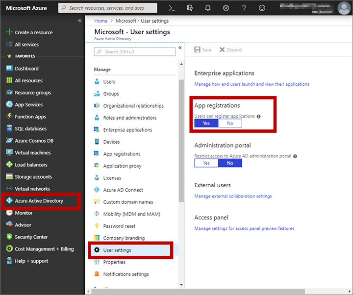 
1. Check the **App registrations** section on this page. If the **Yes** box is highlighted here, then you have permissions to register applications on Azure. If the **No** box is highlighted instead, try to select the **Yes** box and then select **Save**; if you don't have permissions to make this change, then please talk to your global administrator for assistance.

## Why do I get an authorization-failed message when I try to run the setup wizard?

In some cases, when you sign up for a trial of Dynamics 365 or Office 365, you will receive an organization that is in an *unmanaged* state, which means (among other things) that you can't get permission to install third-party solutions&mdash;including Dynamics 365 Marketing. As a result, you'll see the following error message when you run the setup wizard for Marketing.

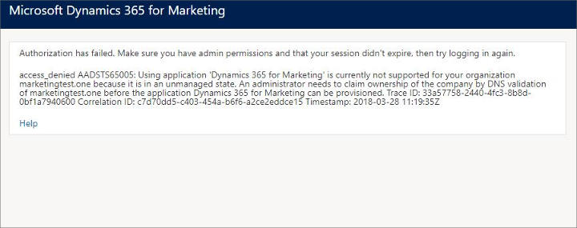

To fix this, do one of the following:

- If you are just setting up a trial of Marketing, then consider creating a new trial tenant and set up the Marketing trial there, as described in [Choose or prepare your Microsoft 365 tenant](trial-signup.md#choose-tenant).
- If you want to continue using the tenant where you received this error, then you must convert your unmanaged org into a managed one and then run the Marketing setup wizard again. For instructions on how to do this, see [Take over an unmanaged directory as administrator in Azure Active Directory](https://go.microsoft.com/fwlink/p/?linkid=866761).

## It looks like Marketing is set up on my instance, but why does it generate so many errors?

If Marketing is visible on your instance, but nothing is working, then you might have just a partial installation. This can happen if you use the Dynamics 365 admin center to set up Marketing as a service (on the **Instances** tab) rather than as an app (on the **Applications** tab). As a result, you might have the Marketing service installed, but not its many supporting components.

To fix this, go back to the [Dynamics 365 admin center](dynamics-365-admin-center.md) and reinstall from the **Applications** tab as described in [Purchase and set up Dynamics 365 Marketing](purchase-setup.md). The setup wizard should fix your installation.

## How can I rerun the setup wizard?

If your setup fails for some reason, you'll be notified by email and/or by a status message in your web browser (if you keep it open during the installation). Often, part of the solution will be to rerun the setup wizard after waiting for an hour or so. To rerun the setup wizard, do one of the following:

- If you are setting up a [trial](trial-signup.md), then you should have received a welcome email that included a link to the setup wizard. Find your welcome mail and click that link to launch the wizard.
- If you are setting up a production instance, then launch the setup wizard from the **Applications** tab in the Dynamics 365 admin center, as described in [Re-run the Marketing setup wizard](re-run-setup.md).

## How can I fix occasional portal issues?

Marketing pages and the event website both run on the Dynamics 365 Portals app. Sometimes, you may notice that settings you make in Dynamics 365 Marketing aren't reflected on the portal right away, such as (for the event website): updates to banner images, speaker images, or payment gateway assignments&mdash;or, your portal may become unresponsive or otherwise unreliable. You can often solve all of these issues either by [clearing the portal cache](#portal-cache), or [restarting it](#restart-portal). It's faster to clear the cache, but restarting it will sometimes solve more or other issues.

### Clear the portal cache

Many portal issues can be solved by clearing the portal cache. Once you have a portal user set up and configured as an administrator, this is faster and easier than [restarting the portal](#restart-portal), though some problem may still require a restart.

The subsections below explain how to set up the required portal user and then run the clear-cache command. If you already have a portal user that's configured as an administrator, just skip ahead to [Step 3: Clear the portal cache](#cache-only).

#### Step 1: Create an account on your portal

Start by adding yourself as a portal user, just as your contacts would do when registering themselves and others for an event (this is not the same as your Dynamics 365 user account). To do this:

1. Open your event website, for example by opening any event record and selecting the globe button next to the **Event URL** field.

1. On the event website, select the **Sign In** button at the top of the page.

1. On the sign-in page, go to the **Register** tab and fill out the fields to create a new account. Note that you must use an email address that doesn&#39;t already belong to a contact in your database. Be sure to make a note of your user name and password.

1. The **Profile** page opens. Enter your first and last names in the fields provided and select **Update**.

1. Your account is now created.

#### Step 2: Grant your new account permission to clear the portals cache

Once you have your account and password set up, you must configure that account as an event-portal administrator. To do this:

1. Sign into Dynamics 365 Marketing and use the app selector to go to the Dynamics 365&mdash;custom app.

    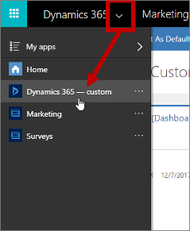

1. In the custom app, go to **Portals** > **Security** > **Contacts**.

    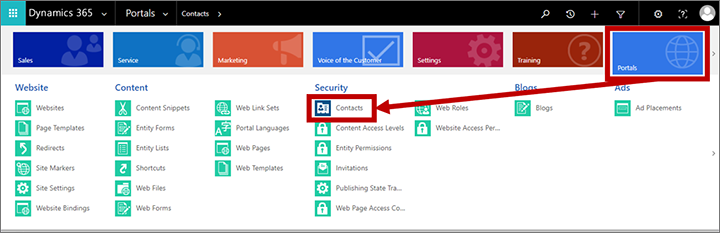

1. The portal contacts page opens. Open the system-view selector menu and choose the **All Contacts** view.

    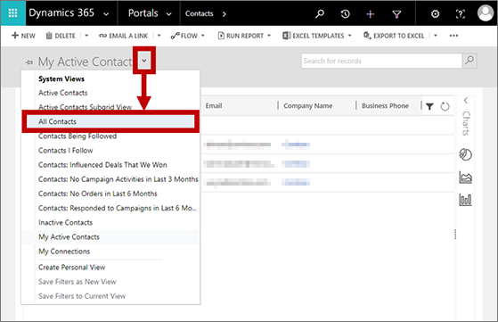

1. Find your portal user in the list and open it.

1. Open the form-view selector and switch to the **Portal contact** form view.

    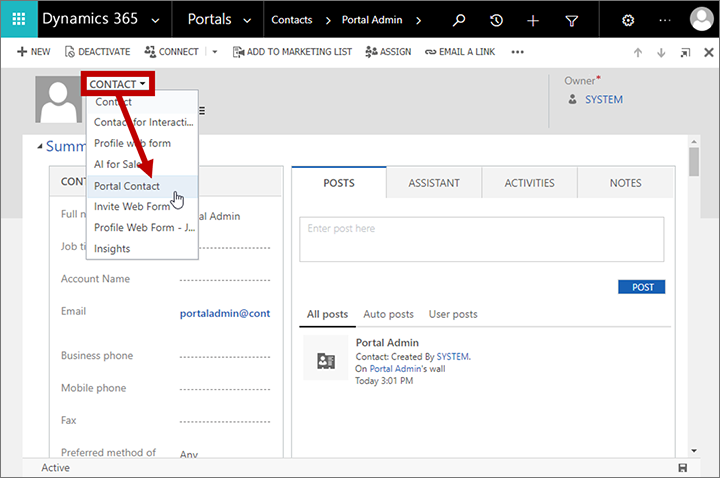

1. Scroll down to the **Web Roles** section for your contact.

1. Select the add (**+**) button to add a role, then select the magnifying glass icon to open the role menu, and finally select the **Administrators Event Portal** role to add that role to your contact.

    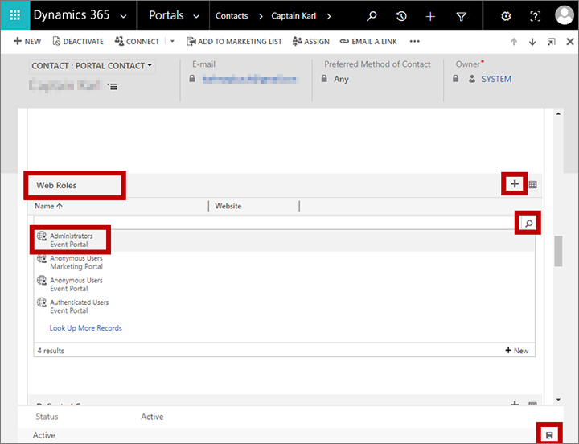

1. Select the **Save** icon in the bottom corner. Your user account is now an administrator for your event website.

#### Step 3: Clear the portal cache

Once you have your portal-administration account set up, you can use it to clear the portal cache at any time. To do this:

1. Open your event website, for example by opening any event record and selecting the globe button next to the **Event URL** field.
1. On the event website, select the **Sign In** button at the top of the page.
1. Sign in as a user that you have set up as an event-portal administrator.
1. Enter the following URL:

     `https://<YourPortalDomain>/_services/about`

    Where `<YourPortalDomain>` is the domain of your portal. You can find it by looking at the URL shown when you signed into the portal.

1. A portal-administration page opens. Select **Clear cache**.

    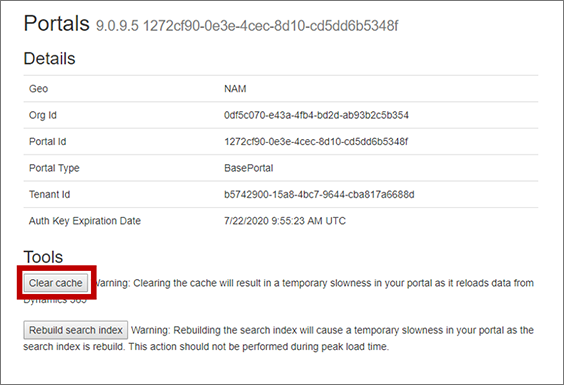

1. Your portal cache is cleared, which also has the effect of signing you out of the portal.

### Restart the portal

If clearing the cache didn't fix your portal issues, then restarting it may help. This operation takes a bit longer than clearing cache, and your portal will be offline until the process is complete.

To restart your portal:

1. [Open the Dynamics 365 admin center](dynamics-365-admin-center.md) and go to the **Applications** tab.

2. Each configured portal app is listed in the **Application** column using the name of the Dynamics 365 instance it is assigned to (so it probably doesn't have "portal" in its name), and shows a value of **Configured** in the **Status** column. Find and select your portal in the list and then select **Manage** in the side panel.  

    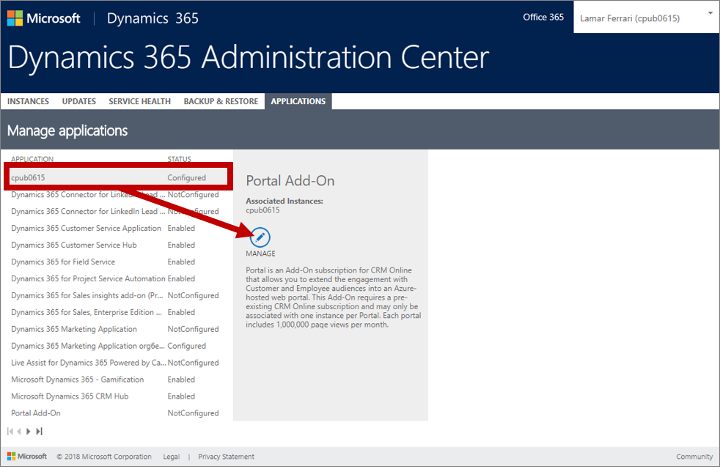

3. The portals manager opens. Select **Portal actions** in the side panel, and then select the **Restart** tile to restart the portal. 

    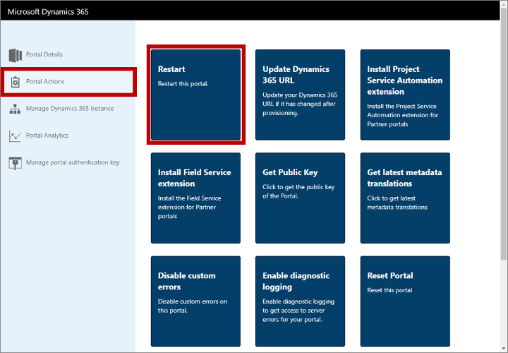

4. You'll be asked to confirm the action. Choose **Restart** to continue and then allow a few minutes for the process to complete.

## How can I fix my portal after changing my instance name?

The Dynamics 365 admin center enables you to change the  name of any of your instances at any time. If you do so, then the URL for the affected instance will also change to match and, as a result, your portal will no longer be configured correctly and will stop working. To fix it, you must reconfigure your portal as follows:

1. [Open the Dynamics 365 admin center](dynamics-365-admin-center.md) and go to the **Applications** tab.

2. Each configured portal app is listed in the **Application** column using the name of the Dynamics 365 instance it is assigned to (so it probably doesn't have "portal" in its name), and shows a value of **Configured** in the **Status** column. Find and select your portal in the list and then select **Manage** in the side panel.  

    

3. The portals manager opens. Select **Portal actions** in the side panel, and then select the **Update Dynamics 365 URL** tile to update the URL.  

    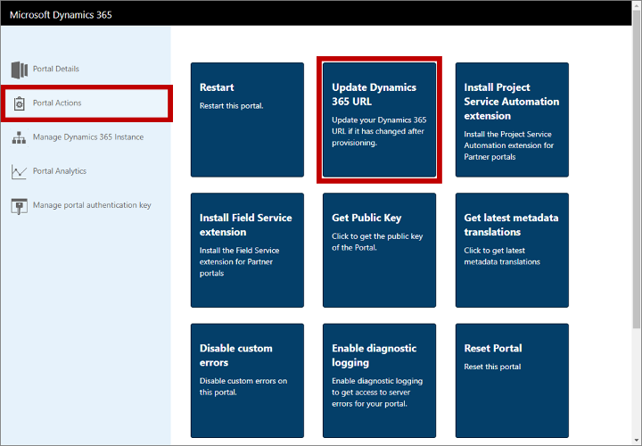

4. You'll be asked to confirm the action. Choose **Update URL** to continue and then allow a few minutes for the process to complete.

## My surveys aren't working; how can I fix my Voice of the Customer installation?

If you don't see the **Survey** tile in the **Toolbox** of your [customer journey designer](customer-journeys-create-automated-campaigns.md), or if it isn't working properly, then the Dynamics 365 Marketing setup wizard might have failed to set up the Voice of the Customer app correctly. If this was the only error that occurred during installation, then you might not have received any messages about it. To fix this, do the following:

1. [Open the Dynamics 365 admin center](dynamics-365-admin-center.md).

1. Go to the **Applications** tab, select any **Voice of the Customer** application in the applications list, and then select the **Manage** button in the side panel.

    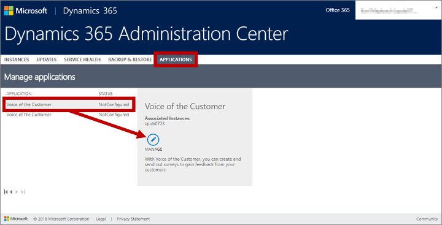

1. The **Set up Voice of the Customer** page opens.

    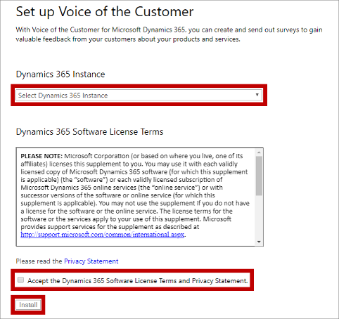

    Do the following:
    - Choose the instance you are having trouble with from the **Dynamics 365 Instance** drop-down list. 
    - Read the license terms and the privacy policy carefully. If you agree with their terms, select the **Accept the Dynamics 365 software license terms and privacy statement** check box.

1. Select **Install**. A message at the bottom of the page announces that the installation has successfully started.

1. To track the installation progress, go back to your Dynamics 365 admin center and open the **Instances** tab. Select your instance in the list and then select the **Solutions** button in the side panel.

    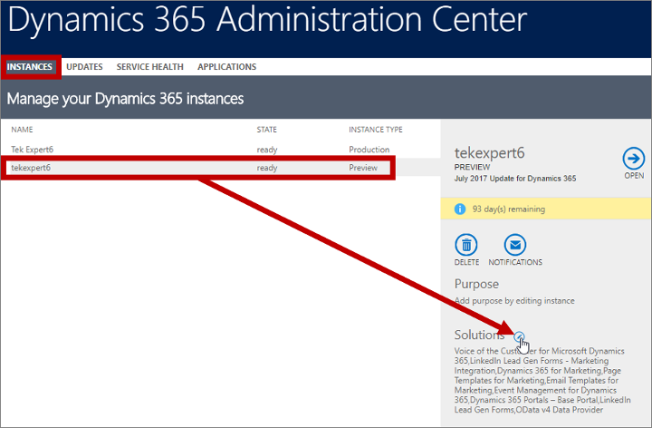

1. The **Manage your solutions** page opens, showing a list of solutions installed on your selected instance and the status of each of them. Find the **Voice of the Customer for Microsoft Dynamics 365** solution (not the **Voice of the Customer *Link* for Dynamics 365** solution) and then refresh the page periodically until you can see that the solution is shown as **Installed**.

    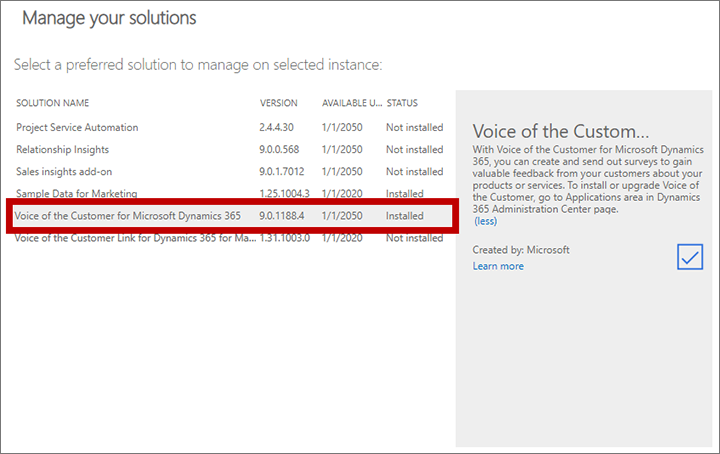

1. Still on the **Manage your solutions** page, find and select the solution called **Voice of the Customer *Link* for Dynamics 365** (not the **Voice of the Customer for Microsoft Dynamics 365** solution that you were looking at in the previous step). Then select the **Install** button.

    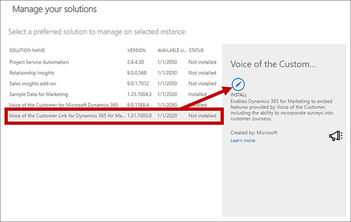

1. Follow the instructions on your screen and wait for the solution to finish installing.

1. Open Dynamics 365 Marketing, go to **Settings** > **Advanced settings** > **Marketing settings** > **Marketing data configuration**, and enable syncing of the **Survey (msdyn_survey)** entity. More information: [Choose entities to sync with the marketing-insights service](mkt-settings-sync.md)

1. Confirm that the **Survey** tile is now visible in the customer journey toolbox, and that your surveys are working correctly.

If your surveys still aren't working after completing these steps, then please [contact Microsoft Support](#contact-support) for assistance.

## Why can't I see my Dynamics 365 Marketing results in other Dynamics 365 apps?

Dynamics 365 Marketing is built to run exclusively on the new Unified Interface for Dynamics 365 applications. Many Dynamics 365 applications support both the new Unified Interface and the older web-client interface, but nearly all are moving to the Unified Interface.

Marketing typically shares data with other Dynamics 365 applications running on the same instance, and operates on many of the same database entities, including contacts, leads, accounts, and more. Some Marketing-specific features, such as displays of analytics and insights from marketing initiatives, require the Unified Interface and therefore won't show any data when you view those entities in web-client apps.

Also, some administration and customization features, and some integrated user features, may require you to switch to a web-client app from time to time, but soon all features are expected to be available on the Unified Interface.

More information: [About Unified Interface for model-driven apps in Power Apps](https://docs.microsoft.com/power-platform/admin/about-unified-interface) and [Find your way around Marketing](navigation.md)

## How can I contact support if I still need help?

For additional support and help resources you can:

- [Contact technical support](https://docs.microsoft.com/power-platform/admin/get-help-support) directly.
- Get in touch with the community on the [Dynamics 365 Marketing forum](https://community.dynamics.com/365/marketing/f/768).
- Find additional [online help resources for Dynamics 365](https://docs.microsoft.com/power-platform/admin/get-help-support).

If you’ve already tried to set up the application several times and are still having trouble, please open a support case through your applicable Microsoft Premier channel or MPN partner channel.
