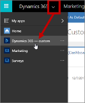

# Administration and setup FAQ

[!INCLUDE[cc_applies_to_update_9_0_0](../includes/cc_applies_to_update_9_0_0.md)]

Read this topic to find answers to common questions and solutions to known issues that can sometimes occur during the initial setup and ongoing administration of [!INCLUDE[pn-marketing-business-app-module-name](../includes/pn-marketing-business-app-module-name.md)].

## Why is my instance (organization) incompatible with [!INCLUDE[pn-marketing-app-module](../includes/pn-marketing-app-module.md)]?

Your tenant might have several different types of instances (also called *organizations*) installed on it, including some that are full [!INCLUDE[pn-dynamics-365](../includes/pn-dynamics-365.md)] instances and others that are, for example, [!INCLUDE[pn-power-apps](../includes/pn-power-apps.md)] instances (also called *environments*) that include many components of [!INCLUDE[pn-dynamics-365](../includes/pn-dynamics-365.md)], but not all of the components required by [!INCLUDE[pn-marketing-app-module](../includes/pn-marketing-app-module.md)].

When you are setting up your [!INCLUDE[pn-marketing-app-module](../includes/pn-marketing-app-module.md)] app, the setup wizard asks you to choose an organization on which to install the app, and the organization selector might show both full [!INCLUDE[pn-dynamics-365](../includes/pn-dynamics-365.md)] instances and the lighter [!INCLUDE[pn-power-apps](../includes/pn-power-apps.md)] instances if they are present. You must choose an instance that includes a full [!INCLUDE[pn-dynamics-365](../includes/pn-dynamics-365.md)] installation. If you see an error telling you that *this application isn't compatible with the platform of your selected [!INCLUDE[pn-dynamics-365](../includes/pn-dynamics-365.md)] organization*, then make sure you have a full [!INCLUDE[pn-dynamics-365](../includes/pn-dynamics-365.md)] organization available (where you want to install [!INCLUDE[pn-marketing-app-module](../includes/pn-marketing-app-module.md)]) and choose that one instead.

## Why can't I install [!INCLUDE[pn-marketing-app-module](../includes/pn-marketing-app-module.md)] in my country/region?

[!INCLUDE[pn-marketing-business-app-module-name](../includes/pn-marketing-business-app-module-name.md)] is a relatively new app for the [!INCLUDE[pn-dynamics-365](../includes/pn-dynamics-365.md)] platform, so it is not yet supported in all countries/regions where [!INCLUDE[pn-dynamics-365](../includes/pn-dynamics-365.md)] is available. If you are located outside of a supported country/region, then the setup wizard will prevent you from setting up the product, even if the Admin center shows that a [!INCLUDE[pn-marketing-app-module](../includes/pn-marketing-app-module.md)] app is available on your tenant. The reason you see the unconfigured app on your tenant is probably because you've licensed a [!INCLUDE[pn-dynamics-365](../includes/pn-dynamics-365.md)] product or bundle that includes it&mdash;you'll be able to set it up as soon as support for the product is extended to your country/region.

These geographical restrictions apply both to trial and production versions of [!INCLUDE[pn-marketing-business-app-module-name](../includes/pn-marketing-business-app-module-name.md)].

To read the latest list of countries/regions where you can use [!INCLUDE[pn-marketing-business-app-module-name](../includes/pn-marketing-business-app-module-name.md)], download the [Microsoft Dynamics 365 International Availability](https://go.microsoft.com/fwlink/p/?linkid=875097) document (PDF).

## Do I have permissions to register applications on [!INCLUDE[pn-azure-shortest](../includes/pn-azure-shortest.md)]?

One of the requirements for running the [setup wizard](purchase-setup.md) for [!INCLUDE[pn-marketing-business-app-module-name](../includes/pn-marketing-business-app-module-name.md)] is that you must sign in to [!INCLUDE[pn-ms-office-365](../includes/pn-ms-office-365.md)] with a user account that has permissions to register applications on [!INCLUDE[pn-azure-shortest](../includes/pn-azure-shortest.md)]. To find out if you have these permissions, do the following:

1. Go to [portal.azure.com](https://portal.azure.com) and sign in with the [!INCLUDE[pn-ms-office-365](../includes/pn-ms-office-365.md)] account that you want to use to install [!INCLUDE[pn-marketing-business-app-module-name](../includes/pn-marketing-business-app-module-name.md)].
1. Select **Azure Active Directory** in the side navigator and the **User settings** in the second side navigator.
     
1. Check the **App registrations** section on this page. If the **Yes** box is highlighted here, then you have permissions to register applications on [!INCLUDE[pn-azure-shortest](../includes/pn-azure-shortest.md)]. If the **No** box is highlighted instead, try to select the **Yes** box and then select **Save**; if you don't have permissions to make this change, then please talk to your global administrator for assistance.

## Why do I need a portal, and how can I get one?

[!INCLUDE[pn-marketing-business-app-module-name](../includes/pn-marketing-business-app-module-name.md)] requires a dedicated [!INCLUDE[pn-dynamics-365](../includes/pn-dynamics-365.md)] portals solution for running marketing pages and event portals. Depending on the [!INCLUDE[pn-marketing-business-app-module-name](../includes/pn-marketing-business-app-module-name.md)] licensing plan you have chosen, your license may include a free portal (provided no other free portals are already in use on your tenant), or you may need to purchase a new portal license before you can install the [!INCLUDE[pn-marketing-app-module](../includes/pn-marketing-app-module.md)] app.

You can have at most one free portal on your tenant, so even if your [!INCLUDE[pn-marketing-business-app-module-name](../includes/pn-marketing-business-app-module-name.md)] license includes a free portal, you may still need to purchase an additional one if  you already have a free portal configured on your tenant (probably because it was included with another  [!INCLUDE[pn-dynamics-365](../includes/pn-dynamics-365.md)] app that you are already using).

The [!INCLUDE[pn-marketing-app-module](../includes/pn-marketing-app-module.md)] setup wizard will let you know if you need a new portal app.

For complete details about [!INCLUDE[pn-marketing-business-app-module-name](../includes/pn-marketing-business-app-module-name.md)] licensing options, please download the [Microsoft Dynamics 365 Licensing Guide](https://go.microsoft.com/fwlink/p/?linkid=874224).

If you don't have any unconfigured free or paid portals available, you have two options:

- Recycle an existing portal.  
  If you have a portal that you aren't using, you can reset it and then run the [!INCLUDE[pn-marketing-app-module](../includes/pn-marketing-app-module.md)] setup wizard to set it up for use with [!INCLUDE[pn-marketing-app-module](../includes/pn-marketing-app-module.md)]. Please note that you will lose all of the data and content of your existing portal when you reset it. After the reset, the portal will still be shown as "configured" in the [!INCLUDE[pn-dyn-365-admin-center](../includes/pn-dyn-365-admin-center.md)], but you will now be able to select it when you run [!INCLUDE[pn-marketing-app-module](../includes/pn-marketing-app-module.md)] setup wizard. For instructions, see [Reset a portal](../portals/reset-portal.md).

- Purchase an additional portal.  
  If you don't have any unused portals that you can recycle, then you can purchase a new one for [!INCLUDE[pn-marketing-app-module](../includes/pn-marketing-app-module.md)] as described in the following procedure.

To get a new, unconfigured portal app and then use it with [!INCLUDE[pn-marketing-app-module](../includes/pn-marketing-app-module.md)]:

1. Open your [!INCLUDE[pn-ms-office-365](../includes/pn-ms-office-365.md)] admin center and go to **Billing** > **Subscriptions**.

2. Choose **Buy add-ons** in the tile for your [!INCLUDE[pn-dynamics-365](../includes/pn-dynamics-365.md)] subscription.

3. Purchase a new portal using the form provided.

   > [!IMPORTANT]
   > Be sure not to configure your new portal because the [!INCLUDE[pn-marketing-app-module](../includes/pn-marketing-app-module.md)] setup wizard requires an *unconfigured* portal to be present on your tenant. The wizard will configure the portal for you as required.

4. Run the [Marketing setup wizard](purchase-setup.md).

## Why do I get an authorization-failed message when I try to run the setup wizard?

In some cases, when you sign up for a trial of [!INCLUDE[pn-microsoftcrm](../includes/pn-dynamics-365.md)] or [!INCLUDE[pn-ms-office-365](../includes/pn-ms-office-365.md)], you will receive an organization that is in an *unmanaged* state, which means (among other things) that you can't get permission to install third-party solutions&mdash;including [!INCLUDE[pn-marketing-business-app-module-name](../includes/pn-marketing-business-app-module-name.md)]. As a result, you'll see the following error message when you run the setup wizard for [!INCLUDE[pn-marketing-app-module](../includes/pn-marketing-app-module.md)].

To fix this, do one of the following:

- If you are just setting up a trial of [!INCLUDE[pn-marketing-app-module](../includes/pn-marketing-app-module.md)], then consider creating a new trial tenant and set up the [!INCLUDE[pn-marketing-app-module](../includes/pn-marketing-app-module.md)] trial there, as described in [Sign up for a managed Office 365 trial tenant and install the Marketing trial on it](trial-signup.md#get-managed-tenant).
- If you want to continue using the tenant where you received this error, then you must convert your unmanaged org into a managed one and then run the [!INCLUDE[pn-marketing-app-module](../includes/pn-marketing-app-module.md)] setup wizard again. For instructions on how to do this, see [Take over an unmanaged directory as administrator in Azure Active Directory](https://go.microsoft.com/fwlink/p/?linkid=866761).

## It looks like [!INCLUDE[pn-marketing-app-module](../includes/pn-marketing-app-module.md)] is set up on my instance, but why does it generate so many errors?

If [!INCLUDE[pn-marketing-app-module](../includes/pn-marketing-app-module.md)] is visible on your instance, but nothing is working, then you might have just a partial installation. This can happen if you use the [!INCLUDE[pn-dyn-365-admin-center](../includes/pn-dyn-365-admin-center.md)] to set up [!INCLUDE[pn-marketing-app-module](../includes/pn-marketing-app-module.md)] as a service (on the **Instances** tab) rather than as an app (on the **Applications** tab). As a result, you might have the [!INCLUDE[pn-marketing-app-module](../includes/pn-marketing-app-module.md)] service installed, but not its many supporting components.

To fix this, go back to the [Dynamics 365 admin center](dynamics-365-admin-center.md) and reinstall from the **Applications** tab as described in [Purchase a production version of Dynamics 365 for Marketing](purchase-marketing.md). The setup wizard should fix your installation.

## How can I rerun the setup wizard?

If your setup fails for some reason, you'll be notified by email and/or by a status message in your web browser (if you keep it open during the installation). Often, part of the solution will be to rerun the setup wizard after waiting for an hour or so. To rerun the setup wizard, do one of the following:

- If you are setting up a [trial](trial-signup.md), then you should have received a welcome email that included a link to the setup wizard. Find your welcome mail and click that link to launch the wizard.
- If you are setting up a production instance, then launch the setup wizard from the **Applications** tab in the [!INCLUDE[pn-dyn-365-admin-center](../includes/pn-dyn-365-admin-center.md)], as described in [Purchase a production version of Dynamics 365 for Marketing](purchase-marketing.md).

## How can I fix occasional portal issues?

Marketing pages and the event portal both run on the [!INCLUDE[pn-dynamics-365](../includes/pn-dynamics-365.md)] portals app. Sometimes, you may notice that settings you make in [!INCLUDE[pn-marketing-business-app-module-name](../includes/pn-marketing-business-app-module-name.md)] aren't reflected on the portal right away, such as (for the event portal): updates to banner images, speaker images, or payment gateway assignments&mdash;or, your portal may become unresponsive or otherwise unreliable. You can often solve all of these issues either by [clearing the portal cache](#portal-cache), or [restarting it](#restart-portal). It's faster to clear the cache, but restarting it will sometimes solve more or other issues.

### Clear the portal cache

Many portal issues can be solved by clearing the portal cache. Once you have a portal user set up and configured as an administrator, this is faster and easier than [restarting the portal](#restart-portal), though some problem may still require a restart.

The subsections below explain how to set up the required portal user and then run the clear-cache command. If you already have a portal user that's configured as an administrator, just skip ahead to [Step 3: Clear the portal cache](#cache-only).

#### Step 1: Create an account on your portal

Start by adding yourself as a portal user, just as your contacts would do when registering themselves and others for an event (this is not the same as your [!INCLUDE[pn-microsoftcrm](../includes/pn-microsoftcrm.md)] user account). To do this:

1. Open your event portal, for example by opening any event record and selecting the globe button next to the **Event URL** field.

1. On the event portal, select the **Sign In** button at the top of the page.

1. On the sign-in page, go the **Register** tab and fill out the fields to create a new account. Note that you must use an email address that doesn&#39;t already belong to a contact in your database. Be sure to make a note of your user name and password.

1. The **Profile** page opens. Enter your first and last names in the fields provided and select **Update**.

1. Your account is now created.

#### Step 2: Grant your new account permission to clear the portals cache

Once you have your account and password set up, you must go into Dynamics 365 and configure that account as an event-portal administrator. To do this:

1. Sign into [!INCLUDE[pn-microsoftcrm](../includes/pn-microsoftcrm.md)] and use the app selector to go to the [!INCLUDE[pn-custom-app-module](../includes/pn-custom-app-module.md)] app.

    

1. In the custom app, go to **Portals** > **Security** > **Contacts**.

    

1. The portal contacts page opens. Open the system-view selector menu and choose the **All Contacts** view.

    

1. Find your portal user in the list and open it.

1. Scroll down to the **Web Roles** section for your contact.

1. Select the add (**+**) button to add a role, then select the magnifying glass icon to open the role menu, and finally select the **Administrators Event Portal** role to add that role to your contact.

    

1. Select the **Save** icon in the bottom corner. Your user account is now an administrator for your event portal.

#### Step 3: Clear the portal cache

Once you have your portal-administration account set up, you can use it to clear the portal cache at any time. To do this:

1. Open your event portal, for example by opening any event record and selecting the globe button next to the **Event URL** field.
1. On the event portal, select the **Sign In** button at the top of the page.
1. Sign in as a user that you have set up as an event-portal administrator.
1. Enter the following URL:

     `https://<YourPortalDomain>/_services/about`

    Where `<YourPortalDomain>` is the domain of your portal. You can find it by looking at the URL shown when you signed into the portal.

1. A portal-administration page opens. Select **Clear cache**.

    

1. Your portal cache is cleared, which also has the effect of signing you out of the portal.

### Restart the portal

If clearing the cache didn't fix your portal issues, then restarting it may help. This operation takes a bit longer than clearing cache, and your portal will be offline until the process is complete.

To restart your portal:

1. [Open the Dynamics 365 admin center](dynamics-365-admin-center.md) and go to the **Applications** tab.

2. Each configured portal app is listed in the **Application** column using the name of the [!INCLUDE[pn-dynamics-365](../includes/pn-dynamics-365.md)] instance it is assigned to (so it probably doesn't have "portal" in its name), and shows a value of **Configured** in the **Status** column. Find and select your portal in the list and then select **Manage** in the side panel.  

    

3. The portals manager opens. Select **Portal actions** in the side panel, and then select the **Restart** tile to restart the portal. 

    

4. You'll be asked to confirm the action. Choose **Restart** to continue and then allow a few minutes for the process to complete.

## How can I fix my portal after changing my instance name?

The [!INCLUDE[pn-dyn-365-admin-center](../includes/pn-dyn-365-admin-center.md)] enables you to change the  name of any of your instances at any time. If you do so, then the URL for the affected instance will also change to match and, as a result, your portal will no longer be configured correctly and will stop working. To fix it, you must reconfigure your portal as follows:

1. [Open the Dynamics 365 admin center](dynamics-365-admin-center.md) and go to the **Applications** tab.

2. Each configured portal app is listed in the **Application** column using the name of the [!INCLUDE[pn-dynamics-365](../includes/pn-dynamics-365.md)] instance it is assigned to (so it probably doesn't have "portal" in its name), and shows a value of **Configured** in the **Status** column. Find and select your portal in the list and then select **Manage** in the side panel.  

    

3. The portals manager opens. Select **Portal actions** in the side panel, and then select the **Update [!INCLUDE[pn-dynamics-365](../includes/pn-dynamics-365.md)] URL** tile to update the URL.  

    

4. You'll be asked to confirm the action. Choose **Update URL** to continue and then allow a few minutes for the process to complete.

## My surveys aren't working; how can I fix my [!INCLUDE[pn-voice-of-the-customer](../includes/pn-voice-of-the-customer.md)] installation?

If you don't see the **Survey** tile in the **Toolbox** of your [customer journey designer](customer-journeys-create-automated-campaigns.md), or if it isn't working properly, then the [!INCLUDE[pn-marketing-business-app-module-name](../includes/pn-marketing-business-app-module-name.md)] setup wizard might have failed to set up the [!INCLUDE[pn-voice-of-the-customer](../includes/pn-voice-of-the-customer.md)] app correctly. If this was the only error that occurred during installation, then you might not have received any messages about it. To fix this, do the following:

1. [Open the Dynamics 365 admin center](dynamics-365-admin-center.md).

1. Go to the **Applications** tab, select any **Voice of the Customer** application in the applications list, and then select the **Manage** button in the side panel.

    

1. The **Set up Voice of the Customer** page opens.

    

    Do the following:
    - Choose the instance you are having trouble with from the **Dynamics 365 Instance** drop-down list. 
    - Read the license terms and the privacy policy carefully. If you agree with their terms, select the **Accept the Dynamics 365 software license terms and privacy statement** check box.

1. Select **Install**. A message at the bottom of the page announces that the installation has successfully started.

1. To track the installation progress, go back to your Dynamics 365 admin center and open the **Instances** tab. Select your instance in the list and then select the **Solutions** button in the side panel.

    

1. The **Manage your solutions** page opens, showing a list of solutions installed on your selected instance and the status of each of them. Find the **Voice of the Customer for Microsoft Dynamics 365** solution (not the **Voice of the Customer *Link* for Dynamics 365** solution) and then refresh the page periodically until you can see that the solution is shown as **Installed**.

    

1. Still on the **Manage your solutions** page, find and select the solution called **Voice of the Customer *Link* for Dynamics 365** (not the **Voice of the Customer for Microsoft Dynamics 365** solution, which you were looking at in the previous step). Then select the **Install** button.

    

1. Open [!INCLUDE[pn-marketing-business-app-module-name](../includes/pn-marketing-business-app-module-name.md)], go to **Settings** > **Advanced settings** > **Marketing settings** > **Customer insights sync**, and enable syncing of the **Survey (msdyn_survey)** entity. [!INCLUDE[proc-more-information](../includes/proc-more-information.md)] [Choose entities to sync with the customer-insights services](marketing-settings.md#dci-sync)

1. Confirm that the **Survey** tile is now visible in the customer journey toolbox, and that your surveys are working correctly.

If your surveys still aren't working after completing these steps, then please [contact Microsoft Support](#contact-support) for assistance.

## Why can't I see my [!INCLUDE[pn-marketing-business-app-module-name](../includes/pn-marketing-business-app-module-name.md)] results in other [!INCLUDE[pn-dynamics-365](../includes/pn-dynamics-365.md)] apps?

[!INCLUDE[pn-marketing-business-app-module-name](../includes/pn-marketing-business-app-module-name.md)] is built to run exclusively on the new Unified Interface for [!INCLUDE[pn-dynamics-365](../includes/pn-dynamics-365.md)] applications. Many [!INCLUDE[pn-dynamics-365](../includes/pn-dynamics-365.md)] applications support both the new Unified Interface and the older web-client interface, but nearly all are moving to the Unified Interface.

[!INCLUDE[pn-marketing-app-module](../includes/pn-marketing-app-module.md)] typically shares data with other [!INCLUDE[pn-dynamics-365](../includes/pn-dynamics-365.md)] applications running on the same instance, and operates on many of the same database entities, including contacts, leads, accounts, and more. Some [!INCLUDE[pn-marketing-app-module](../includes/pn-marketing-app-module.md)]-specific features, such as displays of analytics and insights from marketing initiatives, require the Unified Interface and therefore won't show any data when you view those entities in web-client apps.

Also, some administration and customization features, and some integrated user features, may require you to switch to a web-client app from time to time, but soon all features are expected to be available on the Unified Interface.

[!INCLUDE[proc-more-information](../includes/proc-more-information.md)] [About Unified Interface](../admin/about-unified-interface.md) and [Find your way around Marketing](navigation.md)

## How can I contact support if I still need help?

If you’ve already tried to set up the application several times and are still having trouble, please open a support case through your applicable [!INCLUDE[cc-microsoft](../includes/cc-microsoft.md)] Premier channel or MPN partner channel.

For more information about how to contact [!INCLUDE[pn-microsoft-support](../includes/pn-microsoft-support.md)] directly, and how to find forums, FAQs, and other resources, see the following:

- [Contact technical support](../admin/contact-technical-support.md)
- [Help and additional resources](../admin/help-additional-resources.md)
