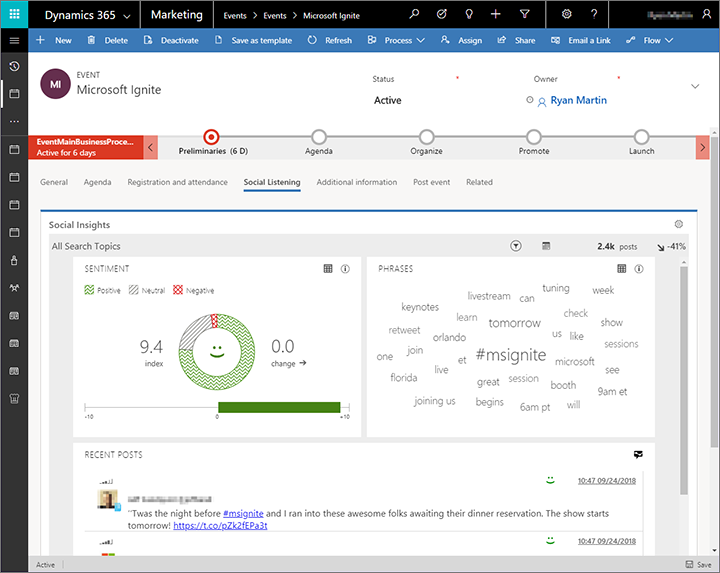
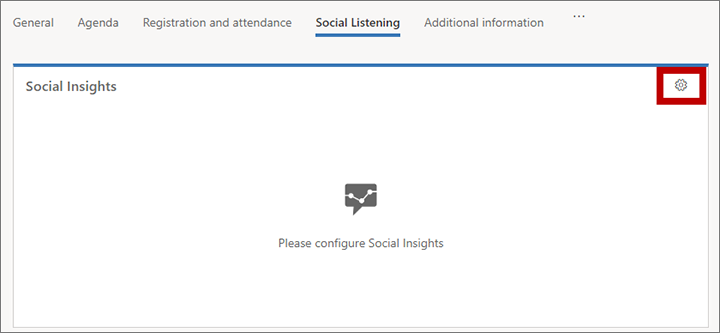
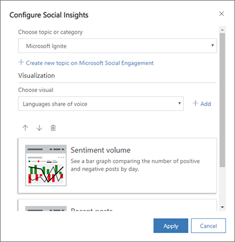

# Set up social listening and add it to any record

> [!IMPORTANT]
> The social listening feature described here relies on a product called Microsoft Social Engagement, which is scheduled to be discontinued. This means that the social listening feature in Dynamics 365 Marketing will also be discontinued. The following terms apply:
> 
> - Microsoft Social Engagement is no longer available to new customers.
> - Organizations that already have a Microsoft Social Engagement subscription can continue to use it until Jan 16, 2020. 
> - Twitter will stop being provided as a data source for Social Engagement on Oct 1, 2019.
> - Organizations that are already using the social listening feature in Dynamics 365 Marketing can continue to do so for as long as their Microsoft Social Engagement subscription is active.
> - In Dynamics 365 Marketing, social listening tabs will soon stop being visible on new trials and on all instances that aren't already integrated with Microsoft Social Engagement.
> 
> More information: [Frequently asked questions about Microsoft Social Engagement service discontinuation](../social-engagement/eol/discontinuation-faq.md)

Social listening in Dynamics 365 Marketing enables you to embed charts, information, and analytics from  Microsoft Social Engagement into any type of Marketing record to see how people on social media are reacting to your campaigns, events, brands, and more.

To use this feature, your organization must purchase the Microsoft Social Engagement product (also available separately) and integrate it with your Dynamics 365 Marketing instance. For a detailed introduction to Social Engagement, see [Connect with customers. Empower your organization. Create real results.](../social-engagement/overview.md).

## Add social listening to Dynamics 365 Marketing

To add social listening to your Dynamics 365 Marketing app, your system administrator or system customizer must do the following:

1. Purchase a license for Microsoft Social Engagement and add it to your Dynamics 365 Marketing instance. Dynamics 365 Marketing users don't require a Social Engagement license to view and select social listening displays in Dynamics 365 Marketing, but you'll need at least one licensed Social Engagement user to configure the system and set up relevant search terms in Social Engagement. More information: [Manage licenses for Social Engagement](../social-engagement/manage-licenses.md)
1. Add your Dynamics 365 Marketing domain to the list of allowed domains in Microsoft Social Engagement. More information: [Connect Social Engagement to other domains](../social-engagement/connect-other-domains.md)
1. Connect your Dynamics 365 Marketing instance to Social Engagement to enable the integration. More information: [Integrate Social Engagement with Dynamics 365](../social-engagement/integrate-social-engagement-dynamics-365.md)
1. Customize each dashboard or entity in Dynamics 365 Marketing where you want to show social listening features by adding the social insights control to an appropriate section or tab. More information: [Integrate Social Engagement with Dynamics 365](../social-engagement/integrate-social-engagement-dynamics-365.md)

When these steps are complete, Dynamics 365 Marketing users will be able to choose which search terms and widgets from Social Engagement they would like to see for any type of record where the system admin or customizer has made social listening available.

## Choose widgets and search terms for a record

Any time you create or edit a type of record that includes social listening, you can choose which search terms and widgets you think are most relevant for that record. For example, if you are working with an event, then you might choose terms that match the name of the event. If you are working with a customer journey, then you might choose terms that match the name of the campaign, brand, and/or product being promoted by that journey. You could even set up social listening on an important account to see how they are being perceived on social media.

To set up social listening for a record:

1. Make sure that the search terms, visualizations, and other resources that you need are set up in Social Engagement. If you have a Social Engagement user license, then you can set these up yourself as described in [Set up searches to listen to social media conversations](../social-engagement/set-up-searches.md) and [Analyze social data using widgets](../social-engagement/analyze-social-data-using-widgets.md).

1. Open Dynamics 365 Marketing, go to the record where you want to set up social listening displays, and go to the tab where your admin or customizer added the social listening control.

1. Select the **Configure Social Engagement** button  in the upper corner of the **Social Insights** area.

    

1. The **Configure Social Insights** dialog box opens.

    

    Make the following settings:

    - Under **Choose topic or category**, select an existing Social Engagement topic or category that you want to show. Choose the topic or category that best matches the record you are working with in Dynamics 365 Marketing. If an appropriate topic or category isn't yet available, then select the **Create new …** link to go to Social Engagement and set up a new one (a Social Engagement user license is required). More information: [Set up searches to listen to social media conversations](https://docs.microsoft.com/dynamics365/customer-engagement/social-engagement/set-up-searches)
    - Under **Visualization**, make a selection from the **Choose visual** drop-down list and then select **Add** to add that visual to the page. Your selected visual is added to the list at the bottom of the dialog.
    - Continue to add each visualization that you want to include. You can rearrange them by selecting an existing visualization in the list and then using the up, down, or delete buttons at the top of the list.

1. Select **Apply**.
