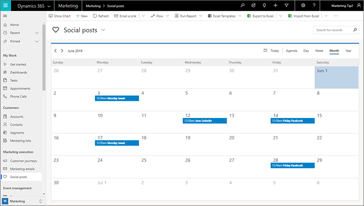
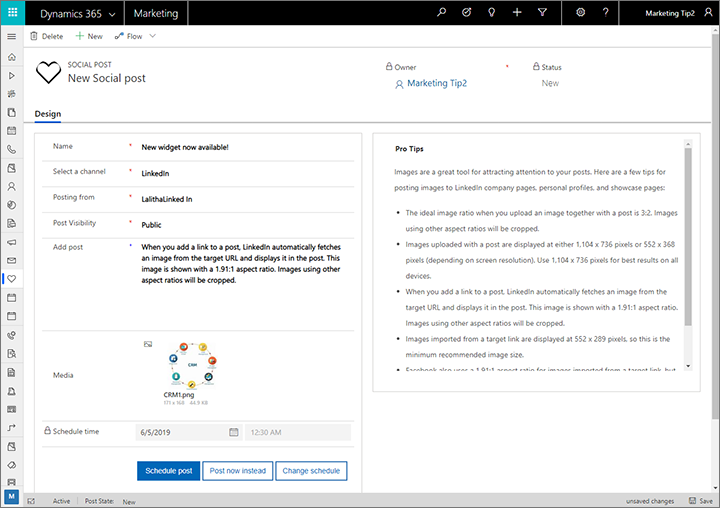

# Schedule and post messages on social media

Dynamics 365 Marketing can schedule and post messages directly to your organization's accounts on social media sites. Use the **Social posts** settings to author and schedule your posts.

> [!NOTE]
> Before you can start publishing messages, your administrator must configure and authenticate each social-media account that you will publish to.  More information: [Configure your social media accounts](mkt-settings-social-media.md)

## Schedule and post a message

Use the **Social posts** entity to author and schedule your posts. You can post from any social-media account that your admin has set up and authenticated in Dynamics 365 Marketing.

To schedule and publish a message to one of your social-media channels:

1. Go to **Marketing** > **Marketing execution** > **Social posts**.
1. A calendar opens, showing all scheduled and previously published messages. Do one of the following:
    - To schedule a message using the calendar, choose a calendar view (month, day, or week), select a day or time slot to highlight it, and then select again (click or press enter) and choose **New item** from the context menu. More information: [Work with marketing calendars](marketing-calendar.md)
    - To schedule a message using date pickers, or to send it right away, select **New** on the command bar.

    

1. A new social post record is created. Make the following settings:
    - **Name**: Enter an internal name for the post. This name will be shown on the calendar, but won't appear in the post itself.
    - **Select a channel**: Choose the social channel on which to post your message (such as Facebook, LinkedIn, or Twitter). This drop-down list only shows those channels that your administrator has set up in Dynamics 365 Marketing. If you don't see the channel you are looking for, please contact your admin. More information: [Configure your social media accounts](mkt-settings-social-media.md)
    - **Posting from**: Select the specific account through which to post your message. This drop-down list shows each account that your admin has set up and authenticated in Dynamics 365 Marketing for the selected channel. If you don't see the account you are looking for, please contact your admin. More information: [Configure your social media accounts](mkt-settings-social-media.md)
    - **Post visibility**: This setting only appears when you are posting to LinkedIn. Use this setting to control who can see this post. Choose **Public** to allow all LinkedIn users to see the post. Choose **Connections** to limit post visibility to users that have connected with the LinkedIn account you are posting through.
    - **Add post**: Enter the text content of your post here.
    - **Media**: If you'd like to include an image with your post, select the **Select file** button  here to open the file gallery dialog and use it to select or upload an image to include with your post. To remove an image already selected here, select its thumbnail image and then select the **Remove file** button  in the corner of the thumbnail.
        > [!TIP]
        > The **Pro tips** area provides tips about how best to design images and other content for your selected social channel. Be sure to review these when designing and selecting images.
    - **Schedule time**: Shows the date and time that your post is scheduled to be published on your selected channel and account. If you started creating your post by selecting a date and/or time from the calendar, then values are already shown here. If you instead created your post using the **New** button on the command bar, then select the **Schedule** button to choose a date and time.
        > [!IMPORTANT]
        > The dates and times for the posting schedule use the time zone configured in your personal settings. To view or edit your time zone, open the **Settings** menu  at the top of the page and then select **Personalization settings**.

    

1. When you are done designing your post, select one of the following buttons at the bottom of the page:
      - **Schedule post**: Select this to save your post and schedule it to be published at the configured **Schedule time**. (This button only appears if you've chosen a schedule.)
      - **Post now** or **Post now instead**: Select this to publish your post right now. Your message will be posted immediately and shown on the calendar for the current date and time. The label of this button changes based on whether you've already set a schedule or not.
      - **Change schedule** or **Schedule**: Establish a specific date and time to post the message or edit the existing one. The label of this button changes based on whether you've already set a schedule or not.

### Edit, reschedule, or cancel a post

You can edit, reschedule, or cancel any post that hasn't been sent yet. Just find and select it on the calendar to open the record, and then edit the settings or select **Delete** on the command bar as needed.

Posts that were already sent are read-only, so you can't change or reschedule them, but you can remove them from the calendar or delete if you want. When you delete a post that has already been sent, it will be removed from the calendar and from the social-media sites.