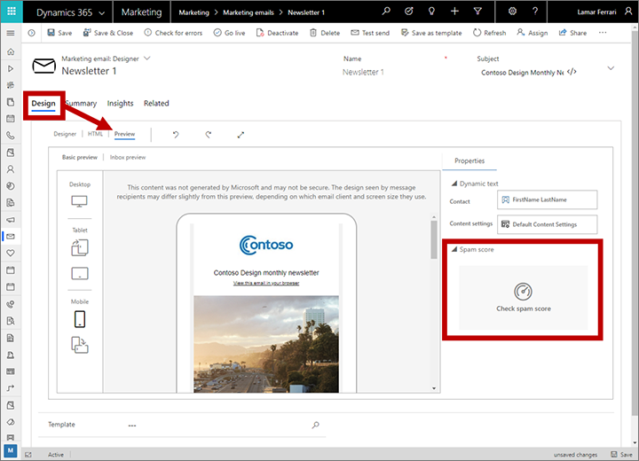
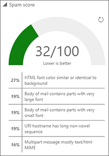

# Preview: Check the spam score of your email content

> [!IMPORTANT]
> This is a preview feature. [!INCLUDE[cc_preview_features_definition](../includes/cc-preview-features-definition.md)]
> [!INCLUDE[cc_preview_features_no_MS_support](../includes/cc-preview-features-no-ms-support.md)]  

The spam score feature applies artificial intelligence to analyze the content of each marketing email message, and then generates a score that predicts how likely the message is to be flagged by content-based spam filters.

> [!NOTE]
> Before you can use spam score, your admin must enable and configure it. If you don't see the features described in this topic, then please ask your admin to enable spam score for your site. More information: [Enable and configure artificial intelligence features](admin-machine-learning.md)

There are two ways to view your spam score:

- **Automatically** : A spam check is always made as part of the standard **Check for errors** and **Go live** processes, and spam-score results are shown together with other results of the error check. Spam-score results are classified as high, medium, or low (lower is better). If you get a high or medium spam score, you should consider revising your content.
- **Manually** : As you are designing your email, you can check your spam score at any time by going to the **Preview** tab of the designer. Unlike the automatic error-check results, this display also provides information about which types of issues are most likely responsible for increasing your score.

To manually view and interpret the spam score for a message:

1. Go to **Marketing** > **Marketing execution** > **Marketing emails**, and then either create or open an email message.

1. Design your email content as usual using the email designer.

1. Before you go live, open the **Design** > **Preview** tab for your message and select **Check spam score** from the **Properties** panel to run the check on your current content. The check may take a couple of minutes but is usually faster than that.

    

1. When the analysis is finished, a score display is shown where the **Check spam score button** used to be. It shows a numerical score (out of 100, the lower the better) and a list of the top issues affecting your score, which can help you to find out how to improve it. The color of the meter also indicates an overall assessment of your score (green is good, yellow is a medium, red is bad). Select the **Refresh** button  to recalculate after making changes.

    

    Though exact thresholds may vary based on your topic and audience, here are a few guidelines for interpreting the score:

      - 0 – 40 (green): This is a good score, so congratulations! The content of your message is mostly free of red-flag terms and is likely to be both delivered to and appreciated by your recipients.
      - 40 – 80 (yellow): This is a medium score. You should consider revising the content, especially if you are on the higher end of this range.
      - 80 – 100 (red): This is a very high score. Your message is likely to be blocked by spam filters, and messages that are delivered are likely to be badly received and may even be reported as spam by recipients.

    When you're revising your content, look to remove high-pressure words and phrases, plus any other content that you would consider spammy if you received this message yourself. Consider also the issues listed as the top factors affecting your score.

1. When you are satisfied with your spam score, go live with your message as usual.

