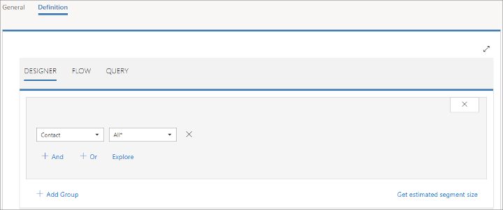
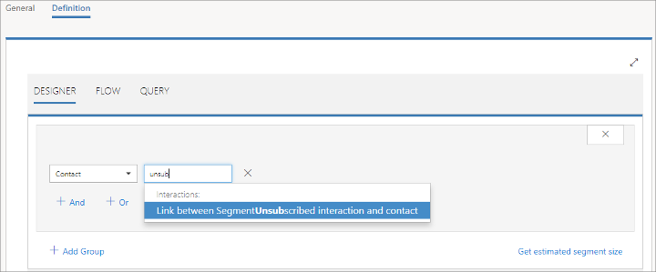
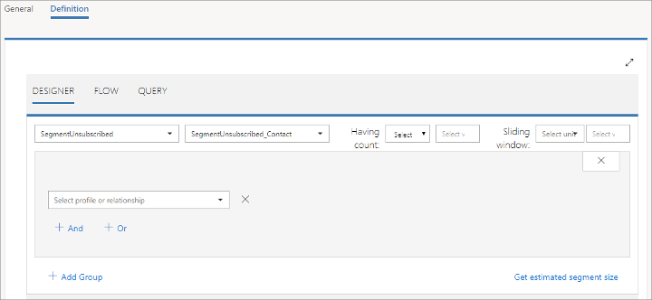
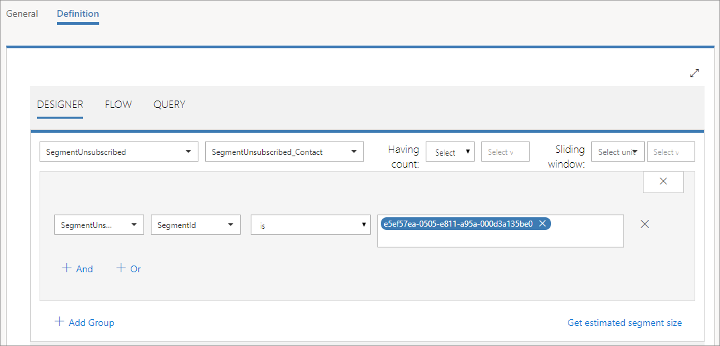
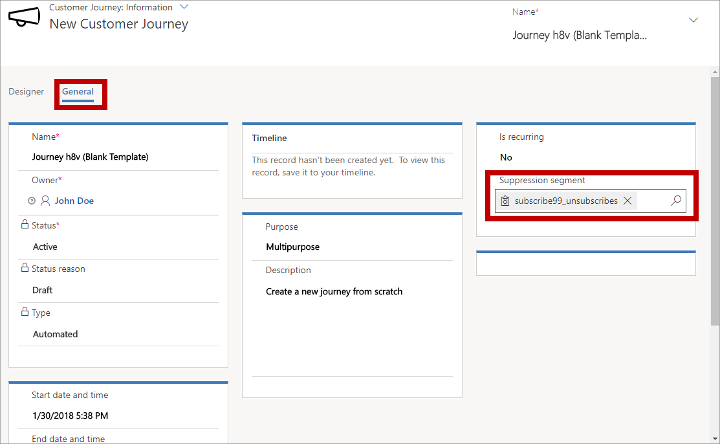

# Use suppression segments to ensure running customer journeys will respect unsubscribe requests

Most customer journeys start with a target segment, which produces a list of contacts to be processed by that journey. The minute the journey starts, all contacts in the target segment proceed to the first tile in the workflow and then continue until they reach the end of the workflow or until the journey end date arrives. Once a contact has started on a journey (including a recurring journey), that contact remains on that journey even if he or she leaves the segment in the meantime, such as by unsubscribing from a relevant mailing list. This can sometimes be a problem because, in many countries/regions, local regulations demand that marketers respect unsubscribe requests in a timely manner. 

> [!NOTE]
> Once a contact has unsubscribed from a list, that contact won't be sent on any new journeys that target that list. The issue addressed in this topic only applies for contacts already on one or more journeys when they submit the unsubscribe request.

If you create a journey that lasts more than a few days (depending on local regulations), then you should set up a suppression segment for it as described in this topic. Neglecting to do so risks not only annoying your contacts, but also may expose your organization to litigation and penalties. In particular, customer journeys that recur, or include schedulers or triggers with long delays, should almost always include a suppression segment. 

By applying the techniques described in this topic, all unsubscribe requests should be honored within a day or so of receiving the request, including for running journeys. Most of the relevant laws specify a maximum response time for honoring unsubscribe requests, so any journey that you create that runs longer than that maximum time should include a suppression segment set up as described in this topic. It is your responsibility to familiarize yourself with and conform to all applicable regulations in the countries/regions where you run marketing campaigns.

> [!NOTE]
> The techniques described in this topic create a suppression segment that includes all contacts that have ever unsubscribed from a given list. That means that contacts are effectively unable to re-subscribe to that journey (or any other journey that uses the same suppression segment) once they unsubscribe. Re-subscribing contacts are added back to the subscription list (as expected), but they also remain in the suppression segment. So contacts that resubscribe to a list can still receive messages from journeys that target that list, provided those journeys don't also use the suppression segment (for example, because the journey only lasts a few days or so).

## Step 1: Prepare a subscription segment

A subscription segment draws its contacts from a static list set up as a subscription list in [!INCLUDE[pn-microsoftcrm](../includes/pn-microsoftcrm.md)]. Contacts use your subscription center pages to add or remove themselves from your various subscription lists.

To continue with the other steps in this topic, you must have the following in place:

- A static marketing list configured as a subscription list in the [!INCLUDE[pn-custom-app-module](../includes/pn-custom-app-module.md)] app
- A dynamic segment based on that subscription list (set up in the [!INCLUDE[pn-marketing-app-module](../includes/pn-marketing-app-module.md)] app).

For a tutorial about how to set up subscription lists, subscription centers and subscription segments, see [Set up subscription lists and subscription centers](set-up-subscription-center.md).

## Step 2: Create a segment that tracks unsubscribes from a list

Next you must set up the segment that you can use as a suppression segment. This new segment will look for unsubscribe events associated with the subscription segment.

1. Find the name of the subscription list your suppression segment should track (this is the list you set up in Step 1).

1. Use the list name to find the unique ID for the list. Start by entering the following URL into your browser:  
    ```clean
    https://<YourMarketingDomain>/api/data/v9.0/lists?$filter=listname%20eq%20%27<YourListName>%27&$select=listid
    ```
     Where:  
    - &lt;YourMarketingDomain&gt; is the domain of your [!INCLUDE[pn-marketing-app-module](../includes/pn-marketing-app-module.md)] instance (such as contoso.crm10.dynamics.com)
    - &lt;YourListName&gt; is the name of your subscription list. Be sure to apply URL encoding if your list name includes spaces or other special characters.

1. On loading the URL, your browser displays text such as the following:  
    ```clean
    {"@odata.context":"https://contoso.crm10.dynamics.com/api/data/v9.0/$metadata#lists(listid)","value":[{"@odata.etag":"W/\"1884167\"","listid":"e5ef57ea-0505-e811-a95a-000d3a135be0"}]}
    ```
    The unique ID is the value shown for "listid" in that text ("e5ef57ea-0505-e811-a95a-000d3a135be0" in this example, not including the quotes). Keep the page open in your browser so you can copy this ID later.

1. Open [!INCLUDE[pn-marketing-business-app-module-name](../includes/pn-marketing-business-app-module-name.md)] and go to **Marketing > Customers > Segments**.

1. Select **New** on the command bar to create a new segment.

1. Give the new segment a suitable **Name** on the **General** tab and then open its **Definition** tab.  
    

1. Select the drop-down list currently showing a value of **All&ast;** and type "unsub" here. The list filters to find entries that include the text you typed, leaving just **Link between SegmentUnsubscribed interaction and contact**.  
    

1. Select **Link between SegmentUnsubscribed interaction and contact** to apply it. This setting creates a query that finds _all_ contacts that have unsubscribed from _any_ of your lists. The page updates to show a new selection of drop-down lists.  
    

1. From the new **Select profile or relationship** drop-down list, select **SegmentUnsubscribed**. Then complete the expression, working left to right, by selecting **SegmentId**, **is**, and then paste in the unique ID you found at the start of this procedure (it should still be open in your browser).  
    

1. This query now finds _only_ those contacts that have unsubscribed to the list associated with the ID you entered. Select **Save** on the command bar to save your new segment.

## Step 3: Set up your customer journey

You now have all the segments you need, so you are ready to use them in your customer journey. Proceed as follows:

1. Go to **Marketing > Marketing Execution > Customer Journeys** and then find or create a customer journey. [!INCLUDE[proc-more-information](../includes/proc-more-information.md)] [Use customer journeys to create automated campaigns](customer-journeys-create-automated-campaigns.md)

1. Start your journey pipeline with a segment-group tile in the first position and include a child segment tile that references your subscription segment (from Step 1). (This will target all subscribers. You can further limit the target segment, for example, by adding more segments and combining them using intersection merge logic, or by adding exclusion segments. [!INCLUDE[proc-more-information](../includes/proc-more-information.md)] [Segment tiles](customer-journey-tiles-reference.md#segment))

1. Continue to design your customer journey as needed by adding more tiles (or do it later).

1. Go to the **General** tab and set the **Suppression segment** to the name of the segment you designed in Step 2.  
    

1. Save your journey.