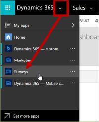
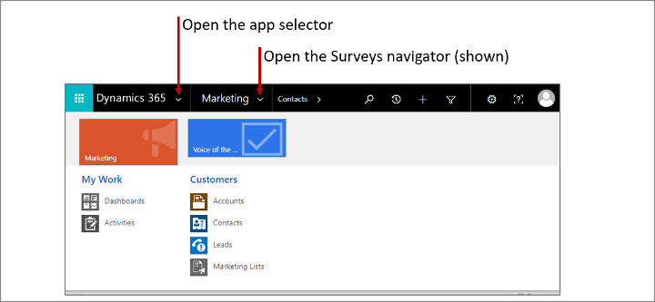

# Create and run online surveys

> [!IMPORTANT]
> As of **July 1, 2020**, Voice of the Customer surveys are no longer supported in Dynamics 365 Marketing. You can read more about the [discontinuation of Voice of the Customer surveys here](https://cloudblogs.microsoft.com/dynamics365/it/2020/06/16/voice-of-the-customer-surveys-are-not-supported-on-dynamics-365-marketing-starting-july-1-2020/).
> 
> If you want to create new surveys in Marketing, you should [use Forms Pro](forms-pro.md).

Dynamics 365 Marketing includes a Surveys app, which you can use to design and publish online surveys that can be integrated with your events, marketing emails, and customer journeys.

[!INCLUDE [cc-marketing-surveys-disclaimer](../includes/cc-marketing-surveys-disclaimer.md)]

In the current version of Dynamics 365 Marketing, Surveys is provided as a separate application, but it still operates on the same database as your other Dynamics 365 applications, so it has access to the same records (such as contacts and accounts), and the surveys you design will be available to other Marketing features.

Use the app-selector menu to switch between Surveys and your other Dynamics 365 apps.

<!-- Unlike other Dynamics 365 Marketing apps and work areas, the Surveys app provides a navigator at the top of the page rather than in a side column.

Go to **Voice of the Customer** to design your surveys. The functionality provided here is the same as that provided for other Dynamics 365 applications that include the Voice of the Customer feature.

Go to **Marketing** to access your Dynamics 365 dashboards, activities, and customer data. This is the same data you'll find in your Marketing app and is provided here for convenience. These entities work just like they do in other Dynamics 365 applications, including Marketing.-->

The Surveys app provides the same settings and options as the Voice of the Customer app. More information: [Voice of the Customer online help](../voice-of-customer/create-voice-of-customer-survey.md)

### See also

[Get feedback by using Voice of the Customer surveys](../voice-of-customer/create-voice-of-customer-survey.md) 
[Find your way around](navigation.md)
