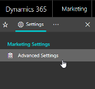

# System and user administration

This section describes how to manage users and change application settings. Most of the settings described here can only be accessed by users who have administrator privileges.

## Open the advanced settings

Administrators use advanced settings to fine-tune application behavior, set defaults, manage users, enable webinars, check quotas, and more. If you also use [!INCLUDE[pn-dyn-365-sales](../includes/pn-dyn-365-sales.md)], many of the settings you find here also apply to that app, though some settings are unique to Sales or [!INCLUDE[pn-marketing-app-module](../includes/pn-marketing-app-module.md)].

1. Sign in as a user with administrator privileges.
1. Expand the side navigator bar and select the ellipsis (**…**) to open the work area menu.

    

1. Select **Settings** from the work area menu.
1. The side navigator is updated to show pages available in the **Settings** work area. Select **Advanced Settings**.

    

You now see **Advanced Settings** in the main area of the window.

## Work with advanced settings

  

- Use the **Settings Overview** column on the left side of the window to navigate between settings pages, which are organized into sections. Select an entry under a heading to open the related settings page. You can also collapse or expand the section headings as needed.
- When you first open the **Advanced Settings** page, the main part of the window provides the same sections as the **Settings Overview** column, and provides icons for opening the same settings pages that are also available in the navigator.

See the subtopics in this section for details about how to work with each group of settings provided on the **Advanced Settings** page.
