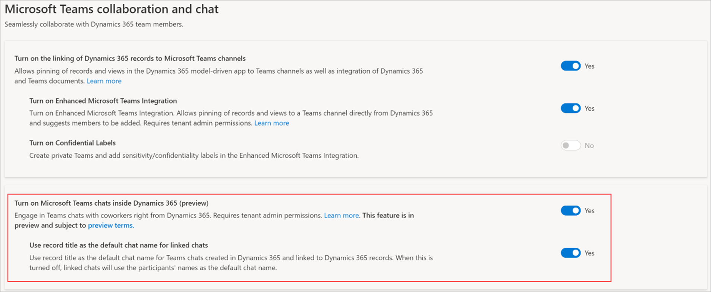

# Preview: Collaborate using built-in Microsoft Teams chat

> [!IMPORTANT]
> A preview feature is a feature that is not complete, but is made available before it’s officially in a release so customers can get early access and provide feedback. Preview features aren’t meant for production use and may have limited or restricted functionality.
> 
> Microsoft doesn't provide support for this preview feature. Microsoft Dynamics 365 Technical Support won’t be able to help you with issues or questions. Preview features aren’t meant for production use, especially to process personal data or other data that are subject to legal or regulatory compliance requirements.

Creating great marketing content and journeys is a team effort. With Microsoft Teams chat, you can collaborate with your team without leaving the journey canvas or the email editor. For example, after you create an email, you can tag someone to review your content. Or, while creating a journey, you can collaborate with a coworker to decide which data to use in a branch. This gives you the added benefits of seeing feedback over time and being able to refer to previous comments people made.

Dynamics 365 Marketing supports the following Teams collaboration activities:

- **Start a new linked chat conversation**: The chat is automatically linked to the record. This functionality is available by default for the following content and customer journey records:

    - **Outbound marketing**
        - Customer journey
        - Email
        - Social post
        - Marketing page
    - **Real-time marketing**
        - Customer journey
        - Email
        - SMS
        - Push notification

    > [!NOTE]
    > Your administrator can extend this list in the [Teams chat settings page](teams-chat.md#settings).

-	**Add users to an existing linked chat**: The chat appears as a linked chat for all the users involved in the conversation.
-	**Link an existing chat to a record**: The entire chat conversation will be visible to all the users who are part of the linked chat.
-	**Access all your recent Dynamics 365 chats**: List pages, such as the opportunities list page, display all of your recent chats that are linked to Dynamics 365 records.
-	**Access all your recent chats**: Your top 200 Teams chat conversations are shown on the list and record pages.
-	**Link an existing channel to a record**: Although the channel is linked to the record, the channel conversations can only be accessed from within Teams.

## Enable the Teams chat preview

This article refers to a feature that is in preview and may not be enabled in your environment. If you don’t see this feature in your app, contact your admin who can activate it by going to **Settings** > **Collaboration** > **Teams chat** and enabling the **Turn on Microsoft Teams chats inside Dynamics 365 (preview)** feature switch. The admin should make sure to select the **Save** button after making any changes.

> [!div class="mx-imgBorder"]
> 

> [!IMPORTANT]
> You must be a global administrator (tenant administrator) to provide the initial consent to enable the Teams chat preview. After that, application administrators can enable the preview for other instances.

> [!NOTE]
> Teams chat settings affect all customer engagement apps. So, whether you enable the preview from the Marketing app or another Dynamics 365 app, it will be enabled for all the supported apps.

## Open Teams chats and channels related to a record

To access Teams chats, open any content or customer journey record in Dynamics 365 Marketing and select the **Teams chats and channels integration** icon  on the right of the top menu bar.

> [!div class="mx-imgBorder"]
> 

The **Teams chats (Preview)** pane opens and displays the following sections in the **Chat** tab:

-	**Chats linked to record** lists Teams chats that either you've linked to the selected record or someone else has linked with you as a participant.
-	**Suggested contacts** lists suggested contacts depending on the users who are working on the record. For more information, see [How contact suggestions work](teams-chat.md#how-contact-suggestions-work) below.
-	**Other chats** lists your top 200 chat conversations on Teams. You can select an existing conversation and link it to a record.

The **Channel** tab lists the channels that you've linked to the selected record and any channels someone else has linked to where you're a participant. If you've linked a record to a channel using the basic or enhanced collaboration experience, that channel is also listed on this tab.

## How contact suggestions work

The suggested contacts list displays users who are connected with or have interacted with the record. Accordingly, a suggested contact can be one or more of the following users, in the given order:

-	If the record is assigned to a user, the owner of the record.
-	If the record is assigned to a team:
    -	The team admin.
    -	Team members who have logged an activity in the record timeline.
-	Users who have linked chats with the record.
-	Other users who have logged an activity in the record timeline.

## View all linked Dynamics 365 chats

To view all linked chats, open the list view of a customer journey or content entity (such as an email, push notification, SMS, social post, or a marketing page) and select the **Teams chats and channels integration** icon . All your linked Dynamics 365 chats will appear under **Chats linked to records**.

## Start a linked Teams chat in Dynamics 365

You can start a new linked chat or convert an existing Teams chat into a linked chat to associate the chat with a Dynamics 365 Marketing record.

1. Open a content or customer journey record in Dynamics 365 Marketing and select the **Teams chats and channels integration** icon . The **Teams chats (preview) pane** opens.
1. Use one of the following methods to start a linked chat:
    -	To start a new linked chat with a participant, select **New linked chat** in the **Chats linked to *record*** section.
    -	To start a linked chat with a suggested contact, go to **More (…)** > **Start a linked chat with *contact*** in the **Suggested contacts** section.
    -	To convert an existing chat into a linked chat, select the chat from the **Other chats** section and then go to **More (…)** > **Link to this *record***.

    The chat name can be automatically set as the record name. To allow the chat name to be automatically set, ask your administrator to enable the [**Use record title as the default chat name for linked chats**](teams-chat.md#set-the-default-name-for-linked-chats) setting.

    If you'd like, you can modify the chat name. It's a good idea to provide a meaningful name so that you can identify the chat even when you're in the Teams app.
1. Add more participants to the chat.

All participants in the linked chat will see the chat when they open the applicable record in the Marketing app.

## Link a Teams channel to a record

Link relevant Teams channels to a record so that all members can easily access the linked channels from the record and follow conversations. To link a Teams channel:

1. Open a content or customer journey record, and select the **Teams chats and channels integration** icon . The **Teams chats (Preview)** pane opens.

    Alternatively, select **Collaborate** on the command bar to link a channel to the record. Learn more: [Enhanced Collaboration Experience with Microsoft Teams](/dynamics365/teams-integration/teams-collaboration-enhanced-experience).
1. Select the **Channel** tab. The tab lists the channels that are already linked to the record.
1. Select the **Link channel** icon in the upper-right corner of the **Teams chats (Preview)** pane. The **Collaborate with Microsoft** Teams dialog opens.
1. To start a new linked channel, select **Create a new connection**.
1. To link an existing channel, select the channel from the list then select **Start collaboration**.

## Start a regular or unlinked Teams chat in Dynamics 365

You can start a regular conversation in Dynamics 365 if you don't want to switch to Teams.

To start a conversation, while you're in any of the records or in the list pane, select the **Teams chats and channels integration** icon . Then, select the **Compose chat** icon  in the upper-right corner of the **Teams chats (Preview)** pane. This option starts an individual or group chat but doesn't link it to the record.

## Settings

### Access Teams chat settings in Dynamics 365

To access the Teams chat settings in Dynamics 365 Marketing, go to **Settings** > **Collaboration** > **Teams chat**.

### Enable linking Dynamics 365 records to Microsoft Teams channels

Go to the **Teams chat** settings, then enable the **Turn on the linking of Dynamics 365 records to Microsoft Teams channels** toggle.

This allows you to pin records and views from the Marketing app to Teams channels and allows the integration of Dynamics 365 and Teams documents.

In this section of the settings, you can also choose whether to enable enhanced Teams integration (allowing pinning of records and views directly from the Marketing app) and confidential labels (allowing private chats and confidentiality labels).

After changing any settings, make sure to select the **Save** button.

<!---### Select areas where you’d like to enable linked chats

By default, you can create Teams chats linked to the following content and customer journey records:

**Outbound marketing**:
-	Customer journey
-	Email
- Social post
-	Marketing page
**Real-time marketing**:
- Customer journey
-	Email
-	SMS
-	Push notification

Your administrator can extend the list of supported record types if needed. To extend the list:

1. Go to **Settings** > **Collaboration** > **Teams chat**.
1. Scroll down to the **Link chats to Dynamics 365 records** section.
1. Select **+Add Record Types”**.
1. Choose a record type.
1. Select **Save**.
-->
### Set the default name for linked chats

To set the chat title to be used as the record title by default, enable the **Use record title as the default chat name for linked chats** toggle and then select **Save**. Users can later change the title if they want.