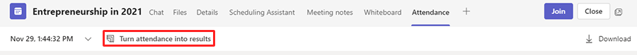
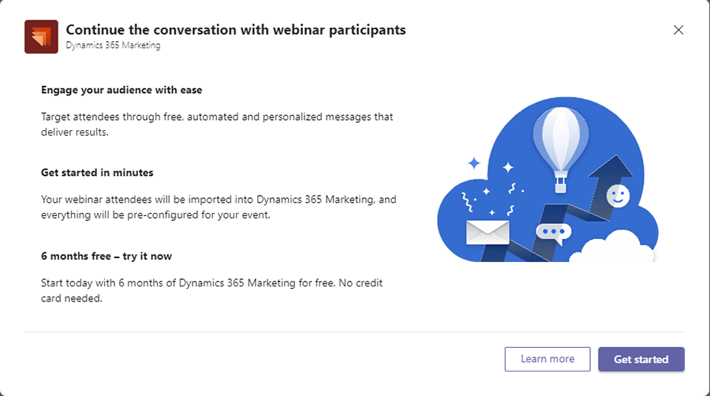

# Access a Dynamics 365 Marketing trial from Microsoft Teams

The Dynamics 365 Marketing/Microsoft Teams trial allows you to use the Marketing app to stay in touch with your webinar participants after hosting a webinar. You can send personalized registration materials, send surveys, and more to drive awareness and engagement.

> [!NOTE]
> The Dynamics 365 Marketing/Microsoft Teams trial does not connect to existing instances of other Dynamics 365 apps. It is standalone and separate from any paid instances of Sales, Customer Service, Field Service, or any other Dynamics 365 apps.

To access Dynamics 365 Marketing/Microsoft Teams trial:

1. [Host a webinar in Teams](/microsoftteams/set-up-webinars) with at least one attendee.
1. In Teams, select the **Attendance** tab to view the attendance report.
1. On the top bar, select **Turn attendance into results**.

    > [!div class="mx-imgBorder"]
    > 

    > [!IMPORTANT]
    > The **Turn attendance into results** button only appears in the attendance tab *after* the webinar has ended. The meeting type must be a webinar to use the **Turn attendance into results** functionality. The button is not shown if the meeting type is not a webinar, if you do not meet eligibility criteria, or if your organization has disabled trials.
    > 
    > Additionally, the **Turn attendance into results** button will not appear unless the **Engagement report** policy is enabled. Learn more: [Enable engagement reports](/microsoftteams/teams-analytics-and-reports/meeting-attendance-report#configure-the-teams-meeting-attendance-report).

1. Select **Get started**.

    > [!div class="mx-imgBorder"]
    > 

1. You'll see some additional screens while the trial is being set up and configured. Once setup is complete, a browser tab will open with a Dynamics 365 Marketing customer journey page that contains your webinar data, allowing you to personalize emails to follow up with your webinar participants.

## Here's what you can do by connecting Teams to Dynamics 365 Marketing

Let's say you've hosted a Microsoft Teams webinar and are reviewing your [Teams attendance report](/microsoftteams/teams-analytics-and-reports/meeting-attendance-report). Maybe some guests registered but didn't attend, while others canceled their registrations. You wish you could follow up with the guests to get feedback or tell them about an upcoming webinar that is more relevant to their interests. Maybe you'd like to send a survey to learn what content guests would like to hear about in the next webinar. By integrating Teams with Dynamics 365 Marketing, you can engage your webinar attendees, converting participants to loyal customers.

Marketing helps you automate and personalize the follow-up process and helps you plan for future webinar events. Using Marketing with Teams, you can:

- Store and manage webinar participant contact information.
- Create groups of participants for targeted messaging (for example, participants who attended, who didn't attend, or who canceled).
- Use built-in email templates to send personalized emails that look professionally designed.
- Advertise upcoming events and webinars.

## What happens when the trial expires?

When your Dynamics 365 Marketing trial expires, your administrator will have to purchase a license for the app if you wish to continue using it.

## Next steps

- [Follow up with Teams webinar participants](teams-webinar-follow-up.md)

> [!NOTE]
> Microsoft Teams and Dynamics 365 Marketing each have their own [service-specific licensing terms](https://www.microsoft.com/licensing/terms/productoffering). The service-specific terms that apply depend on which service processes your data. For example, when you transition from Microsoft Teams to Dynamics 365 Marketing, your Microsoft Teams data related to the webinar (such as the attendance report, engagement data, etc.) is transferred to Dynamics 365 Marketing whereupon it becomes Dynamics 365 Marketing data and the Dynamics 365 service-specific terms apply.

[!INCLUDE[footer-include](../includes/footer-banner.md)]