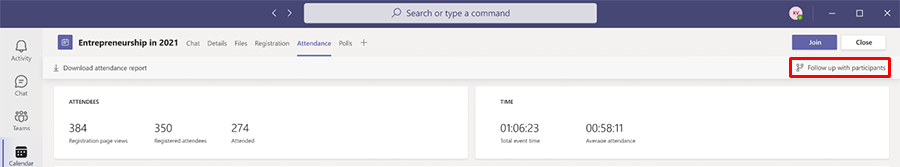
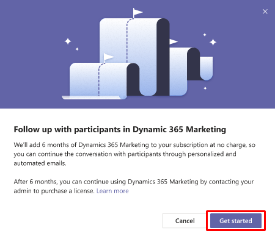

# How to sign up for a free 6 month Dynamics 365 Marketing trial

As an existing Microsoft customer, you are eligible for a free 6 month trial of Dynamics 365 Marketing. The trial allows you to follow up with customers after a webinar and to personalize registration materials before your next webinar.

To sign up for a 6 month Dynamics 365 Marketing trial:

1. [Host a webinar in Teams](/microsoftteams/set-up-webinars) with at least one attendee.
1. In Teams, select the **Attendance** tab to view the attendance report.
1. In the top-right corner, select **Follow up with participants**.

    > [!div class="mx-imgBorder"]
    > 

    > [!IMPORTANT]
    > The **Follow up with participants** button only appears in the attendance tab *after* the webinar has ended.

1. Select **Get started**.

    > [!div class="mx-imgBorder"]
    > 

1. You will be prompted to enter an email address. You'll need to use a work or school email address. If you don't have a work or school email address, or if your school or work account is not managed by Microsoft Azure Active Directory, sign up for a free Office 365 E5 trial, then use the email address associated with your Office 365 E5 trial to sign up for the Marketing trial.
1. After a few moments, a browser tab will open with a customer journey and segments that are personalized to your webinar data.

## Why integrate Teams and Dynamics 365 Marketing?

Let's say you've hosted a Microsoft Teams webinar and are reviewing your [Teams attendance report](/microsoftteams/teams-analytics-and-reports/meeting-attendance-report). Maybe some guests registered but didn't attend, while others canceled their registrations. You wish you could follow up with the guests to get feedback or tell them about an upcoming webinar that is more relevant to their interests. Maybe you'd like to send a survey to learn what content guests would like to hear about in the next webinar. By integrating Teams with Dynamics 365 Marketing, you can engage your webinar attendees, converting participants to loyal customers.

The 6 month trial allows you to immediately connect Teams to Dynamics 365 Marketing. You don't even need a credit card to sign up. Dynamics 365 Marketing is web-based, so no installation on your computer is required. Your data is secure with Microsoft; your data will not be shared outside of your company.

## Here's what you can do by connecting Teams to Dynamics 365 Marketing

Marketing helps you automate and personalize the follow-up process and helps you plan for future webinar events. Using Marketing with Teams, you can:

- Store and manage webinar participant contact information.
- Create groups of participants for targeted messaging (for example, participants who attended, who didn't attend, or who canceled).
- Use built-in email templates to send personalized emails that look professionally designed.
- Advertise upcoming events and webinars.

## What happens when the trial expires?

When your Dynamics 365 Marketing trial expires, your administrator will have to purchase a license for the app if you wish to continue using it. You cannot convert a trial app to a production app. This means that you will not be able to transfer data from your Marketing trial to the production app after you purchase a license.

## Next steps

- [Create a Dynamics 365 Marketing webinar event and run it in Microsoft Teams](teams-journey.md)
- [Follow up with Teams webinar participants](teams-webinar-follow-up.md)

> [!NOTE]
> Microsoft Teams and Dynamics 365 Marketing each have their own [service-specific licensing terms](https://www.microsoft.com/licensing/terms/productoffering). The service-specific terms that apply depend on which service processes your data. For example, when you transition from Microsoft Teams to Dynamics 365 Marketing, your Microsoft Teams data related to the webinar (such as the attendance report, engagement data, etc.) is transferred to Dynamics 365 Marketing whereupon it becomes Dynamics 365 Marketing data and the Dynamics 365 service-specific terms apply.