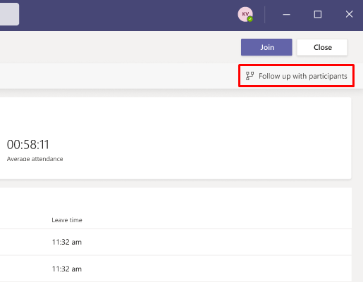
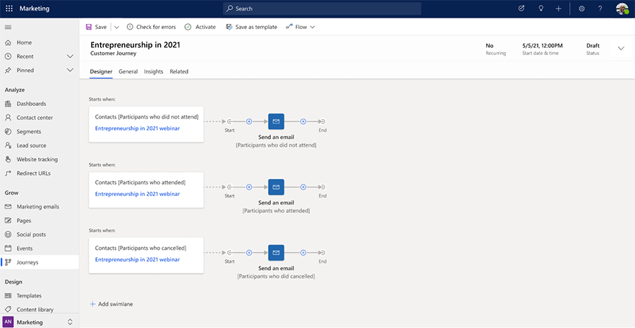

# Incorporate Dynamics 365 Marketing with Microsoft Teams

So you've hosted a Microsoft Teams webinar and decided to follow up with participants in Dynamics 365 Marketing. You may have used the Marketing app before, or you may be new to it. Either way, it's handy to know what Marketing offers.

Using Marketing with Teams participant data, you can:

- Generate contact information
- Generate segments of participants who attended, who didn't attend, and who canceled
- Use prepared follow-up email templates
- Launch ready-to-use customer journeys

Using the data from Teams and the tools in Marketing, you can close the engagement loop with webinar participants, turning attendees into leads and gathering feedback from those who canceled or didn't attend.

## Marketing terminology

- **Contact**: In Marketing, participant data such as names, email addresses, company names, and mailing addresses are stored as contacts.
- **Segment**: A segment is a defined group of people, such as contacts who work at Contoso and attended a webinar. Segments allow you to choose the right audience to market to.
- **Customer journey**: After you've identified the audience you want to target, you can create a journey to send the contacts within a segment down a series of steps. When you use Teams attendee data in Marketing, a customer journey is automatically created for you. Different journey paths can be triggered depending on contact engagement. You can also create parallel paths called "swimlanes" that start from different segments.

## Follow up with webinar participants

In just a few steps, you can generate contacts, segments, and a customer journey to follow up with webinar participants, even if you are not an existing Dynamics 365 Marketing user. To follow up with participants:

1. In Teams, select the **Attendance** tab to view the attendance report.
1. In the top-right corner, select **Follow up with participants**.
    > [!div class="mx-imgBorder"]
    > 
1. If you are an existing Marketing customer, a window pops up that lists your Dynamics organizations. Select the organization you want to use from the dropdown, then select **Get started**.
1. If you are not a Marketing customer, you can [sign up for a free Dynamics 365 Marketing trial](trial-signup.md). To sign up, select **Get started**.
1. After you sign up, a browser tab will open with an automatically generated customer journey and segments that are customized to your webinar data.
    > [!div class="mx-imgBorder"]
    > 

## Using the automatically generated customer journey

The customer journey uses the power of Dynamics 365 Marketing to follow up with webinar participants on three paths:

- The first path sends an email to registrants who did not attend the webinar.
- The second path sends an email to registrants who attended the webinar.
- The third path sends an email to registrants who canceled their webinar registration.

Each path includes an email template to send notification emails. You can customize each email template to suite your branding and company needs. To customize the email, select the **Send an email** tile.

You can also [add tiles](customer-journey-tiles-reference.md) to create more complex paths for your journey. For example, you could try adding a **Wait for** tile and another **Send an email** tile to wait a week before sending a reminder email.

Refer to the links below to learn more about Marketing features and how to customize your journey.

## Learn more about customizing your journey

The links below guide you through some of the key features of emails, segments, and customer journeys.

- [Create a marketing email and go live](create-marketing-email.md)
- [Create a dynamic segment](create-segment.md)
- [Create a simple customer journey with email messaging](create-simple-customer-journey.md)
- [Create an interactive customer journey with conditions and signup](create-interactive-customer-journey.md)

## Additional resources

- [Explore training on Microsoft Learn](/learn/browse/?products=dynamics-marketing)
- [Watch videos on the product playlist](https://www.youtube.com/playlist?list=PLcakwueIHoT_cV1n1es1YJt_T2A5u-XpR)

> [!NOTE]
> Microsoft Teams and Dynamics 365 Marketing each have their own [service-specific licensing terms](https://www.microsoft.com/licensing/terms/productoffering). The service-specific terms that apply depend on which service processes your data. For example, when you transition from Microsoft Teams to Dynamics 365 Marketing, your Microsoft Teams data related to the webinar (such as the attendance report, engagement data, etc.) is transferred to Dynamics 365 Marketing whereupon it becomes Dynamics 365 Marketing data and the Dynamics 365 service-specific terms apply.