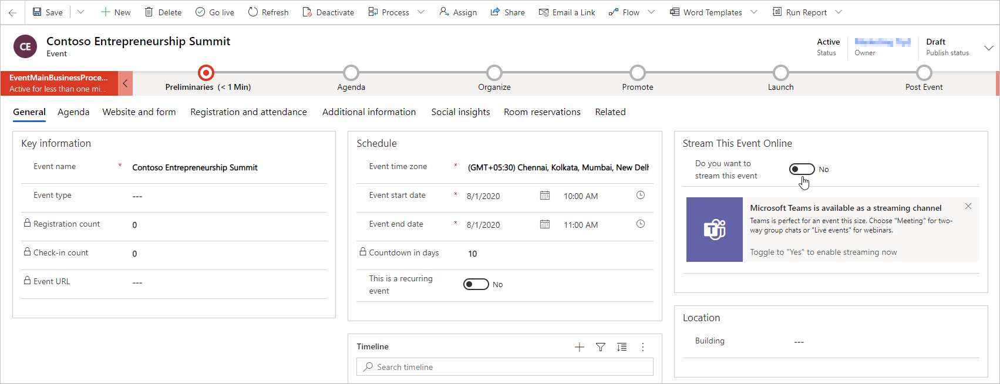
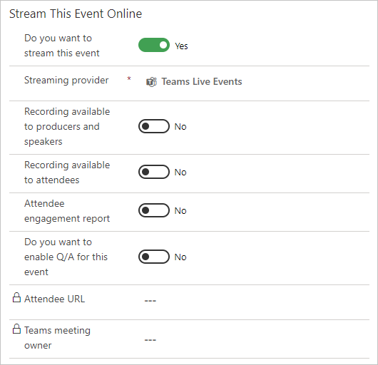

# Early access: Set up a Microsoft Teams webinar

> [!IMPORTANT]
> Early access features are currently available only on opted-in instances. You can opt in for early access on any instance, but we recommend that you do so only on trial, test, or sandbox instances, which will give you a chance to learn the new functionality before it shows up on your production instances later this year.
>
> For instructions on how to opt in and enable early access, see [Opt in to early access updates](https://docs.microsoft.com/power-platform/admin/opt-in-early-access-updates). For more information about the 2020 release wave 2 schedule, and for answers to frequently asked questions about the early access program, see [2020 release wave 2 features available for early access](https://docs.microsoft.com/dynamics365-release-plan/2020wave2/features-ready-early-access).
>
> We encourage all customers to provide feedback related to early access features on the [Dynamics 365 Marketing Forum](https://community.dynamics.com/365/marketing/f/dynamics-365-for-marketing-forum), your Microsoft contact or partner, and/or through [Microsoft Support](https://docs.microsoft.com/power-platform/admin/get-help-support).

This article explains how to use Microsoft Teams as an online meetings provider for Dynamics 365 Marketing events. Teams event functionality is now incorporated directly into Marketing, allowing you to host Teams live events for webinars and Teams meetings for interactive online meetings.

> [!NOTE]
> To use Microsoft Teams as a webinar provider, you have must a [Microsoft 365 license](https://docs.microsoft.com/office365/servicedescriptions/teams-service-description) that allows you access to the Teams service.

## Create an online event

To create a Teams event, click on **Events** in the left navigation pane of the Marketing app. Then click on **+New** in the ribbon. You will see a new banner highlighting that Teams is available as a streaming provider.

> [!NOTE]
> The field **Event Format** is hidden from the event form and is automatically set. Set the **Do you want to stream this event** toggle to **Yes**, and it will show the streaming options.

## Event streaming options

After you flip the **Do you want to stream this event** toggle to **Yes**, you will have three options for selecting the streaming provider.

### Teams live events

Use Teams live events to create webinar style online meetings. Live event presenters can share content, video, and audio. Attendees can view the content, but cannot share their own audio, video, or content. 

Live events are useful for conference keynotes or meetings where a few presenters are presenting to a large audience. The audience can optionally submit questions using the Q&A feature for the live event. More information on Teams live events: [What are Microsoft Teams live events?](https://docs.microsoft.com/microsoftteams/teams-live-events/what-are-teams-live-events)

> [!NOTE]
> You can only create “public” Teams live events from Dynamics 365 Marketing. These events are open to anyone. Attendees are not required to sign in to attend the event.

#### Live event settings

| Setting                                         | Description                                                                                        |
|-------------------------------------------------|----------------------------------------------------------------------------------------------------|
| Recording available to producers and presenters | A downloadable recording will be made available to producers for 180 days after the event is over. |
| Recording available to attendees                | Attendees can watch the event on demand using DVR options for 180 days.                            |
| Attendee engagement report                      | You can download a report that tracks attendee participation.                                      |
| Q&A                                             | Attendees can interact with producers and presenters in a moderated Q&A.                           |

More information on details and settings for Teams live events: [Schedule a Teams live event](https://support.microsoft.com/office/schedule-a-teams-live-event-7a9ce97c-e1cd-470f-acaf-e6dfc179a0e2)

**Notes**:

- Captions configuration options (Teams preview feature) are not available when creating live events from Dynamics 365 Marketing.
- The attendee engagement report includes downloadable CSV details of attendees. The report details may slightly differ from the auto-generated check-in information in Marketing.
- The **Teams meeting owner** is the user who originally created the live event in Marketing. The Teams meeting owner is designated as the owner of the event in Teams. Changing the owner of the event record in Marketing does not change the owner of the live event in Teams.
- The event planner cannot assign the Teams meeting owner.
- Events created in the Marketing app's event management are not available in the Teams calendar for owners, producers, or attendees.
