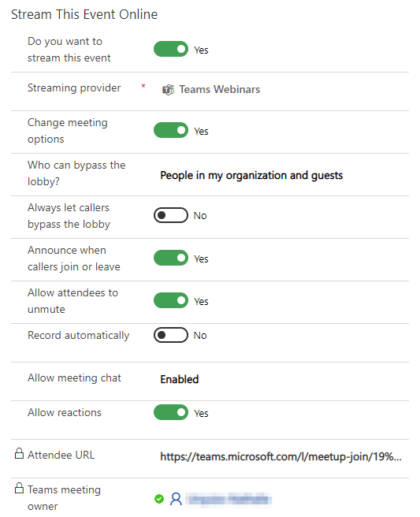

# Set up a Microsoft Teams webinar in Dynamics 365 Marketing

<div class="embeddedvideo"><iframe src="https://www.microsoft.com/videoplayer/embed/RE4J4cV" frameborder="0" allowfullscreen=""></iframe></div>

This article explains how to use Microsoft Teams as an online meetings provider for Dynamics 365 Marketing events. Teams event functionality is now incorporated directly into Marketing, allowing you to use Teams webinars for one/some to many online events, and Teams meetings for interactive online meetings.

> [!NOTE]
> To use Microsoft Teams as a webinar provider, you must have a [Microsoft 365 license](/office365/servicedescriptions/teams-service-description) that allows you access to the Teams service. If you do not have the correct license, you will not see the Teams Meeting, Teams Webinar, or Teams Live Event options as a part of the **Streaming providers** list.

## Create an online event

To create a Teams event, select **Events** in the left navigation pane of the Marketing app. Then select **+New** in the ribbon. You will see a new banner highlighting that Teams is available as a streaming provider.

> [!div class="mx-imgBorder"]
> 

> [!NOTE]
> The field **Event Format** is hidden from the event form and is automatically set. Set the **Do you want to stream this event** toggle to **Yes**, and it will show the streaming options. If you are using a custom form, ensure that you hide this field and set the value to **Hybrid event**. 

## Event streaming options

After you flip the **Do you want to stream this event** toggle to **Yes**, you will have three options for selecting the streaming provider.

### Teams webinars

Use Teams webinars to create online presentations. One or multiple presenters can share content, videos, and audio. Participants can view the content and optionally engage with the presenters. Audience engagement is in the form of reactions, posting in the chat, or answering poll questions. The attendees cannot share their own audio, video, or content.

Webinars are useful for conference keynotes or meetings where a few presenters are presenting to a large audience. Webinars can support up to 1,000 attendees.

> [!NOTE]
> You can only create "public" Teams webinars from Dynamics 365 Marketing. These events are open to anyone who registered for the event.

#### Enable Teams webinars in Dynamics 365

To enable Teams webinars, the following policies need to be set by the Teams tenant administrator. These settings ensure that anyone, including anonymous users, can register for webinars. To implement the settings, run the following PowerShell commands:

1. Turn on meeting registration:

```powershell
Set-CsTeamsMeetingPolicy -AllowMeetingRegistration $True
```

2. Turn on private meeting scheduling:

```powershell
Set-CsTeamsMeetingPolicy -AllowPrivateMeetingScheduling $True
```

3. Allow anyone, including anonymous users, to register for webinars:

```powershell
Set-CsTeamsMeetingPolicy -WhoCanRegister Everyone
```

Read more: [Set up for webinars in Microsoft Teams](/microsoftteams/set-up-webinars)

#### Webinar settings

The default webinar settings are configured to provide the best attendee and presenter experience. However, you can easily tweak these settings from your Dynamics 365 Marketing event. To change the default settings, set the **Change meeting options** switch to **Yes**. This reveals the settings for the webinars, which can be tweaked on a per-event basis.

> [!div class="mx-imgBorder"]
> 

Read more: [Manage meeting settings in Microsoft Teams](/microsoftteams/meeting-settings-in-teams)

#### Webinar roles

| Role name                    | What do they do?                                                                                   | How to create them? |
|------------------------------|----------------------------------------------------------------------------------------------------|----------------------------|
| Event owner                  | The user who owns the event record in Dynamics 365 Marketing. | Set the event owner by using the **Assign** button on the event ribbon. |
| Teams meeting owner          | The user who created the webinar in Marketing. The Teams meeting owner is designated as the owner of the event in Teams. Changing the owner of the event record in Marketing does not change the owner of the webinar in Teams. Any change to the event record in Marketing will only reflect in Teams when done by the owner or when they select **Sync to Teams**. | Sign in as this user in Dynamics 365 Marketing and create a new event with a webinar or meeting stream. |
| Presenter                    | In a Teams webinar, a presenter is a person who presents audio, video, or a screen to the live event, or moderates the Q&A. Presenters can only share audio, video, or a screen (desktop or window) in webinars produced in Teams.| If you want to invite another person to present to the webinar, add them to the event or the session as a speaker. To add the person as a speaker, create a speaker engagement at the event (or session) level. The speaker is added as the “presenter” for the webinar. Ensure that the speaker email ID is filled in.

**Invite a guest to present in a webinar**

- Ensure that the guest user is added to your Teams instance. You only have to do this once. Learn more about adding guest users: [Guest to present](/microsoftteams/teams-live-events/plan-for-teams-live-events#guest-to-present)
- As a best practice, Teams recommends that you create a channel for producers and presenters of the live event so they can chat and share information before the event. Guests who don't have Microsoft 365 credentials won't see the calendar in Teams. To make it easy for guests to join the event, producers can post the event link to the channel. Presenters can then open Teams, go to the channel, and select the link to join the event.
- Add a guest as a presenter in your webinar by adding them as a speaker in your event or session in Dynamics 365 Marketing using the steps detailed in the table above.

#### View webinar engagement data

After you run a Teams webinar through Dynamics 365 Marketing, you can view attendee engagement data (check-in and check-out times) in the Marketing app.

To view the engagement data, prior to the webinar, send an email invite to webinar registrants that contains the webinar **Join in Teams** link. See [Inviting registrants to attend the live event through email](teams-webinar.md#inviting-registrants-to-attend-the-live-event-through-email) for details about creating an invite email in the Marketing email designer.

Ten minutes after the end of the webinar (based on the end date configured in the Marketing app), the system will automatically populate the engagement data for attendees.

> [!IMPORTANT]
> Organizations that manage their Teams user policies need to make sure that the admin enables the **allowTrackingInReport** and **allowEngagementReport** policies before synchronizing the engagement data. For more information, see [Set-CsTeamsMeetingPolicy](/powershell/module/skype/set-csteamsmeetingpolicy).

#### Known issues with Teams webinars

After creating an event with a Teams webinar, you can see it on your Teams calendar. It may look slightly different than you expect:

- There is no webinar icon on the calendar item; it looks more like a regular meeting.
-	The meeting details page is missing several sections like the meeting options tab, a link to the registration form, and the existing registrations file to download.

The discrepancies in appearance are styling issues that won't limit the functionality of the webinar. Until the webinar experience is updated in future releases, use the following guidelines to manage your webinar:

-	The Teams calendar item created for your event is read-only. Synchronization between Teams and Dynamics 365 works in one direction: from Dynamics 365 to Teams. Changes you apply in Teams won't take effect on the Dynamics 365 side and may be overwritten. For this reason, use only Dynamics 365 Marketing to manage and edit your event. This includes configuring meeting settings, creating a registration form, and adding speakers or presenters to your event.
- You may notice that landing pages for Teams meetings and webinars look the same. This is expected. The in-meeting experience is indeed the same for a traditional meeting and a webinar. Your webinar will take place as you structured it to be with clear roles of the attendees.
- After you add a speaker engagement to your webinar through Dynamics 365, the meeting options in Teams will become visible. The calendar item will still be read-only in Teams. Make sure you edit your webinar only in Dynamics 365 Marketing.

### Teams meetings

The Teams meetings option allows you to create an interactive online meeting experience where all attendees can share audio, video, or content. More information about Teams meetings: [Meetings in Microsoft Teams](/microsoftteams/tutorial-meetings-in-teams)

### Teams live events

> [!NOTE]
> We recommend that you use Teams webinars for your presentation event needs. Although Teams live events are still available, Teams webinars provide richer functionality (such as the ability to use [breakout rooms](https://support.microsoft.com/office/use-breakout-rooms-in-teams-meetings-7de1f48a-da07-466c-a5ab-4ebace28e461)) out of the box.

Use Teams live events to create webinar-style online meetings. Live event presenters can share content, video, and audio. Attendees can view the content, but cannot share their own audio, video, or content.

Live events are useful for conference keynotes or meetings where a few presenters are presenting to a large audience. The audience can optionally submit questions using the Q&A feature for the live event. More information on Teams live events: [What are Microsoft Teams live events?](/microsoftteams/teams-live-events/what-are-teams-live-events)

> [!NOTE]
> You can only create "public" Teams live events from Dynamics 365 Marketing. These events are open to anyone. Attendees are not required to sign in to attend the event.

#### Enable Teams live events in Dynamics 365

To enable Teams live events, the following policy needs to be set by the Teams tenant administrator. Dynamics 365 only supports creating public live events. This setting ensures that anyone can watch the event, including anonymous users.

To allow anyone to watch the live event, run the following PowerShell command:

```powershell
Set-CsTeamsMeetingBroadcastPolicy -BroadcastAttendeeVisibilityMode Everyone
```

To enable live event scheduling, run the following command:

```powershell
Set-CsTeamsMeetingBroadcastPolicy -AllowBroadcastScheduling $true
```

To allow the option to disable meeting recordings, run the following command:

```powershell
Set-CsTeamsMeetingBroadcastPolicy -BroadcastRecordingMode UserOverride
```

You can also apply these settings in the Teams admin center:

> [!div class="mx-imgBorder"]
> 

Read more: [Set up for live events in Microsoft Teams](/microsoftteams/teams-live-events/set-up-for-teams-live-events)

#### Live event settings

> [!div class="mx-imgBorder"]
> 

| Setting                                         | Description                                                                                        |
|-------------------------------------------------|----------------------------------------------------------------------------------------------------|
| Recording available to attendees                | Attendees can watch the event on demand using DVR options for 180 days.                            |
| Do you want to enable Q/A for this event                                             | Attendees can interact with producers and presenters in a moderated Q&A.                           |
| Attendee URL                      | The URL that attendees will use to join the live event.                                      |

More information on details and settings for Teams live events: [Schedule a Teams live event](https://support.microsoft.com/office/schedule-a-teams-live-event-7a9ce97c-e1cd-470f-acaf-e6dfc179a0e2)

#### Live events roles

| Role Name                    | What do they do?                                                                                   | How to set them up? |
|------------------------------|----------------------------------------------------------------------------------------------------|----------------------------|
| Event owner                  | The user who owns the event record in Dynamics 365 Marketing. | Set the event owner by using the **Assign** button on the event ribbon |
| Teams meeting owner          | The user who originally created the live event in Marketing. The Teams meeting owner is designated as the owner of the event in Teams. Changing the owner of the event record in Marketing does not change the owner of the live event in Teams. Any change to the event record in Dynamics will only reflect in Teams when done by this user or when they select **Sync to Teams**. | Sign in as this user in Dynamics 365 Marketing and create a new event with a live event or meeting stream. |
| Presenter                    | In a Teams live event, a presenter is a person who presents audio, video, or a screen to the live event, or moderates Q&A. Presenters can only share audio, video, or a screen (desktop or window) in live events produced in Teams.| If you want to invite another person to present to the live event, add them as a speaker to the event or the session. To add the person as a speaker, create a speaker engagement at the event (or session) level. The speaker is added as the “presenter” for the live event. Ensure that the speaker email ID is filled in.
| Producer                     | A producer is a host that makes sure attendees have a great viewing experience by controlling the live event stream. If you want another user to have the ability to produce the live event, you can add the producer user as an **Event Team Member**. This will only work when the Event Team Member is a Dynamics 365 Marketing and Microsoft Teams user. On an event, navigate to the **Additional Information** tab and add the team members. Team members can have any role in Dynamics 365 Marketing, but they will always be producers in the Teams live event. |

> [!Important]
>
> **Join in Teams** buttons generated for in the Dynamics 365 Marketing email editor *cannot* be used for sending live event links to Presenters or Producers. Buttons generated in the email editor only work for attendees. Presenters or Producers can access the live event by following the custom link in their calendar or in the Marketing app by going to **Events** > **Streaming URL**.

**Notes**:

- Captions configuration options (Teams preview feature) are not available when creating live events from Dynamics 365 Marketing.
- More about Teams roles: [Get started with Microsoft Teams live events](https://support.microsoft.com/office/get-started-with-microsoft-teams-live-events-d077fec2-a058-483e-9ab5-1494afda578a?#bkmk_roles)

**How to invite a guest to present in a Live event**

- Ensure that the guest user is added to your Teams instance. You only have to do this once. Learn more about adding guest users: [Guest to present](/microsoftteams/teams-live-events/plan-for-teams-live-events#guest-to-present)
- As a best practice, Teams recommends that you create a channel for producers and presenters of the live event so they can chat and share information before the event. Guests who don't have Microsoft 365 credentials won't see the Calendar in Teams. To make it easy for them to join the event, producers can post the event link to the channel. Presenters can then open Teams, go to the channel, and select the link to join the event.
- Add a guest as a presenter in your live event by adding them as a speaker in your event or session in Dynamics 365 Marketing using the steps detailed above.

### Using other webinar providers

If your organization has already set up a webinar provider (using ON24), you can find the existing webinar configurations after setting the streaming provider to **Other**. Doing so reveals the classic "Webinar Configuration" settings. More information on the classic webinar settings: [Set up a webinar](set-up-webinar.md)

## Teams live event or meeting attendee link

The Teams attendee URL is created when you save a Marketing event that is being streamed with Teams. You can navigate to the Teams live event or meeting using the attendee URL.

> [!NOTE]
> To invite a registrant to join the event, do not share the attendee URL directly. Instead, use the method [described below](teams-webinar.md#inviting-registrants-to-attend-the-live-event-through-email).

## Calendar integration

Once a live event or meeting is created or updated, and the producers and presenters are added (by adding Team members and Speakers) - the meeting will show up in their Outlook calendar as well in their Teams calendar. This would be a **read-only** version of the event, and changes made to this event (from the Teams meeting owner's calendar) would not reflect back in Dynamics 365 Marketing. The speakers and team members can join the live event from their calendar.

> [!NOTE]
> Guest users as presenters will not see the event on their calendar. Send guest users the attendee link from the event in Dynamics 365 Marketing.

## Inviting registrants to attend the live event through email

After creating the event, going live with it, and gathering registrations, you should [send the registrants an email](email-design.md) to provide the attendee URL. In the Marketing email designer, you will find a **Join in Teams** option in the **Link to** menu for the button element.

The **Join in Teams** button generates a unique attendee URL for each registrant. When the registrant selects the button, Marketing will create a relevant check-in record for them, giving insights about the attendance of the live event in Marketing.

> [!IMPORTANT]
> Because the **Join in Teams** button generates a unique URL for each registrant, anyone who selects the **Join in Teams** button from a forwarded email will not be able to check in to the event.

> [!TIP]
> If an attendee selects the **Join in Teams** button *more than 30 minutes* before the event starts, the check-in **will not** be created. This is a hard-coded feature to prevent accidental check-ins when a recipient tests the link after they receive the email.

**To create a Join in Teams button**:

1. Create [a new email](email-design.md) in the email editor.
1. In the **Toolbox** pane, go to **Elements** and drag and drop a **Button** element into the email.
1. The **Edit button** options will appear in the right pane. For the **Link to** option, select **Join in Teams**.

    > [!div class="mx-imgBorder"]
    > 

1. In the **Edit button** pane, open the **Type** dropdown and select whether you want the button to link to an **Event** or a **Session**.
1. Select the specific event or session you want the customer to join. Next, enter the text label for the button and adjust the design to correspond with the email.

    > [!NOTE]
    > The event or session needs to be set to a Teams live event or meeting and must be in a "Live” state before you can select it.

    > [!div class="mx-imgBorder"]
    > 

1. To preview the button in the **Preview and test** panel, select a contact that has a registration for the selected event or session.

## Keeping Dynamics 365 Marketing and Teams in sync

A user who has access to an event record and permissions to edit the record in Dynamics 365 Marketing can make any change to a record. However, since the same user may not have created the corresponding live event or meeting in Teams (and thus may not be the "Teams Meeting owner"), the changes the user made to the event record in Marketing are not propagated to Teams. This functionality is similar to functionality within Teams, where a user cannot make changes to a live event or meeting created by another user.

In scenarios where event record changes are not propagated to Teams, the Marketing app displays a warning to any user who is not the Teams meeting owner. If the user who is the Teams meeting owner for that event opens the event record, the user would see a **Sync with Teams** button in the ribbon. Clicking on the **Sync with Teams** button syncs the changes made to the event by any non-owner users.

> [!NOTE]
> Teams meeting owners are set to the user who creates the live event or meeting in Dynamics 365 Marketing. You cannot change the owner once the event has been created. This is different from the owner of the event record in Marketing.

## Viewing the event recording

Once the live event is over, the attendees can view the recording of the event by navigating to the attendee URL from their email. The recording will be available if the creator of the live event in Marketing sets the **Recording available to attendees** flag to **Yes**.

### See also

[Event management settings](events-settings.md)  
[Set up a webinar](set-up-webinar.md)

[!INCLUDE[footer-include](../includes/footer-banner.md)]
