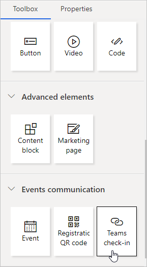
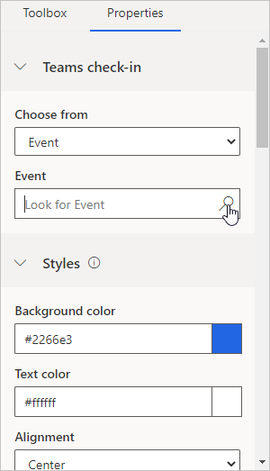

# Set up a Microsoft Teams webinar

This article explains how to use Microsoft Teams as an online meetings provider for Dynamics 365 Marketing events. Teams event functionality is now incorporated directly into Marketing, allowing you to host Teams live events for webinars and Teams meetings for interactive online meetings.

> [!NOTE]
> To use Microsoft Teams as a webinar provider, you must have a [Microsoft 365 license](https://docs.microsoft.com/office365/servicedescriptions/teams-service-description) that allows you access to the Teams service. If you do not have the right license, you will not see the Teams Meeting or Teams Live Event options as a part of the "Streaming providers".

## Create an online event

To create a Teams event, select **Events** in the left navigation pane of the Marketing app. Then select **+New** in the ribbon. You will see a new banner highlighting that Teams is available as a streaming provider.

<!-- @Alex This file needs to be replaced -->

> [!NOTE]
> The field **Event Format** is hidden from the event form and is automatically set. Set the **Do you want to stream this event** toggle to **Yes**, and it will show the streaming options. If you are using a custom form, ensure that you hide this field, and set the value to "Hybrid event". 

## Event streaming options

After you flip the **Do you want to stream this event** toggle to **Yes**, you will have three options for selecting the streaming provider.

### Teams live events

Use Teams live events to create webinar style online meetings. Live event presenters can share content, video, and audio. Attendees can view the content, but cannot share their own audio, video, or content.

Live events are useful for conference keynotes or meetings where a few presenters are presenting to a large audience. The audience can optionally submit questions using the Q&A feature for the live event. More information on Teams live events: [What are Microsoft Teams live events?](https://docs.microsoft.com/microsoftteams/teams-live-events/what-are-teams-live-events)

> [!NOTE]
> You can only create "public" Teams live events from Dynamics 365 Marketing. These events are open to anyone. Attendees are not required to sign in to attend the event.

#### Live event settings

| Setting                                         | Description                                                                                        |
|-------------------------------------------------|----------------------------------------------------------------------------------------------------|
| Recording available to producers and presenters | A downloadable recording will be made available to producers for 180 days after the event is over. |
| Recording available to attendees                | Attendees can watch the event on demand using DVR options for 180 days.                            |
| Attendee engagement report                      | You can download a report that tracks attendee participation.                                      |
| Q&A                                             | Attendees can interact with producers and presenters in a moderated Q&A.                           |

More information on details and settings for Teams live events: [Schedule a Teams live event](https://support.microsoft.com/office/schedule-a-teams-live-event-7a9ce97c-e1cd-470f-acaf-e6dfc179a0e2)

### Live Events Roles

| Role Name                    | What do they do?                                                                                   | How to set them up? |
|------------------------------|----------------------------------------------------------------------------------------------------|----------------------------|
| Event owner                  | The user who owns the Event record in Dynamics. | Set the Event owner by using the Assign button on the event ribbon |
| Teams meeting owner          | The user who originally created the live event in Marketing. The Teams meeting owner is designated as the owner of the event in Teams. Changing the owner of the event record in Marketing does not change the owner of the live event in Teams. Any change to the event record in Dynamics will only reflect in Teams when done by this user or when they click "Sync to Teams" | Sign in as this user in Dynamics 365 Marketing and create a new event with live event or meeting streaming. |
| Presenter                    | In a Teams live event, a presenter is a person who presents audio, video, or a screen to the live event, or moderates Q&A. Presenters can only share audio, video, or a screen (desktop or window) in live events produced in Teams.| If you want to invite another person to present to the live event, add them as a speaker to the event or the session. To add the person as a speaker, create a speaker engagement at the event (or session) level. The speaker is added as the “presenter” for the live event. Ensure that the speaker email ID is filled in.
| Producer                     | A producer is a host that makes sure attendees have a great viewing experience by controlling the live event stream. If you want another user to have the ability to produce the live event, you can add the producer user as an Event Team Member. This will only work when the Event Team Member is a Dynamics 365 Marketing and Microsoft Teams user. On an event, navigate to the **Additional Information** tab and add the Team Members. Team Members can have any role in Dynamics 365 Marketing - they will always be producers in the Team Live Event |

**Notes**:

- Captions configuration options (Teams preview feature) are not available when creating live events from Dynamics 365 Marketing.
- More about Teams roles: [Get started with Microsoft Teams live events](https://support.office.com/article/get-started-with-microsoft-teams-live-events-d077fec2-a058-483e-9ab5-1494afda578a?ui=en-US&rs=en-US&ad=US#bkmk_roles)

**How to invite a guest to present in a Live Event**
- Ensure that the guest user is added to your Teams instance. You only have to do this once. For more [read the steps here](https://docs.microsoft.com/en-us/microsoftteams/teams-live-events/plan-for-teams-live-events#guest-to-present)
- From the Teams Documentation - "As a best practice, we recommend that you create a channel for producers and presenters of the live event so they can chat and share information before the event. Guests who don't have Microsoft 365 credentials won't see the Calendar in Teams. To make it easy for them to join the event, producers can post the event link to the channel. Presenters can then open Teams, go to the channel, and then click the link to join the event."
- Add them as a presenter to your Live Event by adding them as a Speaker to your event or session in Dynamics 365 Marketing, using the steps indicated above

### Teams meetings

The Teams meetings option allows you to create an interactive online meeting experience where all attendees are able to share audio, video, or content. More information about Teams meetings: [Meetings in Microsoft Teams](https://docs.microsoft.com/microsoftteams/tutorial-meetings-in-teams)

### Others

If your organization has already set up a webinar provider (using ON24), you can find the existing webinar configurations after setting the streaming provider to **Other**. Doing so reveals the classic "Webinar Configuration" settings. More information on the classic webinar settings: [Set up a webinar](set-up-webinar.md)

## The Teams live event or meeting attendee link

The Teams attendee URL is created when you save a Marketing event that is being streamed with Teams. You can navigate to the Teams live event or meeting using the attendee URL.

> [!NOTE]
> To invite a registrant to join the event, do not share the attendee URL directly. Instead, use the method [described below](teams-webinar.md#inviting-registrants-to-attend-the-live-event-through-email).

## Calendar Integration

Once a live event or meeting is created or updated, and the producers and presenters are added (by adding Team members and Speakers) - the meeting will show up in their Outlook calendar as well in their Teams calendar. This would be a **read-only** version of the event, and changes made to this event (from the Teams meeting owner's calendar) would not reflect back in Dynamics 365 Marketing. The speakers and team members can join the live event from their calendar. Note: Guest users as presenters would not see this on their calendar - please send guest users the attendee link from the Event in Dynamics 365 Marketing.

> [!NOTE]
> Calendar entries in Outlook?Teams calendar would only show for new events created after updating to the November release. 

## Inviting registrants to attend the live event through email

After creating the event, going live with it, and gathering registrations, you should [send the registrants an email](email-design.md) to provide the attendee URL. In the Marketing email designer, you will find a new **Teams check-in** element in the new **Events communication** area.

The **Teams check-in** button generates a unique attendee URL for each registrant. When the registrant selects the button, Marketing will create a relevant check-in record for them, giving insights about the attendance of the live event in Marketing.

**To create a Teams check-in button**:

1. Create [a new email](email-design.md) in the email editor.
1. In the **Toolbox** pane, go to **Events communication** and drag and drop the **Teams check-in** element into the email. This will create a check-in button.

    

3. In the **Properties** pane, select the Event or Session you want the customer to join. (Note: the Event or Session needs to be set to a Teams live event or meeting and must be in “Live” state before you can select it). Design the button according to the design of the email.

    

4. To preview the button in the **Preview** panel, select a contact that has a registration for the selected Event or Session.

> [!TIP]
> The email with the Teams check-in button should be shared shortly before the event start time, not days in advance. If the email is shared too far in advance, contacts may click on the button and create automated check-ins, only to receive a notice that the "Live event has not started yet."

## Keeping Dynamics 365 Marketing and Teams in sync

A user who has access to an event record and permissions to edit the record in Dynamics 365 Marketing can make any change to a record. However, since the same user may not have created the corresponding live event or meeting in Teams (and thus may not be the "Teams Meeting owner"), the changes the user made to the event record in Marketing are not propagated to Teams. This functionality is similar to functionality within Teams, where a user cannot make changes to a live event or meeting created by another user.

In scenarios where event record changes are not propagated to Teams, the Marketing app displays a warning to any user who is not the Teams meeting owner. If the user who is the Teams meeting owner for that event opens the event record, the user would see a **Sync with Teams** button in the ribbon. Clicking on the **Sync with Teams** button syncs the changes made to the event by any non-owner users.

> [!NOTE]
> Teams meeting owners are set to the user who creates the live event or meeting in Dynamics 365 Marketing. You cannot change the owner once the event has been created. This is different from the owner of the event record in Marketing.

## Viewing the event recording

Once the live event is over, the attendees can view the recording of the event by navigating to the attendee URL from their email. The recording will be available if the creator of the live event in Marketing sets the **Recording available to attendees** flag to **Yes**.

### See also

[Event management settings](events-settings.md)  
[Set up a webinar](set-up-webinar.md)
