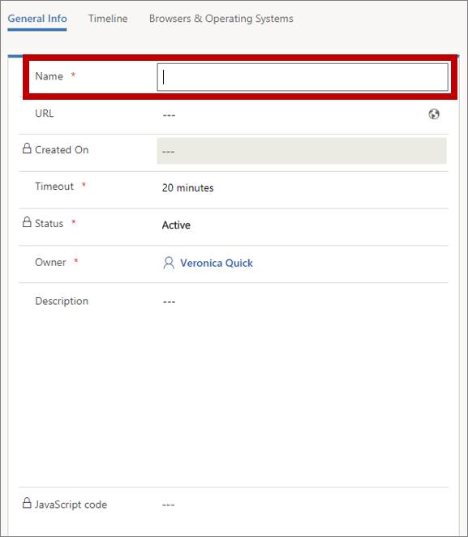
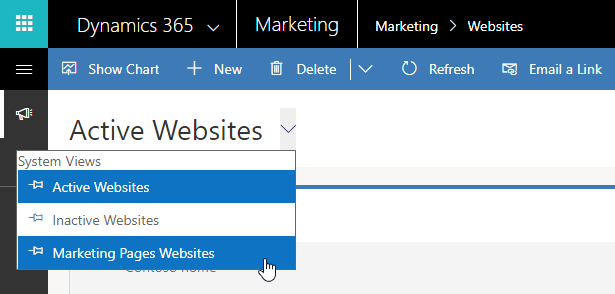
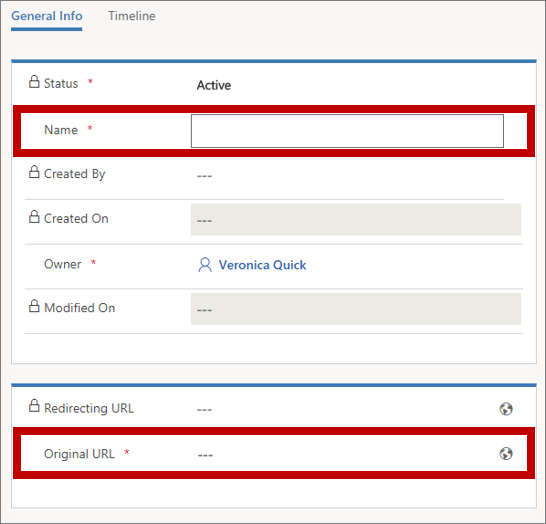

# Track website visits, social media clicks, and banner clicks

Dynamics 365 Marketing provides several ways to help you get to know your potential customers and to see how they interact with your various marketing initiatives. We've already mentioned that you can see when email recipients open a message or select a message link—and when new or existing contacts submit a form from a marketing page. You've also seen that these actions can affect lead scores and the way contacts flow through your customer journeys.

In addition to these activities, you can also store information, view analytics, and score leads based on:

- How known contacts and anonymous visitors use your website.
- How known contacts and anonymous visitors select links you put in social posts, banner ads, and elsewhere.

In this exercise, we'll look into how to set up website and click tracking.

## Set up website tracking and read results

Dynamics 365 Marketing can collect information about how your website is used by its individual visitors. To enable the feature, Dynamics 365 Marketing generates JavaScript code that you must add to each page that you want to monitor (usually an admin would do this site-wide by using your CMS system). The JavaScript uses cookies to record each page that an individual browser requests from your website. Visitors will remain anonymous until they register by using a Dynamics 365 Marketing landing page. <!-- , at which time Dynamics 365 Marketing will be able to link both new and historic browsing records to an actual contact in the system.-->

Each such JavaScript that you generate with Dynamics 365 Marketing includes a unique ID, which the system uses to group all visits to pages that have that script on them. Dynamics 365 Marketing considers all visits to a matching ID to be part of the same website. Many organizations will use just one JavaScript, but you could also choose to generate several different ones if you prefer to organize various sites (or parts of sites) independently of the others.

To set up page analytics for a new website:

1. Go to **Marketing** > **Internet Marketing** > **Marketing websites**. You now see a list of existing websites. Make sure you don't already have one set up for your site.

2. On the command bar, select **New**. The **New Website** page opens.  
    

    Enter a **Name** to identify the website (or partial website) that you want to track. A **URL** and **Description** might help other users but won't affect the script or its functionality.

    > [!TIP]
    > The **Timeout** setting enables closely grouped visits from a single browser to be recorded as a single session. A new session will start after this period of inactivity from a given browser. The default, 20 minutes, is usually a good value.

3. On the command bar, select **Save**.

4. The page saves your settings and then is reloaded to include code in the **JavaScript code** field. Copy this code (be sure to select all of it) and share it with your webmaster to ensure it gets placed on each relevant page of your website.

To see your website analytics, go to **Marketing** > **Internet Marketing** > **Marketing websites** and open the website you want to learn about. Here you'll find lists of most-visited pages, geographical information about where people who visit your site come from, and more. Explore the various tabs offered here for more details about how visitors are using your site. The JavaScript code also remains available here in case you need to add it to more pages.

> [!TIP]
> Each marketing page that you publish from Dynamics 365 Marketing automatically includes its own unique JavaScript tracking code and therefore appears on the **Marketing websites** list page as a discrete website. To view analytics of any of these pages, go to the **Marketing websites** list view and open its **Marketing Pages Websites** view.
> 
> 

## Set up trackable links with redirect URLs and read results

Dynamics 365 Marketing can generate redirect URLs for you. Each redirect URL targets your Dynamics 365 Marketing server, which logs the click and then immediately redirects the user to the expected content. This enables you to log clicks on links that you put into social media posts, banner ads, forums, and elsewhere. This information can help you choose the best channels for getting your message out. These records are also mapped to specific contacts when possible (usually because they have submitted a marketing form and therefore have a cookie set in their browser).

To compare the traffic you generate for different channels or campaigns, you should set up a unique redirect URL for each channel and/or campaign where you want to track link clicks. For example, use one redirect URL for links you put on Twitter, another one for Facebook, and another one for banner ads. Then you could see which of these channels produced the most clicks by comparing the related redirect URLs.

To create a redirecting URL:

1. Go to **Marketing** > **Internet Marketing** > **Redirect URLs**. You now see a list of existing redirect URLs.

1. On the command bar, select **New**. The **New Redirect URL** page opens.  
    

    Enter the following:
    - **Name**: Enter an internal name for the redirect URL. If you use this feature often, you should come up with a naming convention that will make it easy to find the right record when you want to come back and view results, for example "Twitter spring campaign" or "LinkedIn banner".
    - **Original URL**: Enter the full URL for the page the redirect URL will target. This is the page that users will actually be expecting when they select the link.

1. On the command bar, select **Save**. The page is reloaded with an autogenerated link in the **Redirecting URL** field. Copy and use this version of the URL in your communications as needed.

To see usage statistics about one of your redirect URLs, go to **Marketing** > **Internet Marketing** > **Redirect URLs** and open the link you want to learn about. The **General info** tab shows a map of where the clicks occurred, and the **Timeline** tab provides a list of when each click occurred. Redirect URL interactions are also shown on the **Insights** form views for leads and contacts for those clicks that the system was able to associate with a lead or contact, which requires a cookie (as described earlier for website tracking).

[!INCLUDE[cc-marketing-cookies](../includes/cc-marketing-cookies.md)]

### See also

[Register link clicks and website visits](register-engagement.md)  
[Design lead-scoring models](score-manage-leads.md)  
[Set up lead scoring](set-up-lead-scoring.md)  
[How Dynamics 365 Marketing uses cookies](cookies.md)

[!INCLUDE[footer-include](../includes/footer-banner.md)]