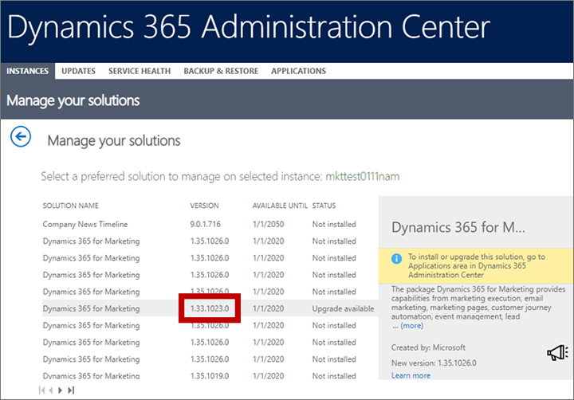

# Transfer data and configurations between instances using the Configuration Migration tool

[!INCLUDE[cc_applies_to_update_9_0_0](../includes/cc_applies_to_update_9_0_0.md)]

You can replicate [!INCLUDE[pn-marketing-business-app-module-name](../includes/pn-marketing-business-app-module-name.md)] configurations and data across instances using the standard tools provided for [!INCLUDE[pn-microsoftcrm](../includes/pn-microsoftcrm.md)]. Common scenarios where this comes in handy include:

- Move validated journeys, emails, and other content from a sandbox to a production environment
- Set up a demo with sample data on a trial or sandbox

The process works as follows:

1. Download the Configuration Migration tool for [!INCLUDE[pn-microsoftcrm](../includes/pn-microsoftcrm.md)] (if you don't already have it).
1. Download the standard database schema for your version of [!INCLUDE[pn-marketing-business-app-module-name](../includes/pn-marketing-business-app-module-name.md)].
1. If your source instance include database customizations, edit the downloaded schema as needed.
1. Export data from source instance using the Configuration Migration tool together with the schema.
1. Import the exported zip bundle onto the destination instance.

## Capabilities and limitations of the export/import process

The following notes apply when you use export/import to move data from one [!INCLUDE[pn-marketing-business-app-module-name](../includes/pn-marketing-business-app-module-name.md)] to another:

- All records exported with a status of "live" will be imported with a status of "draft" on the destination instance.
- If you import (or reimport) a record that already exists on the destination instance, that record will end with a status of "draft" on the destination instance. Matching records won't be duplicated.
- Interaction data can't be exported or transferred to a new instance. It will never be included in the export file.
- If you export from a language not present on the destination instance, that language will simply be added to the destination instance.
- Both the source and destination instances must be running the same version of [!INCLUDE[pn-marketing-business-app-module-name](../includes/pn-marketing-business-app-module-name.md)] and use identical database schema.

<!-- Mention things like: supported/unsupported entities, support for languages, requirement for matching versions, something about customizations, more? -->

## Download the Configuration Migration tool

The Configuration Migration tool helps you extract your data and configuration details from one instance and then import them to another. To get the tool, follow the instructions given in [Download tools from NuGet](../developer/download-tools-nuget.md).

## Find the version of Marketing that you are running

You need to know which version of [!INCLUDE[pn-marketing-business-app-module-name](../includes/pn-marketing-business-app-module-name.md)] you are running on the instance you are exporting from. This will enable you to choose the right schema later when you do the export.

To find your [!INCLUDE[pn-marketing-business-app-module-name](../includes/pn-marketing-business-app-module-name.md)] version number:

1. [Open the Dynamics 365 admin center](dynamics-365-admin-center.md) and go to the **Instances** tab.  

2. If you have more than one [!INCLUDE[pn-microsoftcrm](../includes/pn-dynamics-365.md)] instance, then each of them is listed here. Select the instance where you have [!INCLUDE[pn-marketing-app-module](../includes/pn-marketing-app-module.md)] installed and are planning to export data from.

3. The side panel shows information about your selected instance, including a list of solutions installed there. Select the **Manage your solutions** button  next to the **Solutions** heading here.  
    

4. A list of solutions installed on your selected instance is shown. Find the solution called **Dynamics 365 for Marketing** and check the value shown in the **Version** column.  
    

## Make sure your source and destination versions match

Now that you know the version you are exporting from, follow the procedure in the previous section to find the version of your destination instance. If the versions don't match, then [apply updates](apply-updates.md) to the source and/or destination instance until they do.

## Download the standard database schema for your version of Marketing

The Configuration Migration tool requires a database schema that matches your version of [!INCLUDE[pn-marketing-business-app-module-name](../includes/pn-marketing-business-app-module-name.md)]. We provide a full, downloadable collection of schemas for each released version of [!INCLUDE[pn-marketing-business-app-module-name](../includes/pn-marketing-business-app-module-name.md)] for this purpose.

To download the schema package and find the right schema for your version:

1. Download the [latest schema package](https://go.microsoft.com/fwlink/p/?linkid=2093194).
1. Unpack the zip file you downloaded.
1. Open the folder where you unpacked the zip file. Here you should see a collection of zip files, each named with a version number. Identify the file that matches your version of [!INCLUDE[pn-marketing-business-app-module-name](../includes/pn-marketing-business-app-module-name.md)] <!--Add info about how to identify the right schema. Folder name? File name? How to we show this? -->

<!-- add info here about how to add customizations. Maybe a new section, or maybe just a link to instructions -->

## Export data from your source instance

To export data from your source instance:

1. Open the folder where you [installed the tools](#install-tools). Find and run the **DataMigrationUtility.exe** file here.

1. The tool launches. Select **Export data** and then **Continue**.  
    

1. Set the **Deployment type** to **Office 365** and then select **Login**.  
    

1. Follow the instructions on your screen to sign in using the user name and password for the tenant where your source instance is running.

1. If multiple instances are available on the tenant you signed in to, then choose your source instance and select **Login** to continue. (If only one instance is available, then you'll skip this step.)  
    

1. On successful sign in, you're asked to choose a schema and export file name.  
    

    Make the following settings:
    - **Schema file**: Select the ellipsis button to open a file browser, and then navigate to and select the schema file that you downloaded for your version of [!INCLUDE[pn-marketing-business-app-module-name](../includes/pn-marketing-business-app-module-name.md)].
    - **Save to data file**: Select the ellipsis button to open a file browser, and then navigate to the folder where you want to save the exported data, together with a file name.

1. Select **Export data** to continue. The tool tracks the progress of your export and, when it's done, creates a zip file containing both the schema and your data.  
    

1. When the export is done, select **Exit** to close the export page.

## Import data to your destination instance

To import data to your destination instance:

1. If the Configuration Migration tool isn't still running, then open the folder where you [installed the tools](#install-tools). Find and run the **DataMigrationUtility.exe** file here.

1. Select **Import data** and then **Continue**.  
    

1. Set the **Deployment type** to **Office 365** and then select **Login**.  
    

1. Follow the instructions on your screen to sign in using the user name and password for the tenant where your destination instance is running.

1. If multiple instances are available on the tenant you signed in to, then choose your destination instance and select **Login** to continue. (If only one instance is available, then you'll skip this step.)  
    

1. On successful sign in, you're asked to choose a file to import. Select the ellipsis button next to the **Zip file** field to open a file browser, and then navigate to the folder where you saved the export file from your source instance. This file contains both data and the schema you used for export  
    

    > [!IMPORTANT]
    > As mentioned previously, your source and destination instances must use exactly the same schema, so they must be running identical versions of [!INCLUDE[pn-marketing-business-app-module-name](../includes/pn-marketing-business-app-module-name.md)], and all schema customizations must be identical on both instances. If the schemas don't match, you will get an error and the import will fail. <!-- but can we use just a partial schema? -->

1. Select **Import data** to continue. The tool tracks the progress of your import.  
    

1. When the import is done, select **Exit** to close the import page.

### See also
[Manage your Marketing instances](manage-marketing-instances.md)  
[Transfer customizations between instances](transfer-solution.md)  
[Manage instances](../admin/manage-online-instances.md)  
[Manage your data](../admin/manage-your-data.md)  
[Move configuration data across instances and organizations](../admin/manage-configuration-data.md)  
[Import, update, and export solutions](../customize/import-update-export-solutions.md)